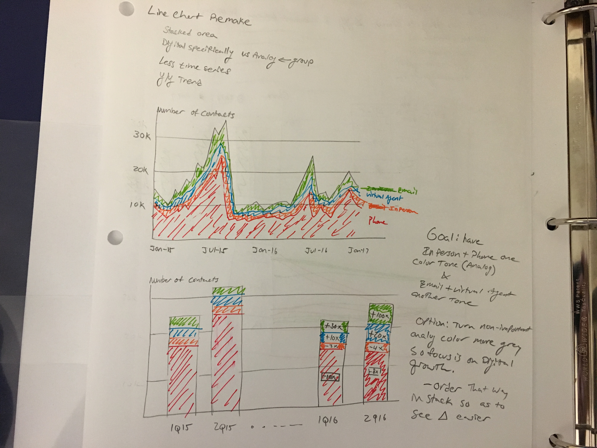
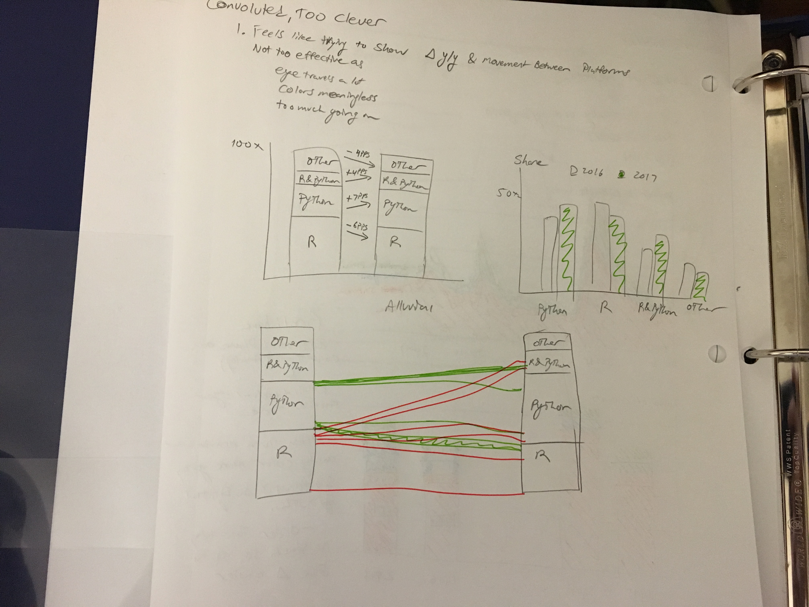
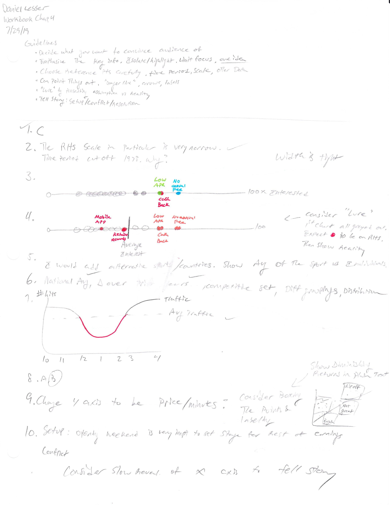
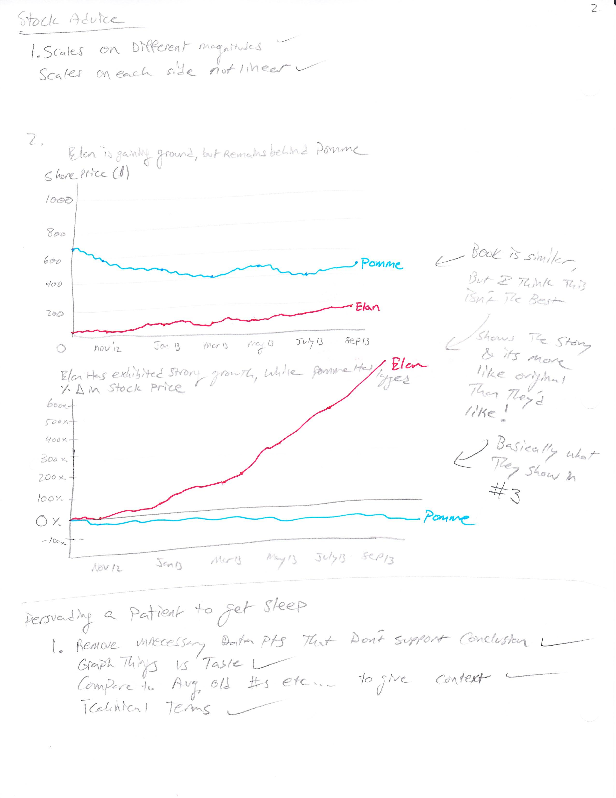
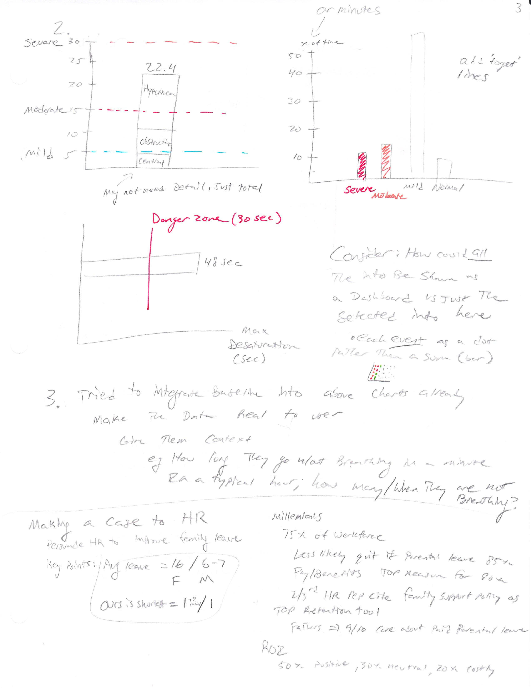
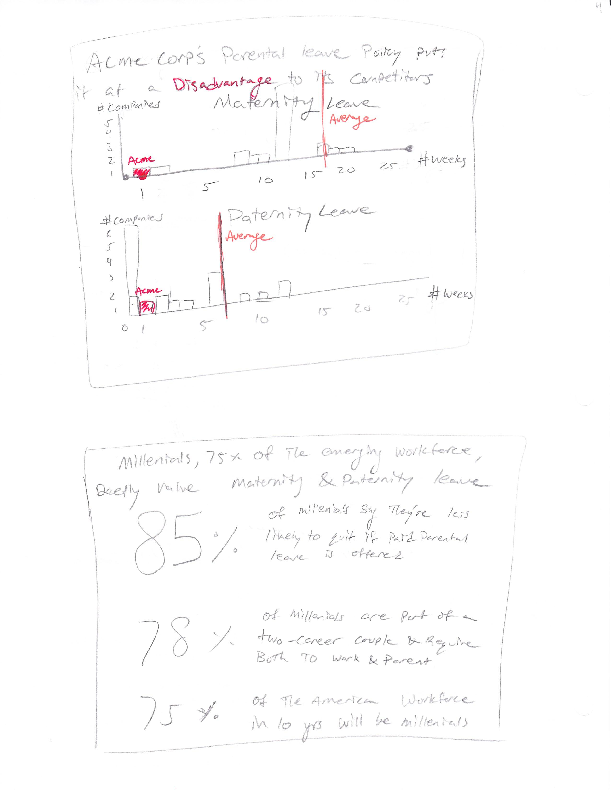
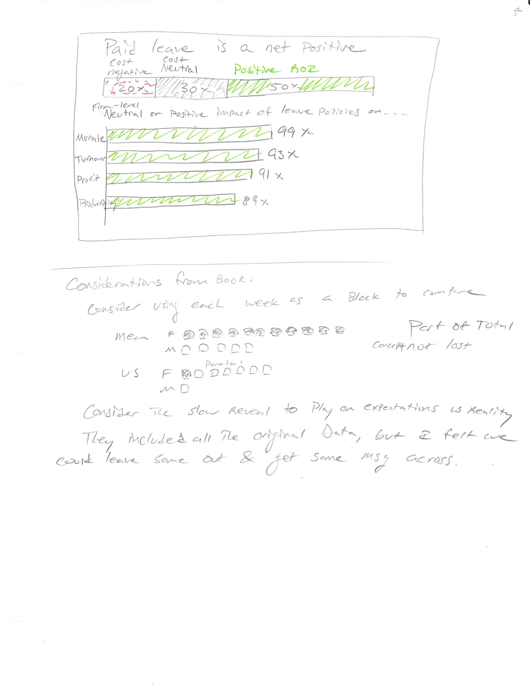

# Daniel Lesser Data Visualization Portfolio
Carnegie Mellon University - Telling Stories with Data 94-870

Summer 2019

## About Me

My name is Daniel Lesser and I am currently pursuing my Master's in Information Systems - Business Intelligence and Data Analytics.  I plan to graduate in August 2019 and have recently accepted a job at Bose to do market intelligence research on the automotive and audio industries.  

I have seven years of experience in market research, covering the tech and CPG industries.  My clients have included equity investors, branded vendors, white box manufacturers, component suppliers, grocery stores, credit card companies, and packaged food suppliers. In my previous roles, I have built many slidedecks and written research reports with graphs.  Part of my goal was to communicate technical findings to a non-technical audience.

## What I hope to Learn

I am passionate about exploring data and informing business decision making through research.  In this course, I hope to find go-to methods and tools that I can leverage when displaying my findings to clients and managers.  I am confident in my spoken presentation skills, but not my 'powerpoint' presentation skills.  I feel I overwhelm pages with too much text and not enough aesthetically pleasing design.  I hope to find ways to display data and stories that are convincing.  I hope to also understand typical pitfalls of data visualization.  I plan to directly apply my learnings from this class to my next role.

## Portfolio

### Assignment 1: Visualizing British Politics

<iframe title="Labour Party Moving Left" aria-label="Bar Chart" id="datawrapper-chart-m9N9s" src="//datawrapper.dwcdn.net/m9N9s/1/" scrolling="no" frameborder="0" style="width: 0; min-width: 100% !important; border: none;" height="265"></iframe>

Revised Graph:  I feel this graph is a slight improvement vs. the original, though there are a few things I would still change given the opportunity.  

  1) I would focus the data more on change in 'likes' rather than looking at a static point in time. 
  
  2) I would like to have a comparison of the Labour metrics + Corbyn against other political parties and leaders in Britain.
  
  3) I would consider including other social platforms and/or approval ratings to measure popularity.  

Original Article Source: “The Metamorphosis.” The Economist, August 13, 2016. https://www.economist.com/britain/2016/08/13/the-metamorphosis

### Assignment 1: Good Charts Chapter 1 Sketching

### Assignment 2: Good Charts Chapter 2 Sketching

### Assignment 2: OIG Newspaper Version

For this version of the Office of Inspector General report, I took on the role of a reporter writing for a newspaper.  My target audience is a left-leaning citizen who is a typical reader of outlets like CNN or MSNBC.  My goal is to communicate the human crisis currently taking place at the southern border.  Rather than focus on the absolute numbers, which may be dehumanizing, I chose to focus on percentages and ratios.  I wanted to highlight the plight that children and families are facing more than single adults.

To accomplish this, I created two visualizations based on the data in the report.  The first shows the change in the proportion of apprehensions that were children or families in the past year.  I use grey to de-emphasize the adults, while using a darker, but 'safe' blue color to highlight the children and families.  In the second chart, I again use grey for those who are detained less than 72 hours in order to bring attention to those who are detained for long periods of time.  I use a darker red color to indicate that this is an issue of poor treatment.  I try and keep the graphics simple and text minimal in order to drive home the takeaway that things are getting worse for children and family migrants at the border.

After reviewing the [Infogram](https://cdn2.hubspot.net/hubfs/521303/Gated%20content/infogram-data-visualization-checklist.pdf?submissionGuid=0e01903b-544b-481e-9a73-b856f560e1cd) checklist, I felt my graph met the requirements.

<a href="https://infogram.com/dd0d0b31-f83d-495d-aedf-ad79ac94ab18" style="color:#989898!important;text-decoration:none!important;" target="_blank">DHS_Assignment2</a> <a href="https://infogram.com" style="color:#989898!important;text-decoration:none!important;" target="_blank" rel="nofollow">Infogram</a>

### Assignment 2: OIG DHS Analyst Report Version

For this version of the Office of Inspector General report, I took on the role of an analyst who would support the compilation of the report itself.  My goal here was to highlight the critical nature of the issue and encourage action by those in power.  I focus more on the high-level issues rather than the personal plights of individuals.  

In order to do this, I split the visualization into two parts.  The bar chart at the top aims to highlight that there is a sharp increase in the number of apprehensions at the southern border, driven mostly by family migrants.  The focus should be on the current year (darker shade) and the increase vs. the prior year.  I also wanted to show in the subtitle that this issue is not simply an apprehension issue, but that it is exacerbated by the inability of the CBP to transfer detainees.  That is where the second half of the graphic comes in.  It displays in simple terms that the stations are overcrowded, have prolonged detentions and that immigration officials are overwhelmed and underfunded.  I feel the iconography may be a bit too 'colorful' for an official document, but I did want to highlight some of the high-level simple metrics from the report.

After reviewing the [Infogram](https://cdn2.hubspot.net/hubfs/521303/Gated%20content/infogram-data-visualization-checklist.pdf?submissionGuid=0e01903b-544b-481e-9a73-b856f560e1cd) checklist, I felt my graph met the requirements.

<a href="https://infogram.com/eda8880b-e8fe-4627-97c8-181c0e791732" style="color:#989898!important;text-decoration:none!important;" target="_blank">Copy: DHS_Assignment2</a> <a href="https://infogram.com" style="color:#989898!important;text-decoration:none!important;" target="_blank" rel="nofollow">Infogram</a>

### Assignment 2: Data Visualization Critique #2

[Source](https://viz.wtf/post/185134001896/a-bad-chart-that-could-be-fixed-by-removing-the)

My Comments:

The intended audience for this chart is not explicit, but given it was produced by the Associated Press, I imagine it was meant to serve a typical reader of news articles found on platforms like USA Today or CNN.com.  The goal is to provide the reader with an update on a new federal report regarding pregnancy-related deaths.  It is not clear why this information is valuable, but the author has chosen to focus on Blacks, who appear to be more affected than other groups.

Overall, I would score this chart at a 6 on the usefulness scale.  It accomplishes its primary goal to show that Blacks are at greater risk of pregnancy deaths than other groups, but it fails on several other measures.  First, the title also tries to say that pregnancy-related deaths are rising, but there is no indication of time series or comparisons made in this chart.  In addition, there is data regarding age, but no reference is made to it or explanation why this information is important.  I am sure there is a lot of available data and it is unclear why these two sets were chosen and aggregated over a 4 year period.

The chart fails to address one key aspect of the title: that pregnancy-related deaths are rising.  By showing a static point in time, no trend is apparent.  We need to see change over time in order to validate the title and provide valid comparisons.  It also arguably includes more data than is necessary (deaths by age group).

If the reader only pays attention to the bars, they will get the general takeaway of the chart: that Blacks and older individuals are at greater risk.  However, the data is distorted and poorly organized.  The order of races in the top chart have no clear reasoning.  They are not ordered alphabetically, by number of deaths or by rate of deaths.  The second chart has its sections organized reasonably, but the scales are completely different than the first chart.  As a reader, I would expect to be able to compare the bars in the two charts as they are right next to each other.  Finally, the colors are a bit too close to each other (both blue/green and the gradient of the highlighted item versus the remainder).

Although the scales between the two charts (Race/Age) are inconsistent and give an inaccurate comparison, the overall chart is not too misleading.  The ratios across races are accurate and truthfully tell the reader that Blacks are more affected to pregnancy-related deaths than other races.  The same is the case for individuals over 40.

The form of the data visualization (bar chart) is very typical and easy to understand.  The reader doesn’t even really need to read the numbers to get the information.  I don’t feel the inconsistent scales are too big of a hindrance to the intuitiveness of the chart, though it would help to have consistency.

I would say the chart’s aesthetics are average.  Its simplicity means that it is unlikely to be beautiful, but at the same time it is something everyone can expect and thus not too ugly.  I don’t love the color scheme (blue/green for the two charts as well as the gradient scale), so I think that is one area for improvement.  The grey shading and darker black text for the important subjects is important.  I like the title/subtitle format.

I think a very specific audience (those affected by pregnancy) are likely to be drawn into the data which makes it seem like a big issue, particularly for Blacks and older individuals.  This may inspire more dialogue on the issue as the chart is easily accessible.  However, it doesn’t show a lot and a bit more context may help drive engagement.

### Assignment 2 OECD

##### Part 1

<iframe src="https://data.oecd.org/chart/5CPg" width="860" height="645" style="border: 0" mozallowfullscreen="true" webkitallowfullscreen="true" allowfullscreen="true">OECD Chart: General government debt, Total, % of GDP, Annual, 2015</iframe> 

##### Part 2

This beeswarm plot shows government debt over time by country.  The colors are used to differentiate the country, while the size of the circle indicates the government debt as a percentage of GDP. 

<svg width="900" height="1500" xmlns="http://www.w3.org/2000/svg"><g id="swarm-AUS" transform="translate(25,0)"><text x="-25" y="23" style="font-size: 10px; font-family: Arial, Helvetica;">AUS</text><g id="circles" class="bees"><circle id="circle" r="5.498028116313638" cx="1.9999999999999976" cy="6.140961713764019" fill="rgb(191, 105, 105)"></circle><circle id="circle" r="5.366192416101501" cx="38.08695652173907" cy="6.143045994622405" fill="rgb(191, 105, 105)"></circle><circle id="circle" r="5.308863772611355" cx="74.17391304347814" cy="6.136614749828615" fill="rgb(191, 105, 105)"></circle><circle id="circle" r="5.157018265233635" cx="110.26086956521725" cy="6.1452030218887055" fill="rgb(191, 105, 105)"></circle><circle id="circle" r="4.627994734571352" cx="146.34782608695627" cy="6.139886808297173" fill="rgb(191, 105, 105)"></circle><circle id="circle" r="4.380104364285437" cx="182.4347826086954" cy="6.137258520108821" fill="rgb(191, 105, 105)"></circle><circle id="circle" r="4.331325189761423" cx="218.5217391304345" cy="6.148260686855787" fill="rgb(191, 105, 105)"></circle><circle id="circle" r="4.2123617237230135" cx="254.60869565217362" cy="6.133716865869997" fill="rgb(191, 105, 105)"></circle><circle id="circle" r="3.9964280258534703" cx="290.6956521739126" cy="6.143955530078068" fill="rgb(191, 105, 105)"></circle><circle id="circle" r="3.7583995036111" cx="326.7826086956517" cy="6.144493684801953" fill="rgb(191, 105, 105)"></circle><circle id="circle" r="3.610179452073355" cx="362.8695652173908" cy="6.132124040763502" fill="rgb(191, 105, 105)"></circle><circle id="circle" r="3.5586711648707183" cx="398.95652173912987" cy="6.150726360836251" fill="rgb(191, 105, 105)"></circle><circle id="circle" r="3.474075582728986" cx="435.043478260869" cy="6.135602283232737" fill="rgb(191, 105, 105)"></circle><circle id="circle" r="3.60901634834124" cx="471.13043478260806" cy="6.138572911804568" fill="rgb(191, 105, 105)"></circle><circle id="circle" r="4.208696875778029" cx="507.21739130434725" cy="6.150406401260101" fill="rgb(191, 105, 105)"></circle><circle id="circle" r="4.431491019725238" cx="543.304347826086" cy="6.129110396427516" fill="rgb(191, 105, 105)"></circle><circle id="circle" r="4.73433130323039" cx="579.3913043478251" cy="6.1489156904359605" fill="rgb(191, 105, 105)"></circle><circle id="circle" r="5.627619848719371" cx="615.4782608695641" cy="6.141487366648546" fill="rgb(191, 105, 105)"></circle><circle id="circle" r="5.386868433604432" cx="651.5652173913033" cy="6.131727573121663" fill="rgb(191, 105, 105)"></circle><circle id="circle" r="5.790748084279219" cx="687.6521739130425" cy="6.154397098770466" fill="rgb(191, 105, 105)"></circle><circle id="circle" r="5.974281430233863" cx="723.7391304347815" cy="6.1303669566312236" fill="rgb(191, 105, 105)"></circle><circle id="circle" r="6.257667542580933" cx="759.8260869565207" cy="6.142195773987376" fill="rgb(191, 105, 105)"></circle><circle id="circle" r="6.074189483791213" cx="795.9130434782597" cy="6.149915837767011" fill="rgb(191, 105, 105)"></circle><circle id="circle" r="6.121621033670173" cx="831.9999999999989" cy="6.126524603724518" fill="rgb(191, 105, 105)"></circle></g><g id="labels" class="label"><text x="1.9999999999999976" y="6.140961713764019" text-anchor="middle" fill="#000"></text><text x="38.08695652173907" y="6.143045994622405" text-anchor="middle" fill="#000"></text><text x="74.17391304347814" y="6.136614749828615" text-anchor="middle" fill="#000"></text><text x="110.26086956521725" y="6.1452030218887055" text-anchor="middle" fill="#000"></text><text x="146.34782608695627" y="6.139886808297173" text-anchor="middle" fill="#000"></text><text x="182.4347826086954" y="6.137258520108821" text-anchor="middle" fill="#000"></text><text x="218.5217391304345" y="6.148260686855787" text-anchor="middle" fill="#000"></text><text x="254.60869565217362" y="6.133716865869997" text-anchor="middle" fill="#000"></text><text x="290.6956521739126" y="6.143955530078068" text-anchor="middle" fill="#000"></text><text x="326.7826086956517" y="6.144493684801953" text-anchor="middle" fill="#000"></text><text x="362.8695652173908" y="6.132124040763502" text-anchor="middle" fill="#000"></text><text x="398.95652173912987" y="6.150726360836251" text-anchor="middle" fill="#000"></text><text x="435.043478260869" y="6.135602283232737" text-anchor="middle" fill="#000"></text><text x="471.13043478260806" y="6.138572911804568" text-anchor="middle" fill="#000"></text><text x="507.21739130434725" y="6.150406401260101" text-anchor="middle" fill="#000"></text><text x="543.304347826086" y="6.129110396427516" text-anchor="middle" fill="#000"></text><text x="579.3913043478251" y="6.1489156904359605" text-anchor="middle" fill="#000"></text><text x="615.4782608695641" y="6.141487366648546" text-anchor="middle" fill="#000"></text><text x="651.5652173913033" y="6.131727573121663" text-anchor="middle" fill="#000"></text><text x="687.6521739130425" y="6.154397098770466" text-anchor="middle" fill="#000"></text><text x="723.7391304347815" y="6.1303669566312236" text-anchor="middle" fill="#000"></text><text x="759.8260869565207" y="6.142195773987376" text-anchor="middle" fill="#000"></text><text x="795.9130434782597" y="6.149915837767011" text-anchor="middle" fill="#000"></text><text x="831.9999999999989" y="6.126524603724518" text-anchor="middle" fill="#000"></text></g></g><g id="swarm-AUT" transform="translate(25,42.285714285714285)"><text x="-25" y="23" style="font-size: 10px; font-family: Arial, Helvetica;">AUT</text><g id="circles" class="bees"><circle id="circle" r="6.320007967571556" cx="1.9999999999999976" cy="6.140961713764019" fill="rgb(191, 120, 105)"></circle><circle id="circle" r="6.357157486953535" cx="38.08695652173907" cy="6.143045994622405" fill="rgb(191, 120, 105)"></circle><circle id="circle" r="6.057253642995477" cx="74.17391304347814" cy="6.136614749828615" fill="rgb(191, 120, 105)"></circle><circle id="circle" r="6.177849462578306" cx="110.26086956521725" cy="6.1452030218887055" fill="rgb(191, 120, 105)"></circle><circle id="circle" r="6.427213926899043" cx="146.34782608695627" cy="6.139886808297173" fill="rgb(191, 120, 105)"></circle><circle id="circle" r="6.450835368113368" cx="182.4347826086954" cy="6.137258520108821" fill="rgb(191, 120, 105)"></circle><circle id="circle" r="6.523732186156912" cx="218.5217391304345" cy="6.148260686855787" fill="rgb(191, 120, 105)"></circle><circle id="circle" r="6.655897536089917" cx="254.60869565217362" cy="6.133716865869997" fill="rgb(191, 120, 105)"></circle><circle id="circle" r="6.552710262562936" cx="290.6956521739126" cy="6.143955530078068" fill="rgb(191, 120, 105)"></circle><circle id="circle" r="6.499828780401467" cx="326.7826086956517" cy="6.144493684801953" fill="rgb(191, 120, 105)"></circle><circle id="circle" r="6.809146646367178" cx="362.8695652173908" cy="6.132124040763502" fill="rgb(191, 120, 105)"></circle><circle id="circle" r="6.562741427549066" cx="398.95652173912987" cy="6.150726360836251" fill="rgb(191, 120, 105)"></circle><circle id="circle" r="6.305536552152363" cx="435.043478260869" cy="6.135602283232737" fill="rgb(191, 120, 105)"></circle><circle id="circle" r="6.666848541282492" cx="471.13043478260806" cy="6.138572911804568" fill="rgb(191, 120, 105)"></circle><circle id="circle" r="7.50566955406621" cx="507.21739130434725" cy="6.150406401260101" fill="rgb(191, 120, 105)"></circle><circle id="circle" r="7.79686221410073" cx="543.304347826086" cy="6.129110396427516" fill="rgb(191, 120, 105)"></circle><circle id="circle" r="7.861114883908205" cx="579.3913043478252" cy="6.150586642940722" fill="rgb(191, 120, 105)"></circle><circle id="circle" r="8.266360127556645" cx="615.4782608695641" cy="6.139967330655695" fill="rgb(191, 120, 105)"></circle><circle id="circle" r="8.060563331376153" cx="651.5652173913033" cy="6.131727573121663" fill="rgb(191, 120, 105)"></circle><circle id="circle" r="8.579537037634143" cx="687.6521739130425" cy="6.154397098770466" fill="rgb(191, 120, 105)"></circle><circle id="circle" r="8.505431503947419" cx="723.7391304347815" cy="6.1303669566312236" fill="rgb(191, 120, 105)"></circle><circle id="circle" r="8.542902379975528" cx="759.8260869565207" cy="6.138071279828833" fill="rgb(191, 120, 105)"></circle><circle id="circle" r="8.0987923326533" cx="795.9130434782597" cy="6.154509537695927" fill="rgb(191, 120, 105)"></circle></g><g id="labels" class="label"><text x="1.9999999999999976" y="6.140961713764019" text-anchor="middle" fill="#000"></text><text x="38.08695652173907" y="6.143045994622405" text-anchor="middle" fill="#000"></text><text x="74.17391304347814" y="6.136614749828615" text-anchor="middle" fill="#000"></text><text x="110.26086956521725" y="6.1452030218887055" text-anchor="middle" fill="#000"></text><text x="146.34782608695627" y="6.139886808297173" text-anchor="middle" fill="#000"></text><text x="182.4347826086954" y="6.137258520108821" text-anchor="middle" fill="#000"></text><text x="218.5217391304345" y="6.148260686855787" text-anchor="middle" fill="#000"></text><text x="254.60869565217362" y="6.133716865869997" text-anchor="middle" fill="#000"></text><text x="290.6956521739126" y="6.143955530078068" text-anchor="middle" fill="#000"></text><text x="326.7826086956517" y="6.144493684801953" text-anchor="middle" fill="#000"></text><text x="362.8695652173908" y="6.132124040763502" text-anchor="middle" fill="#000"></text><text x="398.95652173912987" y="6.150726360836251" text-anchor="middle" fill="#000"></text><text x="435.043478260869" y="6.135602283232737" text-anchor="middle" fill="#000"></text><text x="471.13043478260806" y="6.138572911804568" text-anchor="middle" fill="#000"></text><text x="507.21739130434725" y="6.150406401260101" text-anchor="middle" fill="#000"></text><text x="543.304347826086" y="6.129110396427516" text-anchor="middle" fill="#000"></text><text x="579.3913043478252" y="6.150586642940722" text-anchor="middle" fill="#000"></text><text x="615.4782608695641" y="6.139967330655695" text-anchor="middle" fill="#000"></text><text x="651.5652173913033" y="6.131727573121663" text-anchor="middle" fill="#000"></text><text x="687.6521739130425" y="6.154397098770466" text-anchor="middle" fill="#000"></text><text x="723.7391304347815" y="6.1303669566312236" text-anchor="middle" fill="#000"></text><text x="759.8260869565207" y="6.138071279828833" text-anchor="middle" fill="#000"></text><text x="795.9130434782597" y="6.154509537695927" text-anchor="middle" fill="#000"></text></g></g><g id="swarm-BEL" transform="translate(25,84.57142857142857)"><text x="-25" y="23" style="font-size: 10px; font-family: Arial, Helvetica;">BEL</text><g id="circles" class="bees"><circle id="circle" r="11.240342423993095" cx="1.9999999999999976" cy="6.140961713764019" fill="rgb(191, 134, 105)"></circle><circle id="circle" r="11.369818053352486" cx="38.08695652173907" cy="6.143045994622405" fill="rgb(191, 134, 105)"></circle><circle id="circle" r="10.995510125017109" cx="74.17391304347814" cy="6.136614749828615" fill="rgb(191, 134, 105)"></circle><circle id="circle" r="11.077708317469769" cx="110.26086956521725" cy="6.1452030218887055" fill="rgb(191, 134, 105)"></circle><circle id="circle" r="10.293639566290677" cx="146.34782608695627" cy="6.139886808297173" fill="rgb(191, 134, 105)"></circle><circle id="circle" r="9.869835803555944" cx="182.4347826086954" cy="6.137258520108821" fill="rgb(191, 134, 105)"></circle><circle id="circle" r="9.780056358612903" cx="218.5217391304345" cy="6.148260686855787" fill="rgb(191, 134, 105)"></circle><circle id="circle" r="9.723628895911041" cx="254.60869565217362" cy="6.133716865869997" fill="rgb(191, 134, 105)"></circle><circle id="circle" r="9.476481446903808" cx="290.6956521739126" cy="6.1437315960680055" fill="rgb(191, 134, 105)"></circle><circle id="circle" r="9.173936258641444" cx="326.7826086956517" cy="6.144731844577692" fill="rgb(191, 134, 105)"></circle><circle id="circle" r="9.024197883336939" cx="362.8695652173908" cy="6.132124040763502" fill="rgb(191, 134, 105)"></circle><circle id="circle" r="8.476198415493178" cx="398.95652173912987" cy="6.150726360836251" fill="rgb(191, 134, 105)"></circle><circle id="circle" r="8.045478919515851" cx="435.043478260869" cy="6.135602283232737" fill="rgb(191, 134, 105)"></circle><circle id="circle" r="8.55200402950135" cx="471.13043478260806" cy="6.138572911804568" fill="rgb(191, 134, 105)"></circle><circle id="circle" r="9.130618764922486" cx="507.21739130434725" cy="6.150406401260101" fill="rgb(191, 134, 105)"></circle><circle id="circle" r="9.001861868707124" cx="543.304347826086" cy="6.129110396427516" fill="rgb(191, 134, 105)"></circle><circle id="circle" r="9.18306555174973" cx="579.3913043478252" cy="6.153669169085367" fill="rgb(191, 134, 105)"></circle><circle id="circle" r="9.86535063230138" cx="615.4782608695641" cy="6.137339074867787" fill="rgb(191, 134, 105)"></circle><circle id="circle" r="9.727326225065418" cx="651.5652173913033" cy="6.131727573121663" fill="rgb(191, 134, 105)"></circle><circle id="circle" r="10.600462598939135" cx="687.6521739130425" cy="6.154397098770466" fill="rgb(191, 134, 105)"></circle><circle id="circle" r="10.373163242140077" cx="723.7391304347815" cy="6.1303669566312236" fill="rgb(191, 134, 105)"></circle><circle id="circle" r="10.45011606482045" cx="759.8260869565207" cy="6.134366996971116" fill="rgb(191, 134, 105)"></circle><circle id="circle" r="9.993430260746408" cx="795.9130434782597" cy="6.158461945274865" fill="rgb(191, 134, 105)"></circle><circle id="circle" r="9.83807332730637" cx="831.9999999999989" cy="6.126524603724518" fill="rgb(191, 134, 105)"></circle></g><g id="labels" class="label"><text x="1.9999999999999976" y="6.140961713764019" text-anchor="middle" fill="#000"></text><text x="38.08695652173907" y="6.143045994622405" text-anchor="middle" fill="#000"></text><text x="74.17391304347814" y="6.136614749828615" text-anchor="middle" fill="#000"></text><text x="110.26086956521725" y="6.1452030218887055" text-anchor="middle" fill="#000"></text><text x="146.34782608695627" y="6.139886808297173" text-anchor="middle" fill="#000"></text><text x="182.4347826086954" y="6.137258520108821" text-anchor="middle" fill="#000"></text><text x="218.5217391304345" y="6.148260686855787" text-anchor="middle" fill="#000"></text><text x="254.60869565217362" y="6.133716865869997" text-anchor="middle" fill="#000"></text><text x="290.6956521739126" y="6.1437315960680055" text-anchor="middle" fill="#000"></text><text x="326.7826086956517" y="6.144731844577692" text-anchor="middle" fill="#000"></text><text x="362.8695652173908" y="6.132124040763502" text-anchor="middle" fill="#000"></text><text x="398.95652173912987" y="6.150726360836251" text-anchor="middle" fill="#000"></text><text x="435.043478260869" y="6.135602283232737" text-anchor="middle" fill="#000"></text><text x="471.13043478260806" y="6.138572911804568" text-anchor="middle" fill="#000"></text><text x="507.21739130434725" y="6.150406401260101" text-anchor="middle" fill="#000"></text><text x="543.304347826086" y="6.129110396427516" text-anchor="middle" fill="#000"></text><text x="579.3913043478252" y="6.153669169085367" text-anchor="middle" fill="#000"></text><text x="615.4782608695641" y="6.137339074867787" text-anchor="middle" fill="#000"></text><text x="651.5652173913033" y="6.131727573121663" text-anchor="middle" fill="#000"></text><text x="687.6521739130425" y="6.154397098770466" text-anchor="middle" fill="#000"></text><text x="723.7391304347815" y="6.1303669566312236" text-anchor="middle" fill="#000"></text><text x="759.8260869565207" y="6.134366996971116" text-anchor="middle" fill="#000"></text><text x="795.9130434782597" y="6.158461945274865" text-anchor="middle" fill="#000"></text><text x="831.9999999999989" y="6.126524603724518" text-anchor="middle" fill="#000"></text></g></g><g id="swarm-CAN" transform="translate(25,126.85714285714286)"><text x="-25" y="23" style="font-size: 10px; font-family: Arial, Helvetica;">CAN</text><g id="circles" class="bees"><circle id="circle" r="10.10665837451338" cx="1.9999999999999976" cy="6.140961713764019" fill="rgb(191, 149, 105)"></circle><circle id="circle" r="10.527096531083288" cx="38.08695652173907" cy="6.143045994622405" fill="rgb(191, 149, 105)"></circle><circle id="circle" r="10.105331482555174" cx="74.17391304347814" cy="6.136614749828615" fill="rgb(191, 149, 105)"></circle><circle id="circle" r="10.072539282858868" cx="110.26086956521725" cy="6.1452030218887055" fill="rgb(191, 149, 105)"></circle><circle id="circle" r="9.40939047226698" cx="146.34782608695627" cy="6.139886808297173" fill="rgb(191, 149, 105)"></circle><circle id="circle" r="8.800844647934422" cx="182.4347826086954" cy="6.137258520108821" fill="rgb(191, 149, 105)"></circle><circle id="circle" r="8.780478238555071" cx="218.5217391304345" cy="6.148260686855787" fill="rgb(191, 149, 105)"></circle><circle id="circle" r="8.69747147131538" cx="254.60869565217362" cy="6.133716865869997" fill="rgb(191, 149, 105)"></circle><circle id="circle" r="8.397934595914512" cx="290.6956521739126" cy="6.143876109612328" fill="rgb(191, 149, 105)"></circle><circle id="circle" r="8.127114565065398" cx="326.7826086956517" cy="6.144578169823098" fill="rgb(191, 149, 105)"></circle><circle id="circle" r="8.026999875729139" cx="362.8695652173908" cy="6.132124040763502" fill="rgb(191, 149, 105)"></circle><circle id="circle" r="7.838774722741023" cx="398.95652173912987" cy="6.150726360836251" fill="rgb(191, 149, 105)"></circle><circle id="circle" r="7.548736182274319" cx="435.043478260869" cy="6.135602283232737" fill="rgb(191, 149, 105)"></circle><circle id="circle" r="7.74231244173764" cx="471.13043478260806" cy="6.138572911804568" fill="rgb(191, 149, 105)"></circle><circle id="circle" r="8.637706046031152" cx="507.21739130434725" cy="6.150406401260101" fill="rgb(191, 149, 105)"></circle><circle id="circle" r="8.797112764301964" cx="543.304347826086" cy="6.129110396427516" fill="rgb(191, 149, 105)"></circle><circle id="circle" r="8.979712448258933" cx="579.3913043478252" cy="6.152643438739225" fill="rgb(191, 149, 105)"></circle><circle id="circle" r="9.231794276735748" cx="615.4782608695641" cy="6.137950236257856" fill="rgb(191, 149, 105)"></circle><circle id="circle" r="8.953748213430899" cx="651.5652173913033" cy="6.131727573121663" fill="rgb(191, 149, 105)"></circle><circle id="circle" r="9.027535845919301" cx="687.6521739130425" cy="6.154397098770466" fill="rgb(191, 149, 105)"></circle><circle id="circle" r="9.461726684764372" cx="723.7391304347815" cy="6.1303669566312236" fill="rgb(191, 149, 105)"></circle><circle id="circle" r="9.406536272377712" cx="759.8260869565207" cy="6.136220132460916" fill="rgb(191, 149, 105)"></circle><circle id="circle" r="9.061585828617659" cx="795.9130434782597" cy="6.156341402022219" fill="rgb(191, 149, 105)"></circle><circle id="circle" r="9.021530277629292" cx="831.9999999999989" cy="6.126524603724518" fill="rgb(191, 149, 105)"></circle></g><g id="labels" class="label"><text x="1.9999999999999976" y="6.140961713764019" text-anchor="middle" fill="#000"></text><text x="38.08695652173907" y="6.143045994622405" text-anchor="middle" fill="#000"></text><text x="74.17391304347814" y="6.136614749828615" text-anchor="middle" fill="#000"></text><text x="110.26086956521725" y="6.1452030218887055" text-anchor="middle" fill="#000"></text><text x="146.34782608695627" y="6.139886808297173" text-anchor="middle" fill="#000"></text><text x="182.4347826086954" y="6.137258520108821" text-anchor="middle" fill="#000"></text><text x="218.5217391304345" y="6.148260686855787" text-anchor="middle" fill="#000"></text><text x="254.60869565217362" y="6.133716865869997" text-anchor="middle" fill="#000"></text><text x="290.6956521739126" y="6.143876109612328" text-anchor="middle" fill="#000"></text><text x="326.7826086956517" y="6.144578169823098" text-anchor="middle" fill="#000"></text><text x="362.8695652173908" y="6.132124040763502" text-anchor="middle" fill="#000"></text><text x="398.95652173912987" y="6.150726360836251" text-anchor="middle" fill="#000"></text><text x="435.043478260869" y="6.135602283232737" text-anchor="middle" fill="#000"></text><text x="471.13043478260806" y="6.138572911804568" text-anchor="middle" fill="#000"></text><text x="507.21739130434725" y="6.150406401260101" text-anchor="middle" fill="#000"></text><text x="543.304347826086" y="6.129110396427516" text-anchor="middle" fill="#000"></text><text x="579.3913043478252" y="6.152643438739225" text-anchor="middle" fill="#000"></text><text x="615.4782608695641" y="6.137950236257856" text-anchor="middle" fill="#000"></text><text x="651.5652173913033" y="6.131727573121663" text-anchor="middle" fill="#000"></text><text x="687.6521739130425" y="6.154397098770466" text-anchor="middle" fill="#000"></text><text x="723.7391304347815" y="6.1303669566312236" text-anchor="middle" fill="#000"></text><text x="759.8260869565207" y="6.136220132460916" text-anchor="middle" fill="#000"></text><text x="795.9130434782597" y="6.156341402022219" text-anchor="middle" fill="#000"></text><text x="831.9999999999989" y="6.126524603724518" text-anchor="middle" fill="#000"></text></g></g><g id="swarm-CHE" transform="translate(25,169.14285714285714)"><text x="-25" y="23" style="font-size: 10px; font-family: Arial, Helvetica;">CHE</text><g id="circles" class="bees"><circle id="circle" r="5.326783033853199" cx="146.34782608695627" cy="6.140961713764019" fill="rgb(191, 164, 105)"></circle><circle id="circle" r="5.307949461121403" cx="182.43478260869537" cy="6.143045994622405" fill="rgb(191, 164, 105)"></circle><circle id="circle" r="5.246026454225966" cx="218.5217391304345" cy="6.136614749828615" fill="rgb(191, 164, 105)"></circle><circle id="circle" r="5.674453606127576" cx="254.60869565217365" cy="6.1452030218887055" fill="rgb(191, 164, 105)"></circle><circle id="circle" r="5.621245929693048" cx="290.69565217391255" cy="6.139886808297173" fill="rgb(191, 164, 105)"></circle><circle id="circle" r="5.670849574064009" cx="326.7826086956517" cy="6.137258520108821" fill="rgb(191, 164, 105)"></circle><circle id="circle" r="5.473662371641506" cx="362.8695652173908" cy="6.148260686855787" fill="rgb(191, 164, 105)"></circle><circle id="circle" r="5.031857799096661" cx="398.95652173912987" cy="6.133716865869997" fill="rgb(191, 164, 105)"></circle><circle id="circle" r="4.691588104937095" cx="435.043478260869" cy="6.143955530078068" fill="rgb(191, 164, 105)"></circle><circle id="circle" r="4.71439682482702" cx="471.13043478260806" cy="6.144493684801953" fill="rgb(191, 164, 105)"></circle><circle id="circle" r="4.594557057224543" cx="507.2173913043473" cy="6.132124040763502" fill="rgb(191, 164, 105)"></circle><circle id="circle" r="4.485890134563906" cx="543.3043478260861" cy="6.150726360836251" fill="rgb(191, 164, 105)"></circle><circle id="circle" r="4.5127147758960895" cx="579.3913043478251" cy="6.135602283232737" fill="rgb(191, 164, 105)"></circle><circle id="circle" r="4.566949411419105" cx="615.4782608695641" cy="6.138572911804568" fill="rgb(191, 164, 105)"></circle><circle id="circle" r="4.516453570424162" cx="651.5652173913033" cy="6.150406401260101" fill="rgb(191, 164, 105)"></circle><circle id="circle" r="4.520604945420489" cx="687.6521739130425" cy="6.129110396427516" fill="rgb(191, 164, 105)"></circle><circle id="circle" r="4.5213001815194245" cx="723.7391304347816" cy="6.1489156904359605" fill="rgb(191, 164, 105)"></circle><circle id="circle" r="4.4414537668447736" cx="759.8260869565206" cy="6.141487366648546" fill="rgb(191, 164, 105)"></circle><circle id="circle" r="4.502085127349643" cx="795.9130434782597" cy="6.131727573121663" fill="rgb(191, 164, 105)"></circle></g><g id="labels" class="label"><text x="146.34782608695627" y="6.140961713764019" text-anchor="middle" fill="#000"></text><text x="182.43478260869537" y="6.143045994622405" text-anchor="middle" fill="#000"></text><text x="218.5217391304345" y="6.136614749828615" text-anchor="middle" fill="#000"></text><text x="254.60869565217365" y="6.1452030218887055" text-anchor="middle" fill="#000"></text><text x="290.69565217391255" y="6.139886808297173" text-anchor="middle" fill="#000"></text><text x="326.7826086956517" y="6.137258520108821" text-anchor="middle" fill="#000"></text><text x="362.8695652173908" y="6.148260686855787" text-anchor="middle" fill="#000"></text><text x="398.95652173912987" y="6.133716865869997" text-anchor="middle" fill="#000"></text><text x="435.043478260869" y="6.143955530078068" text-anchor="middle" fill="#000"></text><text x="471.13043478260806" y="6.144493684801953" text-anchor="middle" fill="#000"></text><text x="507.2173913043473" y="6.132124040763502" text-anchor="middle" fill="#000"></text><text x="543.3043478260861" y="6.150726360836251" text-anchor="middle" fill="#000"></text><text x="579.3913043478251" y="6.135602283232737" text-anchor="middle" fill="#000"></text><text x="615.4782608695641" y="6.138572911804568" text-anchor="middle" fill="#000"></text><text x="651.5652173913033" y="6.150406401260101" text-anchor="middle" fill="#000"></text><text x="687.6521739130425" y="6.129110396427516" text-anchor="middle" fill="#000"></text><text x="723.7391304347816" y="6.1489156904359605" text-anchor="middle" fill="#000"></text><text x="759.8260869565206" y="6.141487366648546" text-anchor="middle" fill="#000"></text><text x="795.9130434782597" y="6.131727573121663" text-anchor="middle" fill="#000"></text></g></g><g id="swarm-CHL" transform="translate(25,211.42857142857142)"><text x="-25" y="23" style="font-size: 10px; font-family: Arial, Helvetica;">CHL</text><g id="circles" class="bees"><circle id="circle" r="3.1914752392134167" cx="290.69565217391255" cy="6.140961713764019" fill="rgb(191, 179, 105)"></circle><circle id="circle" r="2.961926385891462" cx="326.7826086956517" cy="6.143045994622405" fill="rgb(191, 179, 105)"></circle><circle id="circle" r="2.6657288552520817" cx="362.8695652173908" cy="6.136614749828615" fill="rgb(191, 179, 105)"></circle><circle id="circle" r="2.4481337780765338" cx="398.95652173912987" cy="6.1452030218887055" fill="rgb(191, 179, 105)"></circle><circle id="circle" r="2.3177763184365854" cx="435.043478260869" cy="6.139886808297173" fill="rgb(191, 179, 105)"></circle><circle id="circle" r="2.398398826688875" cx="471.13043478260806" cy="6.137258520108821" fill="rgb(191, 179, 105)"></circle><circle id="circle" r="2.459342559675573" cx="507.21739130434725" cy="6.148260686855787" fill="rgb(191, 179, 105)"></circle><circle id="circle" r="2.5947726166974157" cx="543.304347826086" cy="6.133716865869997" fill="rgb(191, 179, 105)"></circle><circle id="circle" r="2.773352232674755" cx="579.3913043478251" cy="6.143955530078068" fill="rgb(191, 179, 105)"></circle><circle id="circle" r="2.8087664261676433" cx="615.4782608695641" cy="6.144493684801953" fill="rgb(191, 179, 105)"></circle><circle id="circle" r="2.8517549612552946" cx="651.5652173913033" cy="6.132124040763502" fill="rgb(191, 179, 105)"></circle><circle id="circle" r="3.0867551290388824" cx="687.6521739130425" cy="6.150726360836251" fill="rgb(191, 179, 105)"></circle><circle id="circle" r="3.226873537646389" cx="723.7391304347815" cy="6.135602283232737" fill="rgb(191, 179, 105)"></circle><circle id="circle" r="3.476891772692367" cx="759.8260869565207" cy="6.138572911804568" fill="rgb(191, 179, 105)"></circle><circle id="circle" r="3.5832193571871045" cx="795.9130434782597" cy="6.150406401260101" fill="rgb(191, 179, 105)"></circle><circle id="circle" r="3.788959484023549" cx="831.9999999999989" cy="6.129110396427516" fill="rgb(191, 179, 105)"></circle></g><g id="labels" class="label"><text x="290.69565217391255" y="6.140961713764019" text-anchor="middle" fill="#000"></text><text x="326.7826086956517" y="6.143045994622405" text-anchor="middle" fill="#000"></text><text x="362.8695652173908" y="6.136614749828615" text-anchor="middle" fill="#000"></text><text x="398.95652173912987" y="6.1452030218887055" text-anchor="middle" fill="#000"></text><text x="435.043478260869" y="6.139886808297173" text-anchor="middle" fill="#000"></text><text x="471.13043478260806" y="6.137258520108821" text-anchor="middle" fill="#000"></text><text x="507.21739130434725" y="6.148260686855787" text-anchor="middle" fill="#000"></text><text x="543.304347826086" y="6.133716865869997" text-anchor="middle" fill="#000"></text><text x="579.3913043478251" y="6.143955530078068" text-anchor="middle" fill="#000"></text><text x="615.4782608695641" y="6.144493684801953" text-anchor="middle" fill="#000"></text><text x="651.5652173913033" y="6.132124040763502" text-anchor="middle" fill="#000"></text><text x="687.6521739130425" y="6.150726360836251" text-anchor="middle" fill="#000"></text><text x="723.7391304347815" y="6.135602283232737" text-anchor="middle" fill="#000"></text><text x="759.8260869565207" y="6.138572911804568" text-anchor="middle" fill="#000"></text><text x="795.9130434782597" y="6.150406401260101" text-anchor="middle" fill="#000"></text><text x="831.9999999999989" y="6.129110396427516" text-anchor="middle" fill="#000"></text></g></g><g id="swarm-COL" transform="translate(25,253.71428571428572)"><text x="-25" y="23" style="font-size: 10px; font-family: Arial, Helvetica;">COL</text><g id="circles" class="bees"><circle id="circle" r="6.277313145547569" cx="723.7391304347816" cy="6.140961713764019" fill="rgb(188, 191, 105)"></circle><circle id="circle" r="6.589652455076447" cx="759.8260869565206" cy="6.143045994622405" fill="rgb(188, 191, 105)"></circle></g><g id="labels" class="label"><text x="723.7391304347816" y="6.140961713764019" text-anchor="middle" fill="#000"></text><text x="759.8260869565206" y="6.143045994622405" text-anchor="middle" fill="#000"></text></g></g><g id="swarm-CZE" transform="translate(25,296)"><text x="-25" y="23" style="font-size: 10px; font-family: Arial, Helvetica;">CZE</text><g id="circles" class="bees"><circle id="circle" r="2.7947656427398777" cx="1.9999999999999976" cy="6.140961713764019" fill="rgb(174, 191, 105)"></circle><circle id="circle" r="2.697268800662831" cx="38.08695652173907" cy="6.143045994622405" fill="rgb(174, 191, 105)"></circle><circle id="circle" r="2.723307673163515" cx="74.17391304347814" cy="6.136614749828615" fill="rgb(174, 191, 105)"></circle><circle id="circle" r="2.782370951453191" cx="110.26086956521725" cy="6.1452030218887055" fill="rgb(174, 191, 105)"></circle><circle id="circle" r="3.185848388003146" cx="146.34782608695627" cy="6.139886808297173" fill="rgb(174, 191, 105)"></circle><circle id="circle" r="3.224766405573174" cx="182.4347826086954" cy="6.137258520108821" fill="rgb(174, 191, 105)"></circle><circle id="circle" r="3.496569165778836" cx="218.5217391304345" cy="6.148260686855787" fill="rgb(174, 191, 105)"></circle><circle id="circle" r="3.653477595284589" cx="254.60869565217362" cy="6.133716865869997" fill="rgb(174, 191, 105)"></circle><circle id="circle" r="3.847049017120979" cx="290.6956521739126" cy="6.143955530078068" fill="rgb(174, 191, 105)"></circle><circle id="circle" r="3.8099748265012097" cx="326.7826086956517" cy="6.144493684801953" fill="rgb(174, 191, 105)"></circle><circle id="circle" r="3.7781010848322243" cx="362.8695652173908" cy="6.132124040763502" fill="rgb(174, 191, 105)"></circle><circle id="circle" r="3.7468486326790864" cx="398.95652173912987" cy="6.150726360836251" fill="rgb(174, 191, 105)"></circle><circle id="circle" r="3.6500477177905366" cx="435.043478260869" cy="6.135602283232737" fill="rgb(174, 191, 105)"></circle><circle id="circle" r="3.910486892335369" cx="471.13043478260806" cy="6.138572911804568" fill="rgb(174, 191, 105)"></circle><circle id="circle" r="4.378316515589665" cx="507.21739130434725" cy="6.150406401260101" fill="rgb(174, 191, 105)"></circle><circle id="circle" r="4.689302671756996" cx="543.304347826086" cy="6.129110396427516" fill="rgb(174, 191, 105)"></circle><circle id="circle" r="4.880693706026646" cx="579.3913043478251" cy="6.1489156904359605" fill="rgb(174, 191, 105)"></circle><circle id="circle" r="5.539419543424511" cx="615.4782608695641" cy="6.141487366648546" fill="rgb(174, 191, 105)"></circle><circle id="circle" r="5.544994562917664" cx="651.5652173913033" cy="6.131727573121663" fill="rgb(174, 191, 105)"></circle><circle id="circle" r="5.357743155121794" cx="687.6521739130425" cy="6.154397098770466" fill="rgb(174, 191, 105)"></circle><circle id="circle" r="5.134029170968141" cx="723.7391304347815" cy="6.1303669566312236" fill="rgb(174, 191, 105)"></circle><circle id="circle" r="4.835184076218402" cx="759.8260869565207" cy="6.142847228729639" fill="rgb(174, 191, 105)"></circle><circle id="circle" r="4.56762253265207" cx="795.9130434782597" cy="6.14922751290065" fill="rgb(174, 191, 105)"></circle></g><g id="labels" class="label"><text x="1.9999999999999976" y="6.140961713764019" text-anchor="middle" fill="#000"></text><text x="38.08695652173907" y="6.143045994622405" text-anchor="middle" fill="#000"></text><text x="74.17391304347814" y="6.136614749828615" text-anchor="middle" fill="#000"></text><text x="110.26086956521725" y="6.1452030218887055" text-anchor="middle" fill="#000"></text><text x="146.34782608695627" y="6.139886808297173" text-anchor="middle" fill="#000"></text><text x="182.4347826086954" y="6.137258520108821" text-anchor="middle" fill="#000"></text><text x="218.5217391304345" y="6.148260686855787" text-anchor="middle" fill="#000"></text><text x="254.60869565217362" y="6.133716865869997" text-anchor="middle" fill="#000"></text><text x="290.6956521739126" y="6.143955530078068" text-anchor="middle" fill="#000"></text><text x="326.7826086956517" y="6.144493684801953" text-anchor="middle" fill="#000"></text><text x="362.8695652173908" y="6.132124040763502" text-anchor="middle" fill="#000"></text><text x="398.95652173912987" y="6.150726360836251" text-anchor="middle" fill="#000"></text><text x="435.043478260869" y="6.135602283232737" text-anchor="middle" fill="#000"></text><text x="471.13043478260806" y="6.138572911804568" text-anchor="middle" fill="#000"></text><text x="507.21739130434725" y="6.150406401260101" text-anchor="middle" fill="#000"></text><text x="543.304347826086" y="6.129110396427516" text-anchor="middle" fill="#000"></text><text x="579.3913043478251" y="6.1489156904359605" text-anchor="middle" fill="#000"></text><text x="615.4782608695641" y="6.141487366648546" text-anchor="middle" fill="#000"></text><text x="651.5652173913033" y="6.131727573121663" text-anchor="middle" fill="#000"></text><text x="687.6521739130425" y="6.154397098770466" text-anchor="middle" fill="#000"></text><text x="723.7391304347815" y="6.1303669566312236" text-anchor="middle" fill="#000"></text><text x="759.8260869565207" y="6.142847228729639" text-anchor="middle" fill="#000"></text><text x="795.9130434782597" y="6.14922751290065" text-anchor="middle" fill="#000"></text></g></g><g id="swarm-DEU" transform="translate(25,338.2857142857143)"><text x="-25" y="23" style="font-size: 10px; font-family: Arial, Helvetica;">DEU</text><g id="circles" class="bees"><circle id="circle" r="5.279891224921823" cx="1.9999999999999976" cy="6.140961713764019" fill="rgb(159, 191, 105)"></circle><circle id="circle" r="5.492405411640737" cx="38.08695652173907" cy="6.143045994622405" fill="rgb(159, 191, 105)"></circle><circle id="circle" r="5.593460673870288" cx="74.17391304347814" cy="6.136614749828615" fill="rgb(159, 191, 105)"></circle><circle id="circle" r="5.72391695931754" cx="110.26086956521725" cy="6.1452030218887055" fill="rgb(159, 191, 105)"></circle><circle id="circle" r="5.717925903908324" cx="146.34782608695627" cy="6.139886808297173" fill="rgb(159, 191, 105)"></circle><circle id="circle" r="5.652766524596074" cx="182.4347826086954" cy="6.137258520108821" fill="rgb(159, 191, 105)"></circle><circle id="circle" r="5.600105500004744" cx="218.5217391304345" cy="6.148260686855787" fill="rgb(159, 191, 105)"></circle><circle id="circle" r="5.7692482880189" cx="254.60869565217362" cy="6.133716865869997" fill="rgb(159, 191, 105)"></circle><circle id="circle" r="6.002816518230923" cx="290.6956521739126" cy="6.143955530078068" fill="rgb(159, 191, 105)"></circle><circle id="circle" r="6.206398372366597" cx="326.7826086956517" cy="6.144493684801953" fill="rgb(159, 191, 105)"></circle><circle id="circle" r="6.381465871192058" cx="362.8695652173908" cy="6.132124040763502" fill="rgb(159, 191, 105)"></circle><circle id="circle" r="6.256625379522091" cx="398.95652173912987" cy="6.150726360836251" fill="rgb(159, 191, 105)"></circle><circle id="circle" r="5.975101753543441" cx="435.043478260869" cy="6.135602283232737" fill="rgb(159, 191, 105)"></circle><circle id="circle" r="6.244617698389882" cx="471.13043478260806" cy="6.138572911804568" fill="rgb(159, 191, 105)"></circle><circle id="circle" r="6.755216090251252" cx="507.21739130434725" cy="6.150406401260101" fill="rgb(159, 191, 105)"></circle><circle id="circle" r="7.375717763998901" cx="543.304347826086" cy="6.129110396427516" fill="rgb(159, 191, 105)"></circle><circle id="circle" r="7.357212458808849" cx="579.3913043478252" cy="6.1494133577884185" fill="rgb(159, 191, 105)"></circle><circle id="circle" r="7.628355228483215" cx="615.4782608695641" cy="6.141022347545022" fill="rgb(159, 191, 105)"></circle><circle id="circle" r="7.294307413646425" cx="651.5652173913033" cy="6.131727573121663" fill="rgb(159, 191, 105)"></circle><circle id="circle" r="7.299377246670074" cx="687.6521739130425" cy="6.154397098770466" fill="rgb(159, 191, 105)"></circle><circle id="circle" r="6.996591559240286" cx="723.7391304347815" cy="6.1303669566312236" fill="rgb(159, 191, 105)"></circle><circle id="circle" r="6.792694568264538" cx="759.8260869565207" cy="6.141293253772728" fill="rgb(159, 191, 105)"></circle><circle id="circle" r="6.482298602582785" cx="795.9130434782597" cy="6.1509227218243705" fill="rgb(159, 191, 105)"></circle></g><g id="labels" class="label"><text x="1.9999999999999976" y="6.140961713764019" text-anchor="middle" fill="#000"></text><text x="38.08695652173907" y="6.143045994622405" text-anchor="middle" fill="#000"></text><text x="74.17391304347814" y="6.136614749828615" text-anchor="middle" fill="#000"></text><text x="110.26086956521725" y="6.1452030218887055" text-anchor="middle" fill="#000"></text><text x="146.34782608695627" y="6.139886808297173" text-anchor="middle" fill="#000"></text><text x="182.4347826086954" y="6.137258520108821" text-anchor="middle" fill="#000"></text><text x="218.5217391304345" y="6.148260686855787" text-anchor="middle" fill="#000"></text><text x="254.60869565217362" y="6.133716865869997" text-anchor="middle" fill="#000"></text><text x="290.6956521739126" y="6.143955530078068" text-anchor="middle" fill="#000"></text><text x="326.7826086956517" y="6.144493684801953" text-anchor="middle" fill="#000"></text><text x="362.8695652173908" y="6.132124040763502" text-anchor="middle" fill="#000"></text><text x="398.95652173912987" y="6.150726360836251" text-anchor="middle" fill="#000"></text><text x="435.043478260869" y="6.135602283232737" text-anchor="middle" fill="#000"></text><text x="471.13043478260806" y="6.138572911804568" text-anchor="middle" fill="#000"></text><text x="507.21739130434725" y="6.150406401260101" text-anchor="middle" fill="#000"></text><text x="543.304347826086" y="6.129110396427516" text-anchor="middle" fill="#000"></text><text x="579.3913043478252" y="6.1494133577884185" text-anchor="middle" fill="#000"></text><text x="615.4782608695641" y="6.141022347545022" text-anchor="middle" fill="#000"></text><text x="651.5652173913033" y="6.131727573121663" text-anchor="middle" fill="#000"></text><text x="687.6521739130425" y="6.154397098770466" text-anchor="middle" fill="#000"></text><text x="723.7391304347815" y="6.1303669566312236" text-anchor="middle" fill="#000"></text><text x="759.8260869565207" y="6.141293253772728" text-anchor="middle" fill="#000"></text><text x="795.9130434782597" y="6.1509227218243705" text-anchor="middle" fill="#000"></text></g></g><g id="swarm-DNK" transform="translate(25,380.57142857142856)"><text x="-25" y="23" style="font-size: 10px; font-family: Arial, Helvetica;">DNK</text><g id="circles" class="bees"><circle id="circle" r="7.175725429046" cx="1.9999999999999976" cy="6.140961713764019" fill="rgb(144, 191, 105)"></circle><circle id="circle" r="7.007925428049968" cx="38.08695652173907" cy="6.143045994622405" fill="rgb(144, 191, 105)"></circle><circle id="circle" r="6.722786712574767" cx="74.17391304347814" cy="6.136614749828615" fill="rgb(144, 191, 105)"></circle><circle id="circle" r="6.554959067996272" cx="110.26086956521725" cy="6.1452030218887055" fill="rgb(144, 191, 105)"></circle><circle id="circle" r="6.1763643111104995" cx="146.34782608695627" cy="6.139886808297173" fill="rgb(144, 191, 105)"></circle><circle id="circle" r="5.717498810559277" cx="182.4347826086954" cy="6.137258520108821" fill="rgb(144, 191, 105)"></circle><circle id="circle" r="5.566929745601769" cx="218.5217391304345" cy="6.148260686855787" fill="rgb(144, 191, 105)"></circle><circle id="circle" r="5.557974607062997" cx="254.60869565217362" cy="6.133716865869997" fill="rgb(144, 191, 105)"></circle><circle id="circle" r="5.41434339021405" cx="290.6956521739126" cy="6.143955530078068" fill="rgb(144, 191, 105)"></circle><circle id="circle" r="5.156341688552861" cx="326.7826086956517" cy="6.144493684801953" fill="rgb(144, 191, 105)"></circle><circle id="circle" r="4.657619670807003" cx="362.8695652173908" cy="6.132124040763502" fill="rgb(144, 191, 105)"></circle><circle id="circle" r="4.337869116819892" cx="398.95652173912987" cy="6.150726360836251" fill="rgb(144, 191, 105)"></circle><circle id="circle" r="3.930206441885093" cx="435.043478260869" cy="6.135602283232737" fill="rgb(144, 191, 105)"></circle><circle id="circle" r="4.437886362527969" cx="471.13043478260806" cy="6.138572911804568" fill="rgb(144, 191, 105)"></circle><circle id="circle" r="4.944285003123703" cx="507.21739130434725" cy="6.150406401260101" fill="rgb(144, 191, 105)"></circle><circle id="circle" r="5.232734037598805" cx="543.304347826086" cy="6.129110396427516" fill="rgb(144, 191, 105)"></circle><circle id="circle" r="5.693684555357274" cx="579.3913043478251" cy="6.1489156904359605" fill="rgb(144, 191, 105)"></circle><circle id="circle" r="5.728514778170639" cx="615.4782608695641" cy="6.141487366648546" fill="rgb(144, 191, 105)"></circle><circle id="circle" r="5.460165392504122" cx="651.5652173913033" cy="6.131727573121663" fill="rgb(144, 191, 105)"></circle><circle id="circle" r="5.626699317423366" cx="687.6521739130425" cy="6.154397098770466" fill="rgb(144, 191, 105)"></circle><circle id="circle" r="5.231839076616577" cx="723.7391304347815" cy="6.1303669566312236" fill="rgb(144, 191, 105)"></circle><circle id="circle" r="5.092275612927008" cx="759.8260869565207" cy="6.142847228729639" fill="rgb(144, 191, 105)"></circle><circle id="circle" r="4.916660771168787" cx="795.9130434782597" cy="6.14922751290065" fill="rgb(144, 191, 105)"></circle></g><g id="labels" class="label"><text x="1.9999999999999976" y="6.140961713764019" text-anchor="middle" fill="#000"></text><text x="38.08695652173907" y="6.143045994622405" text-anchor="middle" fill="#000"></text><text x="74.17391304347814" y="6.136614749828615" text-anchor="middle" fill="#000"></text><text x="110.26086956521725" y="6.1452030218887055" text-anchor="middle" fill="#000"></text><text x="146.34782608695627" y="6.139886808297173" text-anchor="middle" fill="#000"></text><text x="182.4347826086954" y="6.137258520108821" text-anchor="middle" fill="#000"></text><text x="218.5217391304345" y="6.148260686855787" text-anchor="middle" fill="#000"></text><text x="254.60869565217362" y="6.133716865869997" text-anchor="middle" fill="#000"></text><text x="290.6956521739126" y="6.143955530078068" text-anchor="middle" fill="#000"></text><text x="326.7826086956517" y="6.144493684801953" text-anchor="middle" fill="#000"></text><text x="362.8695652173908" y="6.132124040763502" text-anchor="middle" fill="#000"></text><text x="398.95652173912987" y="6.150726360836251" text-anchor="middle" fill="#000"></text><text x="435.043478260869" y="6.135602283232737" text-anchor="middle" fill="#000"></text><text x="471.13043478260806" y="6.138572911804568" text-anchor="middle" fill="#000"></text><text x="507.21739130434725" y="6.150406401260101" text-anchor="middle" fill="#000"></text><text x="543.304347826086" y="6.129110396427516" text-anchor="middle" fill="#000"></text><text x="579.3913043478251" y="6.1489156904359605" text-anchor="middle" fill="#000"></text><text x="615.4782608695641" y="6.141487366648546" text-anchor="middle" fill="#000"></text><text x="651.5652173913033" y="6.131727573121663" text-anchor="middle" fill="#000"></text><text x="687.6521739130425" y="6.154397098770466" text-anchor="middle" fill="#000"></text><text x="723.7391304347815" y="6.1303669566312236" text-anchor="middle" fill="#000"></text><text x="759.8260869565207" y="6.142847228729639" text-anchor="middle" fill="#000"></text><text x="795.9130434782597" y="6.14922751290065" text-anchor="middle" fill="#000"></text></g></g><g id="swarm-ESP" transform="translate(25,422.85714285714283)"><text x="-25" y="23" style="font-size: 10px; font-family: Arial, Helvetica;">ESP</text><g id="circles" class="bees"><circle id="circle" r="6.2062960911114855" cx="1.9999999999999976" cy="6.140961713764019" fill="rgb(130, 191, 105)"></circle><circle id="circle" r="6.6435968329836035" cx="38.08695652173907" cy="6.143045994622405" fill="rgb(130, 191, 105)"></circle><circle id="circle" r="6.587541176465862" cx="74.17391304347814" cy="6.136614749828615" fill="rgb(130, 191, 105)"></circle><circle id="circle" r="6.61677702927835" cx="110.26086956521725" cy="6.1452030218887055" fill="rgb(130, 191, 105)"></circle><circle id="circle" r="6.235280387323564" cx="146.34782608695627" cy="6.139886808297173" fill="rgb(130, 191, 105)"></circle><circle id="circle" r="6.042971586116154" cx="182.4347826086954" cy="6.137258520108821" fill="rgb(130, 191, 105)"></circle><circle id="circle" r="5.725292227545056" cx="218.5217391304345" cy="6.148260686855787" fill="rgb(130, 191, 105)"></circle><circle id="circle" r="5.634360736302886" cx="254.60869565217362" cy="6.133716865869997" fill="rgb(130, 191, 105)"></circle><circle id="circle" r="5.300299790764429" cx="290.6956521739126" cy="6.143955530078068" fill="rgb(130, 191, 105)"></circle><circle id="circle" r="5.168601617375042" cx="326.7826086956517" cy="6.144493684801953" fill="rgb(130, 191, 105)"></circle><circle id="circle" r="4.993574201744152" cx="362.8695652173908" cy="6.132124040763502" fill="rgb(130, 191, 105)"></circle><circle id="circle" r="4.696507280436322" cx="398.95652173912987" cy="6.150726360836251" fill="rgb(130, 191, 105)"></circle><circle id="circle" r="4.42870731097125" cx="435.043478260869" cy="6.135602283232737" fill="rgb(130, 191, 105)"></circle><circle id="circle" r="4.80189982075426" cx="471.13043478260806" cy="6.138572911804568" fill="rgb(130, 191, 105)"></circle><circle id="circle" r="5.810984568820994" cx="507.21739130434725" cy="6.150406401260101" fill="rgb(130, 191, 105)"></circle><circle id="circle" r="6.139666073212222" cx="543.304347826086" cy="6.129110396427516" fill="rgb(130, 191, 105)"></circle><circle id="circle" r="6.908338731138746" cx="579.3913043478251" cy="6.149301366370325" fill="rgb(130, 191, 105)"></circle><circle id="circle" r="7.9338568978899575" cx="615.4782608695641" cy="6.141189781161407" fill="rgb(130, 191, 105)"></circle><circle id="circle" r="8.846601687805705" cx="651.5652173913033" cy="6.131727573121663" fill="rgb(130, 191, 105)"></circle><circle id="circle" r="9.722384934700221" cx="687.6521739130425" cy="6.154397098770466" fill="rgb(130, 191, 105)"></circle><circle id="circle" r="9.57765695871707" cx="723.7391304347815" cy="6.1303669566312236" fill="rgb(130, 191, 105)"></circle><circle id="circle" r="9.590732373221897" cx="759.8260869565207" cy="6.135486823419199" fill="rgb(130, 191, 105)"></circle><circle id="circle" r="9.460372149223705" cx="795.9130434782597" cy="6.156781843299625" fill="rgb(130, 191, 105)"></circle><circle id="circle" r="9.380938315017307" cx="831.9999999999989" cy="6.126524603724518" fill="rgb(130, 191, 105)"></circle></g><g id="labels" class="label"><text x="1.9999999999999976" y="6.140961713764019" text-anchor="middle" fill="#000"></text><text x="38.08695652173907" y="6.143045994622405" text-anchor="middle" fill="#000"></text><text x="74.17391304347814" y="6.136614749828615" text-anchor="middle" fill="#000"></text><text x="110.26086956521725" y="6.1452030218887055" text-anchor="middle" fill="#000"></text><text x="146.34782608695627" y="6.139886808297173" text-anchor="middle" fill="#000"></text><text x="182.4347826086954" y="6.137258520108821" text-anchor="middle" fill="#000"></text><text x="218.5217391304345" y="6.148260686855787" text-anchor="middle" fill="#000"></text><text x="254.60869565217362" y="6.133716865869997" text-anchor="middle" fill="#000"></text><text x="290.6956521739126" y="6.143955530078068" text-anchor="middle" fill="#000"></text><text x="326.7826086956517" y="6.144493684801953" text-anchor="middle" fill="#000"></text><text x="362.8695652173908" y="6.132124040763502" text-anchor="middle" fill="#000"></text><text x="398.95652173912987" y="6.150726360836251" text-anchor="middle" fill="#000"></text><text x="435.043478260869" y="6.135602283232737" text-anchor="middle" fill="#000"></text><text x="471.13043478260806" y="6.138572911804568" text-anchor="middle" fill="#000"></text><text x="507.21739130434725" y="6.150406401260101" text-anchor="middle" fill="#000"></text><text x="543.304347826086" y="6.129110396427516" text-anchor="middle" fill="#000"></text><text x="579.3913043478251" y="6.149301366370325" text-anchor="middle" fill="#000"></text><text x="615.4782608695641" y="6.141189781161407" text-anchor="middle" fill="#000"></text><text x="651.5652173913033" y="6.131727573121663" text-anchor="middle" fill="#000"></text><text x="687.6521739130425" y="6.154397098770466" text-anchor="middle" fill="#000"></text><text x="723.7391304347815" y="6.1303669566312236" text-anchor="middle" fill="#000"></text><text x="759.8260869565207" y="6.135486823419199" text-anchor="middle" fill="#000"></text><text x="795.9130434782597" y="6.156781843299625" text-anchor="middle" fill="#000"></text><text x="831.9999999999989" y="6.126524603724518" text-anchor="middle" fill="#000"></text></g></g><g id="swarm-EST" transform="translate(25,465.1428571428571)"><text x="-25" y="23" style="font-size: 10px; font-family: Arial, Helvetica;">EST</text><g id="circles" class="bees"><circle id="circle" r="2.4571981087660335" cx="1.9999999999999976" cy="6.140961713764019" fill="rgb(115, 191, 105)"></circle><circle id="circle" r="2.383894238970728" cx="38.08695652173907" cy="6.143045994622405" fill="rgb(115, 191, 105)"></circle><circle id="circle" r="2.316998151590262" cx="74.17391304347814" cy="6.136614749828615" fill="rgb(115, 191, 105)"></circle><circle id="circle" r="2.2329858490384913" cx="110.26086956521725" cy="6.1452030218887055" fill="rgb(115, 191, 105)"></circle><circle id="circle" r="2.2862253155928514" cx="146.34782608695627" cy="6.139886808297173" fill="rgb(115, 191, 105)"></circle><circle id="circle" r="2.0092779464729795" cx="182.4347826086954" cy="6.137258520108821" fill="rgb(115, 191, 105)"></circle><circle id="circle" r="2" cx="218.5217391304345" cy="6.148260686855787" fill="rgb(115, 191, 105)"></circle><circle id="circle" r="2.063702562516469" cx="254.60869565217362" cy="6.133716865869997" fill="rgb(115, 191, 105)"></circle><circle id="circle" r="2.1193072139863327" cx="290.6956521739126" cy="6.143955530078068" fill="rgb(115, 191, 105)"></circle><circle id="circle" r="2.135609325654113" cx="326.7826086956517" cy="6.144493684801953" fill="rgb(115, 191, 105)"></circle><circle id="circle" r="2.1033286013423216" cx="362.8695652173908" cy="6.132124040763502" fill="rgb(115, 191, 105)"></circle><circle id="circle" r="2.0927248686544333" cx="398.95652173912987" cy="6.150726360836251" fill="rgb(115, 191, 105)"></circle><circle id="circle" r="2.04030558719174" cx="435.043478260869" cy="6.135602283232737" fill="rgb(115, 191, 105)"></circle><circle id="circle" r="2.1204590529585947" cx="471.13043478260806" cy="6.138572911804568" fill="rgb(115, 191, 105)"></circle><circle id="circle" r="2.420163310251273" cx="507.21739130434725" cy="6.150406401260101" fill="rgb(115, 191, 105)"></circle><circle id="circle" r="2.3642700597804995" cx="543.304347826086" cy="6.129110396427516" fill="rgb(115, 191, 105)"></circle><circle id="circle" r="2.1986412548600387" cx="579.3913043478251" cy="6.1489156904359605" fill="rgb(115, 191, 105)"></circle><circle id="circle" r="2.448500746633725" cx="615.4782608695641" cy="6.141487366648546" fill="rgb(115, 191, 105)"></circle><circle id="circle" r="2.480918375787663" cx="651.5652173913033" cy="6.131727573121663" fill="rgb(115, 191, 105)"></circle><circle id="circle" r="2.496699405926023" cx="687.6521739130425" cy="6.154397098770466" fill="rgb(115, 191, 105)"></circle><circle id="circle" r="2.420826065140815" cx="723.7391304347815" cy="6.1303669566312236" fill="rgb(115, 191, 105)"></circle><circle id="circle" r="2.4193471334790635" cx="759.8260869565207" cy="6.142847228729639" fill="rgb(115, 191, 105)"></circle><circle id="circle" r="2.4070450481936274" cx="795.9130434782597" cy="6.14922751290065" fill="rgb(115, 191, 105)"></circle></g><g id="labels" class="label"><text x="1.9999999999999976" y="6.140961713764019" text-anchor="middle" fill="#000"></text><text x="38.08695652173907" y="6.143045994622405" text-anchor="middle" fill="#000"></text><text x="74.17391304347814" y="6.136614749828615" text-anchor="middle" fill="#000"></text><text x="110.26086956521725" y="6.1452030218887055" text-anchor="middle" fill="#000"></text><text x="146.34782608695627" y="6.139886808297173" text-anchor="middle" fill="#000"></text><text x="182.4347826086954" y="6.137258520108821" text-anchor="middle" fill="#000"></text><text x="218.5217391304345" y="6.148260686855787" text-anchor="middle" fill="#000"></text><text x="254.60869565217362" y="6.133716865869997" text-anchor="middle" fill="#000"></text><text x="290.6956521739126" y="6.143955530078068" text-anchor="middle" fill="#000"></text><text x="326.7826086956517" y="6.144493684801953" text-anchor="middle" fill="#000"></text><text x="362.8695652173908" y="6.132124040763502" text-anchor="middle" fill="#000"></text><text x="398.95652173912987" y="6.150726360836251" text-anchor="middle" fill="#000"></text><text x="435.043478260869" y="6.135602283232737" text-anchor="middle" fill="#000"></text><text x="471.13043478260806" y="6.138572911804568" text-anchor="middle" fill="#000"></text><text x="507.21739130434725" y="6.150406401260101" text-anchor="middle" fill="#000"></text><text x="543.304347826086" y="6.129110396427516" text-anchor="middle" fill="#000"></text><text x="579.3913043478251" y="6.1489156904359605" text-anchor="middle" fill="#000"></text><text x="615.4782608695641" y="6.141487366648546" text-anchor="middle" fill="#000"></text><text x="651.5652173913033" y="6.131727573121663" text-anchor="middle" fill="#000"></text><text x="687.6521739130425" y="6.154397098770466" text-anchor="middle" fill="#000"></text><text x="723.7391304347815" y="6.1303669566312236" text-anchor="middle" fill="#000"></text><text x="759.8260869565207" y="6.142847228729639" text-anchor="middle" fill="#000"></text><text x="795.9130434782597" y="6.14922751290065" text-anchor="middle" fill="#000"></text></g></g><g id="swarm-FIN" transform="translate(25,507.42857142857144)"><text x="-25" y="23" style="font-size: 10px; font-family: Arial, Helvetica;">FIN</text><g id="circles" class="bees"><circle id="circle" r="5.887277400970073" cx="1.9999999999999976" cy="6.140961713764019" fill="rgb(105, 191, 110)"></circle><circle id="circle" r="5.945751179863734" cx="38.08695652173907" cy="6.143045994622405" fill="rgb(105, 191, 110)"></circle><circle id="circle" r="5.835728339483303" cx="74.17391304347814" cy="6.136614749828615" fill="rgb(105, 191, 110)"></circle><circle id="circle" r="5.625136072835104" cx="110.26086956521725" cy="6.1452030218887055" fill="rgb(105, 191, 110)"></circle><circle id="circle" r="5.203425620382353" cx="146.34782608695627" cy="6.139886808297173" fill="rgb(105, 191, 110)"></circle><circle id="circle" r="5.064775086003612" cx="182.4347826086954" cy="6.137258520108821" fill="rgb(105, 191, 110)"></circle><circle id="circle" r="4.884695114588113" cx="218.5217391304345" cy="6.148260686855787" fill="rgb(105, 191, 110)"></circle><circle id="circle" r="4.873017083176771" cx="254.60869565217362" cy="6.133716865869997" fill="rgb(105, 191, 110)"></circle><circle id="circle" r="4.939215861189616" cx="290.6956521739126" cy="6.143955530078068" fill="rgb(105, 191, 110)"></circle><circle id="circle" r="4.953242906020721" cx="326.7826086956517" cy="6.144493684801953" fill="rgb(105, 191, 110)"></circle><circle id="circle" r="4.7552174119600386" cx="362.8695652173908" cy="6.132124040763502" fill="rgb(105, 191, 110)"></circle><circle id="circle" r="4.516792204309329" cx="398.95652173912987" cy="6.150726360836251" fill="rgb(105, 191, 110)"></circle><circle id="circle" r="4.241202964395847" cx="435.043478260869" cy="6.135602283232737" fill="rgb(105, 191, 110)"></circle><circle id="circle" r="4.184897824546381" cx="471.13043478260806" cy="6.138572911804568" fill="rgb(105, 191, 110)"></circle><circle id="circle" r="4.9417514687910025" cx="507.21739130434725" cy="6.150406401260101" fill="rgb(105, 191, 110)"></circle><circle id="circle" r="5.344924825933868" cx="543.304347826086" cy="6.129110396427516" fill="rgb(105, 191, 110)"></circle><circle id="circle" r="5.514643291552808" cx="579.3913043478251" cy="6.1489156904359605" fill="rgb(105, 191, 110)"></circle><circle id="circle" r="5.985835756613685" cx="615.4782608695641" cy="6.141487366648546" fill="rgb(105, 191, 110)"></circle><circle id="circle" r="6.016090966529483" cx="651.5652173913033" cy="6.131727573121663" fill="rgb(105, 191, 110)"></circle><circle id="circle" r="6.493738899184947" cx="687.6521739130425" cy="6.154397098770466" fill="rgb(105, 191, 110)"></circle><circle id="circle" r="6.726617422014527" cx="723.7391304347815" cy="6.1303669566312236" fill="rgb(105, 191, 110)"></circle><circle id="circle" r="6.754178764819341" cx="759.8260869565207" cy="6.141178370380917" fill="rgb(105, 191, 110)"></circle><circle id="circle" r="6.600586183029982" cx="795.9130434782597" cy="6.150969350163286" fill="rgb(105, 191, 110)"></circle><circle id="circle" r="6.303307097226751" cx="831.9999999999989" cy="6.126524603724518" fill="rgb(105, 191, 110)"></circle></g><g id="labels" class="label"><text x="1.9999999999999976" y="6.140961713764019" text-anchor="middle" fill="#000"></text><text x="38.08695652173907" y="6.143045994622405" text-anchor="middle" fill="#000"></text><text x="74.17391304347814" y="6.136614749828615" text-anchor="middle" fill="#000"></text><text x="110.26086956521725" y="6.1452030218887055" text-anchor="middle" fill="#000"></text><text x="146.34782608695627" y="6.139886808297173" text-anchor="middle" fill="#000"></text><text x="182.4347826086954" y="6.137258520108821" text-anchor="middle" fill="#000"></text><text x="218.5217391304345" y="6.148260686855787" text-anchor="middle" fill="#000"></text><text x="254.60869565217362" y="6.133716865869997" text-anchor="middle" fill="#000"></text><text x="290.6956521739126" y="6.143955530078068" text-anchor="middle" fill="#000"></text><text x="326.7826086956517" y="6.144493684801953" text-anchor="middle" fill="#000"></text><text x="362.8695652173908" y="6.132124040763502" text-anchor="middle" fill="#000"></text><text x="398.95652173912987" y="6.150726360836251" text-anchor="middle" fill="#000"></text><text x="435.043478260869" y="6.135602283232737" text-anchor="middle" fill="#000"></text><text x="471.13043478260806" y="6.138572911804568" text-anchor="middle" fill="#000"></text><text x="507.21739130434725" y="6.150406401260101" text-anchor="middle" fill="#000"></text><text x="543.304347826086" y="6.129110396427516" text-anchor="middle" fill="#000"></text><text x="579.3913043478251" y="6.1489156904359605" text-anchor="middle" fill="#000"></text><text x="615.4782608695641" y="6.141487366648546" text-anchor="middle" fill="#000"></text><text x="651.5652173913033" y="6.131727573121663" text-anchor="middle" fill="#000"></text><text x="687.6521739130425" y="6.154397098770466" text-anchor="middle" fill="#000"></text><text x="723.7391304347815" y="6.1303669566312236" text-anchor="middle" fill="#000"></text><text x="759.8260869565207" y="6.141178370380917" text-anchor="middle" fill="#000"></text><text x="795.9130434782597" y="6.150969350163286" text-anchor="middle" fill="#000"></text><text x="831.9999999999989" y="6.126524603724518" text-anchor="middle" fill="#000"></text></g></g><g id="swarm-FRA" transform="translate(25,549.7142857142857)"><text x="-25" y="23" style="font-size: 10px; font-family: Arial, Helvetica;">FRA</text><g id="circles" class="bees"><circle id="circle" r="6.189833646665422" cx="1.9999999999999976" cy="6.140961713764019" fill="rgb(105, 191, 125)"></circle><circle id="circle" r="6.604553037113371" cx="38.08695652173907" cy="6.143045994622405" fill="rgb(105, 191, 125)"></circle><circle id="circle" r="6.788464409058192" cx="74.17391304347814" cy="6.136614749828615" fill="rgb(105, 191, 125)"></circle><circle id="circle" r="6.902684236346013" cx="110.26086956521725" cy="6.1452030218887055" fill="rgb(105, 191, 125)"></circle><circle id="circle" r="6.65457479066908" cx="146.34782608695627" cy="6.139886808297173" fill="rgb(105, 191, 125)"></circle><circle id="circle" r="6.544967986204712" cx="182.4347826086954" cy="6.137258520108821" fill="rgb(105, 191, 125)"></circle><circle id="circle" r="6.478892913223387" cx="218.5217391304345" cy="6.148260686855787" fill="rgb(105, 191, 125)"></circle><circle id="circle" r="6.733799915827882" cx="254.60869565217362" cy="6.133716865869997" fill="rgb(105, 191, 125)"></circle><circle id="circle" r="7.00443127922669" cx="290.6956521739126" cy="6.143955530078068" fill="rgb(105, 191, 125)"></circle><circle id="circle" r="7.106151369614467" cx="326.7826086956517" cy="6.144493684801953" fill="rgb(105, 191, 125)"></circle><circle id="circle" r="7.216227423891138" cx="362.8695652173908" cy="6.132124040763502" fill="rgb(105, 191, 125)"></circle><circle id="circle" r="6.8794657003460795" cx="398.95652173912987" cy="6.150726360836251" fill="rgb(105, 191, 125)"></circle><circle id="circle" r="6.78772217886907" cx="435.043478260869" cy="6.135602283232737" fill="rgb(105, 191, 125)"></circle><circle id="circle" r="7.24119303430271" cx="471.13043478260806" cy="6.138572911804568" fill="rgb(105, 191, 125)"></circle><circle id="circle" r="8.282638051089773" cx="507.21739130434725" cy="6.150406401260101" fill="rgb(105, 191, 125)"></circle><circle id="circle" r="8.519142720848889" cx="543.304347826086" cy="6.129110396427516" fill="rgb(105, 191, 125)"></circle><circle id="circle" r="8.713428729291937" cx="579.3913043478252" cy="6.152532309855493" fill="rgb(105, 191, 125)"></circle><circle id="circle" r="9.275395117174948" cx="615.4782608695641" cy="6.138274618141182" fill="rgb(105, 191, 125)"></circle><circle id="circle" r="9.311981398564253" cx="651.5652173913033" cy="6.131727573121663" fill="rgb(105, 191, 125)"></circle><circle id="circle" r="9.843256499018114" cx="687.6521739130425" cy="6.154397098770466" fill="rgb(105, 191, 125)"></circle><circle id="circle" r="9.889566410538652" cx="723.7391304347815" cy="6.1303669566312236" fill="rgb(105, 191, 125)"></circle><circle id="circle" r="10.210155947253504" cx="759.8260869565207" cy="6.134166644968563" fill="rgb(105, 191, 125)"></circle><circle id="circle" r="10.126084902089001" cx="795.9130434782597" cy="6.158045997441075" fill="rgb(105, 191, 125)"></circle></g><g id="labels" class="label"><text x="1.9999999999999976" y="6.140961713764019" text-anchor="middle" fill="#000"></text><text x="38.08695652173907" y="6.143045994622405" text-anchor="middle" fill="#000"></text><text x="74.17391304347814" y="6.136614749828615" text-anchor="middle" fill="#000"></text><text x="110.26086956521725" y="6.1452030218887055" text-anchor="middle" fill="#000"></text><text x="146.34782608695627" y="6.139886808297173" text-anchor="middle" fill="#000"></text><text x="182.4347826086954" y="6.137258520108821" text-anchor="middle" fill="#000"></text><text x="218.5217391304345" y="6.148260686855787" text-anchor="middle" fill="#000"></text><text x="254.60869565217362" y="6.133716865869997" text-anchor="middle" fill="#000"></text><text x="290.6956521739126" y="6.143955530078068" text-anchor="middle" fill="#000"></text><text x="326.7826086956517" y="6.144493684801953" text-anchor="middle" fill="#000"></text><text x="362.8695652173908" y="6.132124040763502" text-anchor="middle" fill="#000"></text><text x="398.95652173912987" y="6.150726360836251" text-anchor="middle" fill="#000"></text><text x="435.043478260869" y="6.135602283232737" text-anchor="middle" fill="#000"></text><text x="471.13043478260806" y="6.138572911804568" text-anchor="middle" fill="#000"></text><text x="507.21739130434725" y="6.150406401260101" text-anchor="middle" fill="#000"></text><text x="543.304347826086" y="6.129110396427516" text-anchor="middle" fill="#000"></text><text x="579.3913043478252" y="6.152532309855493" text-anchor="middle" fill="#000"></text><text x="615.4782608695641" y="6.138274618141182" text-anchor="middle" fill="#000"></text><text x="651.5652173913033" y="6.131727573121663" text-anchor="middle" fill="#000"></text><text x="687.6521739130425" y="6.154397098770466" text-anchor="middle" fill="#000"></text><text x="723.7391304347815" y="6.1303669566312236" text-anchor="middle" fill="#000"></text><text x="759.8260869565207" y="6.134166644968563" text-anchor="middle" fill="#000"></text><text x="795.9130434782597" y="6.158045997441075" text-anchor="middle" fill="#000"></text></g></g><g id="swarm-GBR" transform="translate(25,592)"><text x="-25" y="23" style="font-size: 10px; font-family: Arial, Helvetica;">GBR</text><g id="circles" class="bees"><circle id="circle" r="4.911461013307564" cx="1.9999999999999976" cy="6.140961713764019" fill="rgb(105, 191, 139)"></circle><circle id="circle" r="4.864997679904359" cx="38.08695652173907" cy="6.143045994622405" fill="rgb(105, 191, 139)"></circle><circle id="circle" r="4.800416742555139" cx="74.17391304347814" cy="6.136614749828615" fill="rgb(105, 191, 139)"></circle><circle id="circle" r="4.892025501567644" cx="110.26086956521725" cy="6.1452030218887055" fill="rgb(105, 191, 139)"></circle><circle id="circle" r="4.53390219967458" cx="146.34782608695627" cy="6.139886808297173" fill="rgb(105, 191, 139)"></circle><circle id="circle" r="4.642689371918931" cx="182.4347826086954" cy="6.137258520108821" fill="rgb(105, 191, 139)"></circle><circle id="circle" r="4.474927380848785" cx="218.5217391304345" cy="6.148260686855787" fill="rgb(105, 191, 139)"></circle><circle id="circle" r="4.679386918727647" cx="254.60869565217362" cy="6.133716865869997" fill="rgb(105, 191, 139)"></circle><circle id="circle" r="4.649712915133126" cx="290.6956521739126" cy="6.143955530078068" fill="rgb(105, 191, 139)"></circle><circle id="circle" r="4.88863017855167" cx="326.7826086956517" cy="6.144493684801953" fill="rgb(105, 191, 139)"></circle><circle id="circle" r="4.90852872029784" cx="362.8695652173908" cy="6.132124040763502" fill="rgb(105, 191, 139)"></circle><circle id="circle" r="4.845081169829589" cx="398.95652173912987" cy="6.150726360836251" fill="rgb(105, 191, 139)"></circle><circle id="circle" r="4.9717537399272675" cx="435.043478260869" cy="6.135602283232737" fill="rgb(105, 191, 139)"></circle><circle id="circle" r="5.842667569770987" cx="471.13043478260806" cy="6.138572911804568" fill="rgb(105, 191, 139)"></circle><circle id="circle" r="6.75441649962852" cx="507.21739130434725" cy="6.150406401260101" fill="rgb(105, 191, 139)"></circle><circle id="circle" r="7.5215362793102045" cx="543.304347826086" cy="6.129110396427516" fill="rgb(105, 191, 139)"></circle><circle id="circle" r="8.47160958080438" cx="579.3913043478252" cy="6.151641682121473" fill="rgb(105, 191, 139)"></circle><circle id="circle" r="8.734555337189011" cx="615.4782608695641" cy="6.138914405178345" fill="rgb(105, 191, 139)"></circle><circle id="circle" r="8.445120117909553" cx="651.5652173913033" cy="6.131727573121663" fill="rgb(105, 191, 139)"></circle><circle id="circle" r="9.135898689172851" cx="687.6521739130425" cy="6.154397098770466" fill="rgb(105, 191, 139)"></circle><circle id="circle" r="9.103113400372159" cx="723.7391304347815" cy="6.1303669566312236" fill="rgb(105, 191, 139)"></circle><circle id="circle" r="9.78974543426606" cx="759.8260869565207" cy="6.135234841864621" fill="rgb(105, 191, 139)"></circle><circle id="circle" r="9.57692440378181" cx="795.9130434782597" cy="6.1571648369516145" fill="rgb(105, 191, 139)"></circle><circle id="circle" r="9.343121894208416" cx="831.9999999999989" cy="6.126524603724518" fill="rgb(105, 191, 139)"></circle></g><g id="labels" class="label"><text x="1.9999999999999976" y="6.140961713764019" text-anchor="middle" fill="#000"></text><text x="38.08695652173907" y="6.143045994622405" text-anchor="middle" fill="#000"></text><text x="74.17391304347814" y="6.136614749828615" text-anchor="middle" fill="#000"></text><text x="110.26086956521725" y="6.1452030218887055" text-anchor="middle" fill="#000"></text><text x="146.34782608695627" y="6.139886808297173" text-anchor="middle" fill="#000"></text><text x="182.4347826086954" y="6.137258520108821" text-anchor="middle" fill="#000"></text><text x="218.5217391304345" y="6.148260686855787" text-anchor="middle" fill="#000"></text><text x="254.60869565217362" y="6.133716865869997" text-anchor="middle" fill="#000"></text><text x="290.6956521739126" y="6.143955530078068" text-anchor="middle" fill="#000"></text><text x="326.7826086956517" y="6.144493684801953" text-anchor="middle" fill="#000"></text><text x="362.8695652173908" y="6.132124040763502" text-anchor="middle" fill="#000"></text><text x="398.95652173912987" y="6.150726360836251" text-anchor="middle" fill="#000"></text><text x="435.043478260869" y="6.135602283232737" text-anchor="middle" fill="#000"></text><text x="471.13043478260806" y="6.138572911804568" text-anchor="middle" fill="#000"></text><text x="507.21739130434725" y="6.150406401260101" text-anchor="middle" fill="#000"></text><text x="543.304347826086" y="6.129110396427516" text-anchor="middle" fill="#000"></text><text x="579.3913043478252" y="6.151641682121473" text-anchor="middle" fill="#000"></text><text x="615.4782608695641" y="6.138914405178345" text-anchor="middle" fill="#000"></text><text x="651.5652173913033" y="6.131727573121663" text-anchor="middle" fill="#000"></text><text x="687.6521739130425" y="6.154397098770466" text-anchor="middle" fill="#000"></text><text x="723.7391304347815" y="6.1303669566312236" text-anchor="middle" fill="#000"></text><text x="759.8260869565207" y="6.135234841864621" text-anchor="middle" fill="#000"></text><text x="795.9130434782597" y="6.1571648369516145" text-anchor="middle" fill="#000"></text><text x="831.9999999999989" y="6.126524603724518" text-anchor="middle" fill="#000"></text></g></g><g id="swarm-GRC" transform="translate(25,634.2857142857142)"><text x="-25" y="23" style="font-size: 10px; font-family: Arial, Helvetica;">GRC</text><g id="circles" class="bees"><circle id="circle" r="8.30137970890988" cx="1.9999999999999976" cy="6.140961713764019" fill="rgb(105, 191, 154)"></circle><circle id="circle" r="8.379994601985821" cx="38.08695652173907" cy="6.143045994622405" fill="rgb(105, 191, 154)"></circle><circle id="circle" r="8.152673821410355" cx="74.17391304347814" cy="6.136614749828615" fill="rgb(105, 191, 154)"></circle><circle id="circle" r="8.041245304861699" cx="110.26086956521725" cy="6.1452030218887055" fill="rgb(105, 191, 154)"></circle><circle id="circle" r="8.226097940789373" cx="146.34782608695627" cy="6.139886808297173" fill="rgb(105, 191, 154)"></circle><circle id="circle" r="9.258788235010517" cx="182.4347826086954" cy="6.137258520108821" fill="rgb(105, 191, 154)"></circle><circle id="circle" r="9.507684140608513" cx="218.5217391304345" cy="6.148260686855787" fill="rgb(105, 191, 154)"></circle><circle id="circle" r="9.599889309912648" cx="254.60869565217362" cy="6.133716865869997" fill="rgb(105, 191, 154)"></circle><circle id="circle" r="9.134067301834701" cx="290.6956521739126" cy="6.143723348954737" fill="rgb(105, 191, 154)"></circle><circle id="circle" r="9.441291166428867" cx="326.7826086956517" cy="6.144711737102035" fill="rgb(105, 191, 154)"></circle><circle id="circle" r="9.543378916463396" cx="362.8695652173908" cy="6.132124040763502" fill="rgb(105, 191, 154)"></circle><circle id="circle" r="9.502729028452084" cx="398.95652173912987" cy="6.150726360836251" fill="rgb(105, 191, 154)"></circle><circle id="circle" r="9.333888937665893" cx="435.043478260869" cy="6.135538984052445" fill="rgb(105, 191, 154)"></circle><circle id="circle" r="9.65624075276274" cx="471.13043478260806" cy="6.137948963632546" fill="rgb(105, 191, 154)"></circle><circle id="circle" r="10.869545230630473" cx="507.21739130434725" cy="6.150951640048741" fill="rgb(105, 191, 154)"></circle><circle id="circle" r="10.45277675963248" cx="543.304347826086" cy="6.129110396427516" fill="rgb(105, 191, 154)"></circle><circle id="circle" r="9.204129961586261" cx="579.3913043478252" cy="6.158537007083844" fill="rgb(105, 191, 154)"></circle><circle id="circle" r="12.880733340013002" cx="615.4782608695641" cy="6.137439801785389" fill="rgb(105, 191, 154)"></circle><circle id="circle" r="13.957589094845144" cx="651.5652173913033" cy="6.1308599681898" fill="rgb(105, 191, 154)"></circle><circle id="circle" r="14.035488710224865" cx="687.6521739130425" cy="6.154397098770466" fill="rgb(105, 191, 154)"></circle><circle id="circle" r="14.182435083700643" cx="723.7391304347815" cy="6.1303669566312236" fill="rgb(105, 191, 154)"></circle><circle id="circle" r="14.379388697851336" cx="759.8260869565207" cy="6.125235580971877" fill="rgb(105, 191, 154)"></circle><circle id="circle" r="14.582686514177206" cx="795.9130434782597" cy="6.166367589554516" fill="rgb(105, 191, 154)"></circle></g><g id="labels" class="label"><text x="1.9999999999999976" y="6.140961713764019" text-anchor="middle" fill="#000"></text><text x="38.08695652173907" y="6.143045994622405" text-anchor="middle" fill="#000"></text><text x="74.17391304347814" y="6.136614749828615" text-anchor="middle" fill="#000"></text><text x="110.26086956521725" y="6.1452030218887055" text-anchor="middle" fill="#000"></text><text x="146.34782608695627" y="6.139886808297173" text-anchor="middle" fill="#000"></text><text x="182.4347826086954" y="6.137258520108821" text-anchor="middle" fill="#000"></text><text x="218.5217391304345" y="6.148260686855787" text-anchor="middle" fill="#000"></text><text x="254.60869565217362" y="6.133716865869997" text-anchor="middle" fill="#000"></text><text x="290.6956521739126" y="6.143723348954737" text-anchor="middle" fill="#000"></text><text x="326.7826086956517" y="6.144711737102035" text-anchor="middle" fill="#000"></text><text x="362.8695652173908" y="6.132124040763502" text-anchor="middle" fill="#000"></text><text x="398.95652173912987" y="6.150726360836251" text-anchor="middle" fill="#000"></text><text x="435.043478260869" y="6.135538984052445" text-anchor="middle" fill="#000"></text><text x="471.13043478260806" y="6.137948963632546" text-anchor="middle" fill="#000"></text><text x="507.21739130434725" y="6.150951640048741" text-anchor="middle" fill="#000"></text><text x="543.304347826086" y="6.129110396427516" text-anchor="middle" fill="#000"></text><text x="579.3913043478252" y="6.158537007083844" text-anchor="middle" fill="#000"></text><text x="615.4782608695641" y="6.137439801785389" text-anchor="middle" fill="#000"></text><text x="651.5652173913033" y="6.1308599681898" text-anchor="middle" fill="#000"></text><text x="687.6521739130425" y="6.154397098770466" text-anchor="middle" fill="#000"></text><text x="723.7391304347815" y="6.1303669566312236" text-anchor="middle" fill="#000"></text><text x="759.8260869565207" y="6.125235580971877" text-anchor="middle" fill="#000"></text><text x="795.9130434782597" y="6.166367589554516" text-anchor="middle" fill="#000"></text></g></g><g id="swarm-HUN" transform="translate(25,676.5714285714286)"><text x="-25" y="23" style="font-size: 10px; font-family: Arial, Helvetica;">HUN</text><g id="circles" class="bees"><circle id="circle" r="7.5757591663106725" cx="1.9999999999999976" cy="6.140961713764019" fill="rgb(105, 191, 169)"></circle><circle id="circle" r="6.772319174720887" cx="38.08695652173907" cy="6.143045994622405" fill="rgb(105, 191, 169)"></circle><circle id="circle" r="6.089433537340236" cx="74.17391304347814" cy="6.136614749828615" fill="rgb(105, 191, 169)"></circle><circle id="circle" r="6.034682657914732" cx="110.26086956521725" cy="6.1452030218887055" fill="rgb(105, 191, 169)"></circle><circle id="circle" r="6.148621211750995" cx="146.34782608695627" cy="6.139886808297173" fill="rgb(105, 191, 169)"></circle><circle id="circle" r="5.755579918670248" cx="182.4347826086954" cy="6.137258520108821" fill="rgb(105, 191, 169)"></circle><circle id="circle" r="5.619937006063442" cx="218.5217391304345" cy="6.148260686855787" fill="rgb(105, 191, 169)"></circle><circle id="circle" r="5.701189787995881" cx="254.60869565217362" cy="6.133716865869997" fill="rgb(105, 191, 169)"></circle><circle id="circle" r="5.752212239236737" cx="290.6956521739126" cy="6.143955530078068" fill="rgb(105, 191, 169)"></circle><circle id="circle" r="5.983533737284109" cx="326.7826086956517" cy="6.144493684801953" fill="rgb(105, 191, 169)"></circle><circle id="circle" r="6.185155661423181" cx="362.8695652173908" cy="6.132124040763502" fill="rgb(105, 191, 169)"></circle><circle id="circle" r="6.420583613645379" cx="398.95652173912987" cy="6.150726360836251" fill="rgb(105, 191, 169)"></circle><circle id="circle" r="6.476120952991945" cx="435.043478260869" cy="6.135602283232737" fill="rgb(105, 191, 169)"></circle><circle id="circle" r="6.733045937116215" cx="471.13043478260806" cy="6.138572911804568" fill="rgb(105, 191, 169)"></circle><circle id="circle" r="7.354477126324171" cx="507.21739130434725" cy="6.150406401260101" fill="rgb(105, 191, 169)"></circle><circle id="circle" r="7.469196611365003" cx="543.304347826086" cy="6.129110396427516" fill="rgb(105, 191, 169)"></circle><circle id="circle" r="8.090493038108452" cx="579.3913043478252" cy="6.150837066397704" fill="rgb(105, 191, 169)"></circle><circle id="circle" r="8.320088885520594" cx="615.4782608695641" cy="6.139664719461091" fill="rgb(105, 191, 169)"></circle><circle id="circle" r="8.211280980589397" cx="651.5652173913033" cy="6.131727573121663" fill="rgb(105, 191, 169)"></circle><circle id="circle" r="8.457939829276604" cx="687.6521739130425" cy="6.154397098770466" fill="rgb(105, 191, 169)"></circle><circle id="circle" r="8.40814060655972" cx="723.7391304347815" cy="6.1303669566312236" fill="rgb(105, 191, 169)"></circle><circle id="circle" r="8.411911191207622" cx="759.8260869565207" cy="6.138214082563742" fill="rgb(105, 191, 169)"></circle><circle id="circle" r="8.041199692950634" cx="795.9130434782597" cy="6.154271569486611" fill="rgb(105, 191, 169)"></circle><circle id="circle" r="7.609824352979383" cx="831.9999999999989" cy="6.126524603724518" fill="rgb(105, 191, 169)"></circle></g><g id="labels" class="label"><text x="1.9999999999999976" y="6.140961713764019" text-anchor="middle" fill="#000"></text><text x="38.08695652173907" y="6.143045994622405" text-anchor="middle" fill="#000"></text><text x="74.17391304347814" y="6.136614749828615" text-anchor="middle" fill="#000"></text><text x="110.26086956521725" y="6.1452030218887055" text-anchor="middle" fill="#000"></text><text x="146.34782608695627" y="6.139886808297173" text-anchor="middle" fill="#000"></text><text x="182.4347826086954" y="6.137258520108821" text-anchor="middle" fill="#000"></text><text x="218.5217391304345" y="6.148260686855787" text-anchor="middle" fill="#000"></text><text x="254.60869565217362" y="6.133716865869997" text-anchor="middle" fill="#000"></text><text x="290.6956521739126" y="6.143955530078068" text-anchor="middle" fill="#000"></text><text x="326.7826086956517" y="6.144493684801953" text-anchor="middle" fill="#000"></text><text x="362.8695652173908" y="6.132124040763502" text-anchor="middle" fill="#000"></text><text x="398.95652173912987" y="6.150726360836251" text-anchor="middle" fill="#000"></text><text x="435.043478260869" y="6.135602283232737" text-anchor="middle" fill="#000"></text><text x="471.13043478260806" y="6.138572911804568" text-anchor="middle" fill="#000"></text><text x="507.21739130434725" y="6.150406401260101" text-anchor="middle" fill="#000"></text><text x="543.304347826086" y="6.129110396427516" text-anchor="middle" fill="#000"></text><text x="579.3913043478252" y="6.150837066397704" text-anchor="middle" fill="#000"></text><text x="615.4782608695641" y="6.139664719461091" text-anchor="middle" fill="#000"></text><text x="651.5652173913033" y="6.131727573121663" text-anchor="middle" fill="#000"></text><text x="687.6521739130425" y="6.154397098770466" text-anchor="middle" fill="#000"></text><text x="723.7391304347815" y="6.1303669566312236" text-anchor="middle" fill="#000"></text><text x="759.8260869565207" y="6.138214082563742" text-anchor="middle" fill="#000"></text><text x="795.9130434782597" y="6.154271569486611" text-anchor="middle" fill="#000"></text><text x="831.9999999999989" y="6.126524603724518" text-anchor="middle" fill="#000"></text></g></g><g id="swarm-IRL" transform="translate(25,718.8571428571429)"><text x="-25" y="23" style="font-size: 10px; font-family: Arial, Helvetica;">IRL</text><g id="circles" class="bees"><circle id="circle" r="5.774298079445263" cx="110.26086956521725" cy="6.140961713764019" fill="rgb(105, 191, 183)"></circle><circle id="circle" r="5.028320111631006" cx="146.34782608695627" cy="6.143045994622405" fill="rgb(105, 191, 183)"></circle><circle id="circle" r="4.215177222596833" cx="182.4347826086954" cy="6.136614749828615" fill="rgb(105, 191, 183)"></circle><circle id="circle" r="3.9961557365662133" cx="218.5217391304345" cy="6.1452030218887055" fill="rgb(105, 191, 183)"></circle><circle id="circle" r="3.8923630685833004" cx="254.60869565217362" cy="6.139886808297173" fill="rgb(105, 191, 183)"></circle><circle id="circle" r="3.8095456598834776" cx="290.6956521739126" cy="6.137258520108821" fill="rgb(105, 191, 183)"></circle><circle id="circle" r="3.717399924281636" cx="326.7826086956517" cy="6.148260686855787" fill="rgb(105, 191, 183)"></circle><circle id="circle" r="3.7045822861832716" cx="362.86956521739074" cy="6.133716865869997" fill="rgb(105, 191, 183)"></circle><circle id="circle" r="3.4497367905497542" cx="398.9565217391299" cy="6.143955530078068" fill="rgb(105, 191, 183)"></circle><circle id="circle" r="3.4368908177793656" cx="435.043478260869" cy="6.144493684801953" fill="rgb(105, 191, 183)"></circle><circle id="circle" r="4.820176375299434" cx="471.13043478260806" cy="6.132124040763502" fill="rgb(105, 191, 183)"></circle><circle id="circle" r="6.207247721437762" cx="507.2173913043473" cy="6.150726360836251" fill="rgb(105, 191, 183)"></circle><circle id="circle" r="7.309888027811932" cx="543.304347826086" cy="6.135602283232737" fill="rgb(105, 191, 183)"></circle><circle id="circle" r="9.242070778516236" cx="579.3913043478252" cy="6.138572911804568" fill="rgb(105, 191, 183)"></circle><circle id="circle" r="10.479134915510608" cx="615.4782608695641" cy="6.150406401260101" fill="rgb(105, 191, 183)"></circle><circle id="circle" r="10.643158112052683" cx="651.5652173913033" cy="6.129110396427516" fill="rgb(105, 191, 183)"></circle><circle id="circle" r="9.915330229393833" cx="687.6521739130425" cy="6.151202244369988" fill="rgb(105, 191, 183)"></circle><circle id="circle" r="7.656855070912635" cx="723.7391304347815" cy="6.137759313918483" fill="rgb(105, 191, 183)"></circle><circle id="circle" r="7.353946369540887" cx="759.8260869565207" cy="6.131727573121663" fill="rgb(105, 191, 183)"></circle><circle id="circle" r="6.877258360286438" cx="795.9130434782597" cy="6.154397098770466" fill="rgb(105, 191, 183)"></circle></g><g id="labels" class="label"><text x="110.26086956521725" y="6.140961713764019" text-anchor="middle" fill="#000"></text><text x="146.34782608695627" y="6.143045994622405" text-anchor="middle" fill="#000"></text><text x="182.4347826086954" y="6.136614749828615" text-anchor="middle" fill="#000"></text><text x="218.5217391304345" y="6.1452030218887055" text-anchor="middle" fill="#000"></text><text x="254.60869565217362" y="6.139886808297173" text-anchor="middle" fill="#000"></text><text x="290.6956521739126" y="6.137258520108821" text-anchor="middle" fill="#000"></text><text x="326.7826086956517" y="6.148260686855787" text-anchor="middle" fill="#000"></text><text x="362.86956521739074" y="6.133716865869997" text-anchor="middle" fill="#000"></text><text x="398.9565217391299" y="6.143955530078068" text-anchor="middle" fill="#000"></text><text x="435.043478260869" y="6.144493684801953" text-anchor="middle" fill="#000"></text><text x="471.13043478260806" y="6.132124040763502" text-anchor="middle" fill="#000"></text><text x="507.2173913043473" y="6.150726360836251" text-anchor="middle" fill="#000"></text><text x="543.304347826086" y="6.135602283232737" text-anchor="middle" fill="#000"></text><text x="579.3913043478252" y="6.138572911804568" text-anchor="middle" fill="#000"></text><text x="615.4782608695641" y="6.150406401260101" text-anchor="middle" fill="#000"></text><text x="651.5652173913033" y="6.129110396427516" text-anchor="middle" fill="#000"></text><text x="687.6521739130425" y="6.151202244369988" text-anchor="middle" fill="#000"></text><text x="723.7391304347815" y="6.137759313918483" text-anchor="middle" fill="#000"></text><text x="759.8260869565207" y="6.131727573121663" text-anchor="middle" fill="#000"></text><text x="795.9130434782597" y="6.154397098770466" text-anchor="middle" fill="#000"></text></g></g><g id="swarm-ISL" transform="translate(25,761.1428571428571)"><text x="-25" y="23" style="font-size: 10px; font-family: Arial, Helvetica;">ISL</text><g id="circles" class="bees"><circle id="circle" r="6.0609399147168705" cx="290.69565217391255" cy="6.140961713764019" fill="rgb(105, 183, 191)"></circle><circle id="circle" r="5.619834724808331" cx="326.7826086956517" cy="6.143045994622405" fill="rgb(105, 183, 191)"></circle><circle id="circle" r="4.959887041065617" cx="362.8695652173908" cy="6.136614749828615" fill="rgb(105, 183, 191)"></circle><circle id="circle" r="5.29532256374203" cx="398.95652173912987" cy="6.1452030218887055" fill="rgb(105, 183, 191)"></circle><circle id="circle" r="4.949094295382642" cx="435.043478260869" cy="6.139886808297173" fill="rgb(105, 183, 191)"></circle><circle id="circle" r="8.016182250821947" cx="471.13043478260806" cy="6.137258520108821" fill="rgb(105, 183, 191)"></circle><circle id="circle" r="8.920492983728344" cx="507.21739130434725" cy="6.148260686855787" fill="rgb(105, 183, 191)"></circle><circle id="circle" r="9.201337959757534" cx="543.304347826086" cy="6.133716865869997" fill="rgb(105, 183, 191)"></circle><circle id="circle" r="9.700705455153896" cx="579.3913043478252" cy="6.143681244879374" fill="rgb(105, 183, 191)"></circle><circle id="circle" r="9.54751163204156" cx="615.4782608695641" cy="6.144776397784324" fill="rgb(105, 183, 191)"></circle><circle id="circle" r="8.972822285330121" cx="651.5652173913033" cy="6.132124040763502" fill="rgb(105, 183, 191)"></circle></g><g id="labels" class="label"><text x="290.69565217391255" y="6.140961713764019" text-anchor="middle" fill="#000"></text><text x="326.7826086956517" y="6.143045994622405" text-anchor="middle" fill="#000"></text><text x="362.8695652173908" y="6.136614749828615" text-anchor="middle" fill="#000"></text><text x="398.95652173912987" y="6.1452030218887055" text-anchor="middle" fill="#000"></text><text x="435.043478260869" y="6.139886808297173" text-anchor="middle" fill="#000"></text><text x="471.13043478260806" y="6.137258520108821" text-anchor="middle" fill="#000"></text><text x="507.21739130434725" y="6.148260686855787" text-anchor="middle" fill="#000"></text><text x="543.304347826086" y="6.133716865869997" text-anchor="middle" fill="#000"></text><text x="579.3913043478252" y="6.143681244879374" text-anchor="middle" fill="#000"></text><text x="615.4782608695641" y="6.144776397784324" text-anchor="middle" fill="#000"></text><text x="651.5652173913033" y="6.132124040763502" text-anchor="middle" fill="#000"></text></g></g><g id="swarm-ISR" transform="translate(25,803.4285714285714)"><text x="-25" y="23" style="font-size: 10px; font-family: Arial, Helvetica;">ISR</text><g id="circles" class="bees"><circle id="circle" r="7.842831418467416" cx="218.5217391304345" cy="6.140961713764019" fill="rgb(105, 169, 191)"></circle><circle id="circle" r="8.099209750748486" cx="254.60869565217362" cy="6.143045994622405" fill="rgb(105, 169, 191)"></circle><circle id="circle" r="8.46031717736839" cx="290.69565217391255" cy="6.136614749828615" fill="rgb(105, 169, 191)"></circle><circle id="circle" r="8.313409504908059" cx="326.7826086956517" cy="6.1452030218887055" fill="rgb(105, 169, 191)"></circle><circle id="circle" r="8.132926628278167" cx="362.86956521739074" cy="6.139886808297173" fill="rgb(105, 169, 191)"></circle><circle id="circle" r="7.423873575738382" cx="398.95652173912987" cy="6.137258520108821" fill="rgb(105, 169, 191)"></circle><circle id="circle" r="7.072748246745736" cx="435.043478260869" cy="6.148260686855787" fill="rgb(105, 169, 191)"></circle><circle id="circle" r="7.107603348783317" cx="471.13043478260806" cy="6.133716865869997" fill="rgb(105, 169, 191)"></circle><circle id="circle" r="7.3345364281147445" cx="507.2173913043473" cy="6.143955530078068" fill="rgb(105, 169, 191)"></circle><circle id="circle" r="7.069384022760033" cx="543.304347826086" cy="6.144493684801953" fill="rgb(105, 169, 191)"></circle><circle id="circle" r="6.94288629832143" cx="579.3913043478251" cy="6.132124040763502" fill="rgb(105, 169, 191)"></circle><circle id="circle" r="6.995292310864541" cx="615.4782608695641" cy="6.150726360836251" fill="rgb(105, 169, 191)"></circle><circle id="circle" r="6.824925603236853" cx="651.5652173913033" cy="6.135602283232737" fill="rgb(105, 169, 191)"></circle><circle id="circle" r="6.894318597203257" cx="687.6521739130425" cy="6.138572911804568" fill="rgb(105, 169, 191)"></circle><circle id="circle" r="6.843919508746933" cx="723.7391304347816" cy="6.150406401260101" fill="rgb(105, 169, 191)"></circle><circle id="circle" r="6.6642783792030285" cx="759.8260869565206" cy="6.129110396427516" fill="rgb(105, 169, 191)"></circle><circle id="circle" r="6.44606546795944" cx="795.9130434782597" cy="6.1489156904359605" fill="rgb(105, 169, 191)"></circle></g><g id="labels" class="label"><text x="218.5217391304345" y="6.140961713764019" text-anchor="middle" fill="#000"></text><text x="254.60869565217362" y="6.143045994622405" text-anchor="middle" fill="#000"></text><text x="290.69565217391255" y="6.136614749828615" text-anchor="middle" fill="#000"></text><text x="326.7826086956517" y="6.1452030218887055" text-anchor="middle" fill="#000"></text><text x="362.86956521739074" y="6.139886808297173" text-anchor="middle" fill="#000"></text><text x="398.95652173912987" y="6.137258520108821" text-anchor="middle" fill="#000"></text><text x="435.043478260869" y="6.148260686855787" text-anchor="middle" fill="#000"></text><text x="471.13043478260806" y="6.133716865869997" text-anchor="middle" fill="#000"></text><text x="507.2173913043473" y="6.143955530078068" text-anchor="middle" fill="#000"></text><text x="543.304347826086" y="6.144493684801953" text-anchor="middle" fill="#000"></text><text x="579.3913043478251" y="6.132124040763502" text-anchor="middle" fill="#000"></text><text x="615.4782608695641" y="6.150726360836251" text-anchor="middle" fill="#000"></text><text x="651.5652173913033" y="6.135602283232737" text-anchor="middle" fill="#000"></text><text x="687.6521739130425" y="6.138572911804568" text-anchor="middle" fill="#000"></text><text x="723.7391304347816" y="6.150406401260101" text-anchor="middle" fill="#000"></text><text x="759.8260869565206" y="6.129110396427516" text-anchor="middle" fill="#000"></text><text x="795.9130434782597" y="6.1489156904359605" text-anchor="middle" fill="#000"></text></g></g><g id="swarm-ITA" transform="translate(25,845.7142857142857)"><text x="-25" y="23" style="font-size: 10px; font-family: Arial, Helvetica;">ITA</text><g id="circles" class="bees"><circle id="circle" r="9.917852706293548" cx="1.9999999999999976" cy="6.140961713764019" fill="rgb(105, 154, 191)"></circle><circle id="circle" r="10.324987388803311" cx="38.08695652173907" cy="6.143045994622405" fill="rgb(105, 154, 191)"></circle><circle id="circle" r="10.431442824866938" cx="74.17391304347814" cy="6.136614749828615" fill="rgb(105, 154, 191)"></circle><circle id="circle" r="10.49433888586506" cx="110.26086956521725" cy="6.1452030218887055" fill="rgb(105, 154, 191)"></circle><circle id="circle" r="10.09116414654307" cx="146.34782608695627" cy="6.139886808297173" fill="rgb(105, 154, 191)"></circle><circle id="circle" r="9.762696188826366" cx="182.4347826086954" cy="6.137258520108821" fill="rgb(105, 154, 191)"></circle><circle id="circle" r="9.703739338329171" cx="218.5217391304345" cy="6.148260686855787" fill="rgb(105, 154, 191)"></circle><circle id="circle" r="9.622294433498617" cx="254.60869565217362" cy="6.133716865869997" fill="rgb(105, 154, 191)"></circle><circle id="circle" r="9.437642213543798" cx="290.6956521739126" cy="6.143703728798116" fill="rgb(105, 154, 191)"></circle><circle id="circle" r="9.465866311238154" cx="326.7826086956517" cy="6.144744061860447" fill="rgb(105, 154, 191)"></circle><circle id="circle" r="9.655086633194923" cx="362.8695652173908" cy="6.132124040763502" fill="rgb(105, 154, 191)"></circle><circle id="circle" r="9.48792589004334" cx="398.95652173912987" cy="6.150726360836251" fill="rgb(105, 154, 191)"></circle><circle id="circle" r="9.189575615419681" cx="435.043478260869" cy="6.135602283232737" fill="rgb(105, 154, 191)"></circle><circle id="circle" r="9.348367263980702" cx="471.13043478260806" cy="6.138572911804568" fill="rgb(105, 154, 191)"></circle><circle id="circle" r="10.245719416091692" cx="507.21739130434725" cy="6.150406401260101" fill="rgb(105, 154, 191)"></circle><circle id="circle" r="10.169754851484356" cx="543.304347826086" cy="6.129110396427516" fill="rgb(105, 154, 191)"></circle><circle id="circle" r="9.689876081724156" cx="579.3913043478252" cy="6.155627251824696" fill="rgb(105, 154, 191)"></circle><circle id="circle" r="10.954528514016243" cx="615.4782608695641" cy="6.136175991994187" fill="rgb(105, 154, 191)"></circle><circle id="circle" r="11.469459346339072" cx="651.5652173913033" cy="6.131727573121663" fill="rgb(105, 154, 191)"></circle><circle id="circle" r="12.324496084595376" cx="687.6521739130425" cy="6.154397098770466" fill="rgb(105, 154, 191)"></circle><circle id="circle" r="12.391884227743676" cx="723.7391304347815" cy="6.1303669566312236" fill="rgb(105, 154, 191)"></circle><circle id="circle" r="12.244018705151014" cx="759.8260869565207" cy="6.130282707745378" fill="rgb(105, 154, 191)"></circle><circle id="circle" r="12.071508928792907" cx="795.9130434782597" cy="6.162139227568314" fill="rgb(105, 154, 191)"></circle></g><g id="labels" class="label"><text x="1.9999999999999976" y="6.140961713764019" text-anchor="middle" fill="#000"></text><text x="38.08695652173907" y="6.143045994622405" text-anchor="middle" fill="#000"></text><text x="74.17391304347814" y="6.136614749828615" text-anchor="middle" fill="#000"></text><text x="110.26086956521725" y="6.1452030218887055" text-anchor="middle" fill="#000"></text><text x="146.34782608695627" y="6.139886808297173" text-anchor="middle" fill="#000"></text><text x="182.4347826086954" y="6.137258520108821" text-anchor="middle" fill="#000"></text><text x="218.5217391304345" y="6.148260686855787" text-anchor="middle" fill="#000"></text><text x="254.60869565217362" y="6.133716865869997" text-anchor="middle" fill="#000"></text><text x="290.6956521739126" y="6.143703728798116" text-anchor="middle" fill="#000"></text><text x="326.7826086956517" y="6.144744061860447" text-anchor="middle" fill="#000"></text><text x="362.8695652173908" y="6.132124040763502" text-anchor="middle" fill="#000"></text><text x="398.95652173912987" y="6.150726360836251" text-anchor="middle" fill="#000"></text><text x="435.043478260869" y="6.135602283232737" text-anchor="middle" fill="#000"></text><text x="471.13043478260806" y="6.138572911804568" text-anchor="middle" fill="#000"></text><text x="507.21739130434725" y="6.150406401260101" text-anchor="middle" fill="#000"></text><text x="543.304347826086" y="6.129110396427516" text-anchor="middle" fill="#000"></text><text x="579.3913043478252" y="6.155627251824696" text-anchor="middle" fill="#000"></text><text x="615.4782608695641" y="6.136175991994187" text-anchor="middle" fill="#000"></text><text x="651.5652173913033" y="6.131727573121663" text-anchor="middle" fill="#000"></text><text x="687.6521739130425" y="6.154397098770466" text-anchor="middle" fill="#000"></text><text x="723.7391304347815" y="6.1303669566312236" text-anchor="middle" fill="#000"></text><text x="759.8260869565207" y="6.130282707745378" text-anchor="middle" fill="#000"></text><text x="795.9130434782597" y="6.162139227568314" text-anchor="middle" fill="#000"></text></g></g><g id="swarm-JPN" transform="translate(25,888)"><text x="-25" y="23" style="font-size: 10px; font-family: Arial, Helvetica;">JPN</text><g id="circles" class="bees"><circle id="circle" r="8.087108081435904" cx="1.9999999999999976" cy="6.140961713764019" fill="rgb(105, 139, 191)"></circle><circle id="circle" r="8.520842801170343" cx="38.08695652173907" cy="6.143045994622405" fill="rgb(105, 139, 191)"></circle><circle id="circle" r="9.165276906435022" cx="74.17391304347814" cy="6.136614749828615" fill="rgb(105, 139, 191)"></circle><circle id="circle" r="9.856850230694118" cx="110.26086956521725" cy="6.1452030218887055" fill="rgb(105, 139, 191)"></circle><circle id="circle" r="10.720463390409455" cx="146.34782608695627" cy="6.139886808297173" fill="rgb(105, 139, 191)"></circle><circle id="circle" r="11.397606764623054" cx="182.4347826086954" cy="6.137258520108821" fill="rgb(105, 139, 191)"></circle><circle id="circle" r="11.827554313560112" cx="218.5217391304345" cy="6.148260686855787" fill="rgb(105, 139, 191)"></circle><circle id="circle" r="12.534836103553603" cx="254.60869565217362" cy="6.133716865869997" fill="rgb(105, 139, 191)"></circle><circle id="circle" r="13.210141179533437" cx="290.6956521739126" cy="6.143017603060983" fill="rgb(105, 139, 191)"></circle><circle id="circle" r="13.649535922777098" cx="326.7826086956516" cy="6.145374264173897" fill="rgb(105, 139, 191)"></circle><circle id="circle" r="13.698941915533451" cx="362.8695652173908" cy="6.132124040763502" fill="rgb(105, 139, 191)"></circle><circle id="circle" r="13.697587379992783" cx="398.95652173912987" cy="6.150811686398027" fill="rgb(105, 139, 191)"></circle><circle id="circle" r="13.805017252338219" cx="435.043478260869" cy="6.1327264187047845" fill="rgb(105, 139, 191)"></circle><circle id="circle" r="14.06911021739505" cx="471.13043478260806" cy="6.131028134952081" fill="rgb(105, 139, 191)"></circle><circle id="circle" r="15.531773630867027" cx="507.21739130434725" cy="6.158860080145853" fill="rgb(105, 139, 191)"></circle><circle id="circle" r="15.86031069753989" cx="543.304347826086" cy="6.129110396427516" fill="rgb(105, 139, 191)"></circle><circle id="circle" r="16.880662969818395" cx="579.3469247064778" cy="6.164031935751438" fill="rgb(105, 139, 191)"></circle><circle id="circle" r="17.438745434365405" cx="614.6625804558221" cy="6.245023260926326" fill="rgb(105, 139, 191)"></circle><circle id="circle" r="17.638076396607886" cx="650.7189768357135" cy="5.259622621571004" fill="rgb(105, 139, 191)"></circle><circle id="circle" r="18" cx="687.2307234554758" cy="8.198519820643595" fill="rgb(105, 139, 191)"></circle><circle id="circle" r="17.924802544806006" cx="723.919176108076" cy="4.094609388221364" fill="rgb(105, 139, 191)"></circle><circle id="circle" r="17.816425879761226" cx="760.5538303107543" cy="6.828007011535737" fill="rgb(105, 139, 191)"></circle><circle id="circle" r="17.731643012348307" cx="797.0961764668049" cy="6.181264001134009" fill="rgb(105, 139, 191)"></circle></g><g id="labels" class="label"><text x="1.9999999999999976" y="6.140961713764019" text-anchor="middle" fill="#000"></text><text x="38.08695652173907" y="6.143045994622405" text-anchor="middle" fill="#000"></text><text x="74.17391304347814" y="6.136614749828615" text-anchor="middle" fill="#000"></text><text x="110.26086956521725" y="6.1452030218887055" text-anchor="middle" fill="#000"></text><text x="146.34782608695627" y="6.139886808297173" text-anchor="middle" fill="#000"></text><text x="182.4347826086954" y="6.137258520108821" text-anchor="middle" fill="#000"></text><text x="218.5217391304345" y="6.148260686855787" text-anchor="middle" fill="#000"></text><text x="254.60869565217362" y="6.133716865869997" text-anchor="middle" fill="#000"></text><text x="290.6956521739126" y="6.143017603060983" text-anchor="middle" fill="#000"></text><text x="326.7826086956516" y="6.145374264173897" text-anchor="middle" fill="#000"></text><text x="362.8695652173908" y="6.132124040763502" text-anchor="middle" fill="#000"></text><text x="398.95652173912987" y="6.150811686398027" text-anchor="middle" fill="#000"></text><text x="435.043478260869" y="6.1327264187047845" text-anchor="middle" fill="#000"></text><text x="471.13043478260806" y="6.131028134952081" text-anchor="middle" fill="#000"></text><text x="507.21739130434725" y="6.158860080145853" text-anchor="middle" fill="#000"></text><text x="543.304347826086" y="6.129110396427516" text-anchor="middle" fill="#000"></text><text x="579.3469247064778" y="6.164031935751438" text-anchor="middle" fill="#000"></text><text x="614.6625804558221" y="6.245023260926326" text-anchor="middle" fill="#000"></text><text x="650.7189768357135" y="5.259622621571004" text-anchor="middle" fill="#000"></text><text x="687.2307234554758" y="8.198519820643595" text-anchor="middle" fill="#000"></text><text x="723.919176108076" y="4.094609388221364" text-anchor="middle" fill="#000"></text><text x="760.5538303107543" y="6.828007011535737" text-anchor="middle" fill="#000"></text><text x="797.0961764668049" y="6.181264001134009" text-anchor="middle" fill="#000"></text></g></g><g id="swarm-LTU" transform="translate(25,930.2857142857142)"><text x="-25" y="23" style="font-size: 10px; font-family: Arial, Helvetica;">LTU</text><g id="circles" class="bees"><circle id="circle" r="2.4485961169932215" cx="1.9999999999999976" cy="6.140961713764019" fill="rgb(105, 125, 191)"></circle><circle id="circle" r="2.6425683707753205" cx="38.08695652173907" cy="6.143045994622405" fill="rgb(105, 125, 191)"></circle><circle id="circle" r="3.556412684183521" cx="74.17391304347814" cy="6.136614749828615" fill="rgb(105, 125, 191)"></circle><circle id="circle" r="3.515563762378478" cx="110.26086956521725" cy="6.1452030218887055" fill="rgb(105, 125, 191)"></circle><circle id="circle" r="3.785789456204646" cx="146.34782608695627" cy="6.139886808297173" fill="rgb(105, 125, 191)"></circle><circle id="circle" r="3.919267185215065" cx="182.4347826086954" cy="6.137258520108821" fill="rgb(105, 125, 191)"></circle><circle id="circle" r="3.854610228014073" cx="218.5217391304345" cy="6.148260686855787" fill="rgb(105, 125, 191)"></circle><circle id="circle" r="3.7495114007598" cx="254.60869565217362" cy="6.133716865869997" fill="rgb(105, 125, 191)"></circle><circle id="circle" r="3.513115923151411" cx="290.6956521739126" cy="6.143955530078068" fill="rgb(105, 125, 191)"></circle><circle id="circle" r="3.423852722110862" cx="326.7826086956517" cy="6.144493684801953" fill="rgb(105, 125, 191)"></circle><circle id="circle" r="3.260056894034542" cx="362.8695652173908" cy="6.132124040763502" fill="rgb(105, 125, 191)"></circle><circle id="circle" r="3.0565455310341476" cx="398.95652173912987" cy="6.150726360836251" fill="rgb(105, 125, 191)"></circle><circle id="circle" r="2.879111050460323" cx="435.043478260869" cy="6.135602283232737" fill="rgb(105, 125, 191)"></circle><circle id="circle" r="2.7224279161516414" cx="471.13043478260806" cy="6.138572911804568" fill="rgb(105, 125, 191)"></circle><circle id="circle" r="3.8982939992006598" cx="507.21739130434725" cy="6.150406401260101" fill="rgb(105, 125, 191)"></circle><circle id="circle" r="4.681805732193128" cx="543.304347826086" cy="6.129110396427516" fill="rgb(105, 125, 191)"></circle><circle id="circle" r="4.699541163611597" cx="579.3913043478251" cy="6.1489156904359605" fill="rgb(105, 125, 191)"></circle><circle id="circle" r="5.081762067426904" cx="615.4782608695641" cy="6.141487366648546" fill="rgb(105, 125, 191)"></circle><circle id="circle" r="4.856720500225483" cx="651.5652173913033" cy="6.131727573121663" fill="rgb(105, 125, 191)"></circle><circle id="circle" r="5.172999711344848" cx="687.6521739130425" cy="6.154397098770466" fill="rgb(105, 125, 191)"></circle><circle id="circle" r="5.2679346844171695" cx="723.7391304347815" cy="6.1303669566312236" fill="rgb(105, 125, 191)"></circle><circle id="circle" r="5.106307495385044" cx="759.8260869565207" cy="6.142847228729639" fill="rgb(105, 125, 191)"></circle><circle id="circle" r="4.844560779389729" cx="795.9130434782597" cy="6.14922751290065" fill="rgb(105, 125, 191)"></circle></g><g id="labels" class="label"><text x="1.9999999999999976" y="6.140961713764019" text-anchor="middle" fill="#000"></text><text x="38.08695652173907" y="6.143045994622405" text-anchor="middle" fill="#000"></text><text x="74.17391304347814" y="6.136614749828615" text-anchor="middle" fill="#000"></text><text x="110.26086956521725" y="6.1452030218887055" text-anchor="middle" fill="#000"></text><text x="146.34782608695627" y="6.139886808297173" text-anchor="middle" fill="#000"></text><text x="182.4347826086954" y="6.137258520108821" text-anchor="middle" fill="#000"></text><text x="218.5217391304345" y="6.148260686855787" text-anchor="middle" fill="#000"></text><text x="254.60869565217362" y="6.133716865869997" text-anchor="middle" fill="#000"></text><text x="290.6956521739126" y="6.143955530078068" text-anchor="middle" fill="#000"></text><text x="326.7826086956517" y="6.144493684801953" text-anchor="middle" fill="#000"></text><text x="362.8695652173908" y="6.132124040763502" text-anchor="middle" fill="#000"></text><text x="398.95652173912987" y="6.150726360836251" text-anchor="middle" fill="#000"></text><text x="435.043478260869" y="6.135602283232737" text-anchor="middle" fill="#000"></text><text x="471.13043478260806" y="6.138572911804568" text-anchor="middle" fill="#000"></text><text x="507.21739130434725" y="6.150406401260101" text-anchor="middle" fill="#000"></text><text x="543.304347826086" y="6.129110396427516" text-anchor="middle" fill="#000"></text><text x="579.3913043478251" y="6.1489156904359605" text-anchor="middle" fill="#000"></text><text x="615.4782608695641" y="6.141487366648546" text-anchor="middle" fill="#000"></text><text x="651.5652173913033" y="6.131727573121663" text-anchor="middle" fill="#000"></text><text x="687.6521739130425" y="6.154397098770466" text-anchor="middle" fill="#000"></text><text x="723.7391304347815" y="6.1303669566312236" text-anchor="middle" fill="#000"></text><text x="759.8260869565207" y="6.142847228729639" text-anchor="middle" fill="#000"></text><text x="795.9130434782597" y="6.14922751290065" text-anchor="middle" fill="#000"></text></g></g><g id="swarm-LUX" transform="translate(25,972.5714285714286)"><text x="-25" y="23" style="font-size: 10px; font-family: Arial, Helvetica;">LUX</text><g id="circles" class="bees"><circle id="circle" r="2.79914438620196" cx="146.34782608695627" cy="6.140961713764019" fill="rgb(105, 110, 191)"></circle><circle id="circle" r="2.7209206498178657" cx="182.43478260869537" cy="6.143045994622405" fill="rgb(105, 110, 191)"></circle><circle id="circle" r="2.7323319206584435" cx="218.5217391304345" cy="6.136614749828615" fill="rgb(105, 110, 191)"></circle><circle id="circle" r="2.737808805433854" cx="254.60869565217365" cy="6.1452030218887055" fill="rgb(105, 110, 191)"></circle><circle id="circle" r="2.819537748074211" cx="290.69565217391255" cy="6.139886808297173" fill="rgb(105, 110, 191)"></circle><circle id="circle" r="2.870431656656616" cx="326.7826086956517" cy="6.137258520108821" fill="rgb(105, 110, 191)"></circle><circle id="circle" r="2.7617813201454555" cx="362.8695652173908" cy="6.148260686855787" fill="rgb(105, 110, 191)"></circle><circle id="circle" r="2.7000048242370704" cx="398.95652173912987" cy="6.133716865869997" fill="rgb(105, 110, 191)"></circle><circle id="circle" r="2.6826861198242264" cx="435.043478260869" cy="6.143955530078068" fill="rgb(105, 110, 191)"></circle><circle id="circle" r="3.26547088965985" cx="471.13043478260806" cy="6.144493684801953" fill="rgb(105, 110, 191)"></circle><circle id="circle" r="3.1342267621124122" cx="507.2173913043473" cy="6.132124040763502" fill="rgb(105, 110, 191)"></circle><circle id="circle" r="3.492234652048694" cx="543.3043478260861" cy="6.150726360836251" fill="rgb(105, 110, 191)"></circle><circle id="circle" r="3.430406324423192" cx="579.3913043478251" cy="6.135602283232737" fill="rgb(105, 110, 191)"></circle><circle id="circle" r="3.5992678389857904" cx="615.4782608695641" cy="6.138572911804568" fill="rgb(105, 110, 191)"></circle><circle id="circle" r="3.634270143099985" cx="651.5652173913033" cy="6.150406401260101" fill="rgb(105, 110, 191)"></circle><circle id="circle" r="3.6548113981384107" cx="687.6521739130425" cy="6.129110396427516" fill="rgb(105, 110, 191)"></circle><circle id="circle" r="3.6621037751920555" cx="723.7391304347816" cy="6.1489156904359605" fill="rgb(105, 110, 191)"></circle><circle id="circle" r="3.5259059176673127" cx="759.8260869565206" cy="6.141487366648546" fill="rgb(105, 110, 191)"></circle><circle id="circle" r="3.648614398039849" cx="795.9130434782597" cy="6.131727573121663" fill="rgb(105, 110, 191)"></circle></g><g id="labels" class="label"><text x="146.34782608695627" y="6.140961713764019" text-anchor="middle" fill="#000"></text><text x="182.43478260869537" y="6.143045994622405" text-anchor="middle" fill="#000"></text><text x="218.5217391304345" y="6.136614749828615" text-anchor="middle" fill="#000"></text><text x="254.60869565217365" y="6.1452030218887055" text-anchor="middle" fill="#000"></text><text x="290.69565217391255" y="6.139886808297173" text-anchor="middle" fill="#000"></text><text x="326.7826086956517" y="6.137258520108821" text-anchor="middle" fill="#000"></text><text x="362.8695652173908" y="6.148260686855787" text-anchor="middle" fill="#000"></text><text x="398.95652173912987" y="6.133716865869997" text-anchor="middle" fill="#000"></text><text x="435.043478260869" y="6.143955530078068" text-anchor="middle" fill="#000"></text><text x="471.13043478260806" y="6.144493684801953" text-anchor="middle" fill="#000"></text><text x="507.2173913043473" y="6.132124040763502" text-anchor="middle" fill="#000"></text><text x="543.3043478260861" y="6.150726360836251" text-anchor="middle" fill="#000"></text><text x="579.3913043478251" y="6.135602283232737" text-anchor="middle" fill="#000"></text><text x="615.4782608695641" y="6.138572911804568" text-anchor="middle" fill="#000"></text><text x="651.5652173913033" y="6.150406401260101" text-anchor="middle" fill="#000"></text><text x="687.6521739130425" y="6.129110396427516" text-anchor="middle" fill="#000"></text><text x="723.7391304347816" y="6.1489156904359605" text-anchor="middle" fill="#000"></text><text x="759.8260869565206" y="6.141487366648546" text-anchor="middle" fill="#000"></text><text x="795.9130434782597" y="6.131727573121663" text-anchor="middle" fill="#000"></text></g></g><g id="swarm-LVA" transform="translate(25,1014.8571428571429)"><text x="-25" y="23" style="font-size: 10px; font-family: Arial, Helvetica;">LVA</text><g id="circles" class="bees"><circle id="circle" r="2.590024140319896" cx="1.9999999999999976" cy="6.140961713764019" fill="rgb(115, 105, 191)"></circle><circle id="circle" r="2.5765126483017187" cx="38.08695652173907" cy="6.143045994622405" fill="rgb(115, 105, 191)"></circle><circle id="circle" r="2.4862618802776915" cx="74.17391304347814" cy="6.136614749828615" fill="rgb(115, 105, 191)"></circle><circle id="circle" r="2.309512269459379" cx="110.26086956521725" cy="6.1452030218887055" fill="rgb(115, 105, 191)"></circle><circle id="circle" r="2.550953391956762" cx="146.34782608695627" cy="6.139886808297173" fill="rgb(115, 105, 191)"></circle><circle id="circle" r="2.5412484212436905" cx="182.4347826086954" cy="6.137258520108821" fill="rgb(115, 105, 191)"></circle><circle id="circle" r="2.636296041914547" cx="218.5217391304345" cy="6.148260686855787" fill="rgb(115, 105, 191)"></circle><circle id="circle" r="2.634895203373253" cx="254.60869565217362" cy="6.133716865869997" fill="rgb(115, 105, 191)"></circle><circle id="circle" r="2.7034989730603485" cx="290.6956521739126" cy="6.143955530078068" fill="rgb(115, 105, 191)"></circle><circle id="circle" r="2.7607889155350467" cx="326.7826086956517" cy="6.144493684801953" fill="rgb(115, 105, 191)"></circle><circle id="circle" r="2.5505926432056247" cx="362.8695652173908" cy="6.132124040763502" fill="rgb(115, 105, 191)"></circle><circle id="circle" r="2.546222192818281" cx="398.95652173912987" cy="6.150726360836251" fill="rgb(115, 105, 191)"></circle><circle id="circle" r="2.4247714954477955" cx="435.043478260869" cy="6.135602283232737" fill="rgb(115, 105, 191)"></circle><circle id="circle" r="3.1218935777967056" cx="471.13043478260806" cy="6.138572911804568" fill="rgb(115, 105, 191)"></circle><circle id="circle" r="4.415479856762877" cx="507.21739130434725" cy="6.150406401260101" fill="rgb(115, 105, 191)"></circle><circle id="circle" r="5.212990991003988" cx="543.304347826086" cy="6.129110396427516" fill="rgb(115, 105, 191)"></circle><circle id="circle" r="4.822766578976184" cx="579.3913043478251" cy="6.1489156904359605" fill="rgb(115, 105, 191)"></circle><circle id="circle" r="4.698839016617045" cx="615.4782608695641" cy="6.141487366648546" fill="rgb(115, 105, 191)"></circle><circle id="circle" r="4.540876675529905" cx="651.5652173913033" cy="6.131727573121663" fill="rgb(115, 105, 191)"></circle><circle id="circle" r="4.70725234093955" cx="687.6521739130425" cy="6.154397098770466" fill="rgb(115, 105, 191)"></circle><circle id="circle" r="4.3768140868828205" cx="723.7391304347815" cy="6.1303669566312236" fill="rgb(115, 105, 191)"></circle><circle id="circle" r="4.932021618853715" cx="759.8260869565207" cy="6.142847228729639" fill="rgb(115, 105, 191)"></circle><circle id="circle" r="4.811733334125783" cx="795.9130434782597" cy="6.14922751290065" fill="rgb(115, 105, 191)"></circle></g><g id="labels" class="label"><text x="1.9999999999999976" y="6.140961713764019" text-anchor="middle" fill="#000"></text><text x="38.08695652173907" y="6.143045994622405" text-anchor="middle" fill="#000"></text><text x="74.17391304347814" y="6.136614749828615" text-anchor="middle" fill="#000"></text><text x="110.26086956521725" y="6.1452030218887055" text-anchor="middle" fill="#000"></text><text x="146.34782608695627" y="6.139886808297173" text-anchor="middle" fill="#000"></text><text x="182.4347826086954" y="6.137258520108821" text-anchor="middle" fill="#000"></text><text x="218.5217391304345" y="6.148260686855787" text-anchor="middle" fill="#000"></text><text x="254.60869565217362" y="6.133716865869997" text-anchor="middle" fill="#000"></text><text x="290.6956521739126" y="6.143955530078068" text-anchor="middle" fill="#000"></text><text x="326.7826086956517" y="6.144493684801953" text-anchor="middle" fill="#000"></text><text x="362.8695652173908" y="6.132124040763502" text-anchor="middle" fill="#000"></text><text x="398.95652173912987" y="6.150726360836251" text-anchor="middle" fill="#000"></text><text x="435.043478260869" y="6.135602283232737" text-anchor="middle" fill="#000"></text><text x="471.13043478260806" y="6.138572911804568" text-anchor="middle" fill="#000"></text><text x="507.21739130434725" y="6.150406401260101" text-anchor="middle" fill="#000"></text><text x="543.304347826086" y="6.129110396427516" text-anchor="middle" fill="#000"></text><text x="579.3913043478251" y="6.1489156904359605" text-anchor="middle" fill="#000"></text><text x="615.4782608695641" y="6.141487366648546" text-anchor="middle" fill="#000"></text><text x="651.5652173913033" y="6.131727573121663" text-anchor="middle" fill="#000"></text><text x="687.6521739130425" y="6.154397098770466" text-anchor="middle" fill="#000"></text><text x="723.7391304347815" y="6.1303669566312236" text-anchor="middle" fill="#000"></text><text x="759.8260869565207" y="6.142847228729639" text-anchor="middle" fill="#000"></text><text x="795.9130434782597" y="6.14922751290065" text-anchor="middle" fill="#000"></text></g></g><g id="swarm-MEX" transform="translate(25,1057.142857142857)"><text x="-25" y="23" style="font-size: 10px; font-family: Arial, Helvetica;">MEX</text><g id="circles" class="bees"><circle id="circle" r="4.06215202533752" cx="290.69565217391255" cy="6.140961713764019" fill="rgb(130, 105, 191)"></circle><circle id="circle" r="3.713705359485504" cx="326.7826086956517" cy="6.143045994622405" fill="rgb(130, 105, 191)"></circle><circle id="circle" r="3.6763422934289998" cx="362.8695652173908" cy="6.136614749828615" fill="rgb(130, 105, 191)"></circle><circle id="circle" r="3.6640623230095337" cx="398.95652173912987" cy="6.1452030218887055" fill="rgb(130, 105, 191)"></circle><circle id="circle" r="3.781054110528795" cx="435.043478260869" cy="6.139886808297173" fill="rgb(130, 105, 191)"></circle><circle id="circle" r="3.911149647224911" cx="471.13043478260806" cy="6.137258520108821" fill="rgb(130, 105, 191)"></circle><circle id="circle" r="3.6517063327382955" cx="507.21739130434725" cy="6.148260686855787" fill="rgb(130, 105, 191)"></circle><circle id="circle" r="3.6920203512226863" cx="543.304347826086" cy="6.133716865869997" fill="rgb(130, 105, 191)"></circle><circle id="circle" r="4.1062615076940325" cx="579.3913043478251" cy="6.143955530078068" fill="rgb(130, 105, 191)"></circle><circle id="circle" r="4.381932296175778" cx="615.4782608695641" cy="6.144493684801953" fill="rgb(130, 105, 191)"></circle><circle id="circle" r="4.795022788527117" cx="651.5652173913033" cy="6.132124040763502" fill="rgb(130, 105, 191)"></circle><circle id="circle" r="4.998483010899955" cx="687.6521739130425" cy="6.150726360836251" fill="rgb(130, 105, 191)"></circle><circle id="circle" r="5.221745022480344" cx="723.7391304347815" cy="6.135602283232737" fill="rgb(130, 105, 191)"></circle><circle id="circle" r="5.017610296695418" cx="759.8260869565207" cy="6.138572911804568" fill="rgb(130, 105, 191)"></circle><circle id="circle" r="5.2061685548522085" cx="795.9130434782597" cy="6.150406401260101" fill="rgb(130, 105, 191)"></circle></g><g id="labels" class="label"><text x="290.69565217391255" y="6.140961713764019" text-anchor="middle" fill="#000"></text><text x="326.7826086956517" y="6.143045994622405" text-anchor="middle" fill="#000"></text><text x="362.8695652173908" y="6.136614749828615" text-anchor="middle" fill="#000"></text><text x="398.95652173912987" y="6.1452030218887055" text-anchor="middle" fill="#000"></text><text x="435.043478260869" y="6.139886808297173" text-anchor="middle" fill="#000"></text><text x="471.13043478260806" y="6.137258520108821" text-anchor="middle" fill="#000"></text><text x="507.21739130434725" y="6.148260686855787" text-anchor="middle" fill="#000"></text><text x="543.304347826086" y="6.133716865869997" text-anchor="middle" fill="#000"></text><text x="579.3913043478251" y="6.143955530078068" text-anchor="middle" fill="#000"></text><text x="615.4782608695641" y="6.144493684801953" text-anchor="middle" fill="#000"></text><text x="651.5652173913033" y="6.132124040763502" text-anchor="middle" fill="#000"></text><text x="687.6521739130425" y="6.150726360836251" text-anchor="middle" fill="#000"></text><text x="723.7391304347815" y="6.135602283232737" text-anchor="middle" fill="#000"></text><text x="759.8260869565207" y="6.138572911804568" text-anchor="middle" fill="#000"></text><text x="795.9130434782597" y="6.150406401260101" text-anchor="middle" fill="#000"></text></g></g><g id="swarm-NLD" transform="translate(25,1099.4285714285713)"><text x="-25" y="23" style="font-size: 10px; font-family: Arial, Helvetica;">NLD</text><g id="circles" class="bees"><circle id="circle" r="7.398793935549151" cx="1.9999999999999976" cy="6.140961713764019" fill="rgb(144, 105, 191)"></circle><circle id="circle" r="7.310003439768714" cx="38.08695652173907" cy="6.143045994622405" fill="rgb(144, 105, 191)"></circle><circle id="circle" r="6.939795054712546" cx="74.17391304347814" cy="6.136614749828615" fill="rgb(144, 105, 191)"></circle><circle id="circle" r="6.789812033703245" cx="110.26086956521725" cy="6.1452030218887055" fill="rgb(144, 105, 191)"></circle><circle id="circle" r="6.200152304909164" cx="146.34782608695627" cy="6.139886808297173" fill="rgb(144, 105, 191)"></circle><circle id="circle" r="5.764324965982304" cx="182.4347826086954" cy="6.137258520108821" fill="rgb(144, 105, 191)"></circle><circle id="circle" r="5.486759209922743" cx="218.5217391304345" cy="6.148260686855787" fill="rgb(144, 105, 191)"></circle><circle id="circle" r="5.522442928344642" cx="254.60869565217362" cy="6.133716865869997" fill="rgb(144, 105, 191)"></circle><circle id="circle" r="5.605424125270556" cx="290.6956521739126" cy="6.143955530078068" fill="rgb(144, 105, 191)"></circle><circle id="circle" r="5.618931470751364" cx="326.7826086956517" cy="6.144493684801953" fill="rgb(144, 105, 191)"></circle><circle id="circle" r="5.569082489586047" cx="362.8695652173908" cy="6.132124040763502" fill="rgb(144, 105, 191)"></circle><circle id="circle" r="5.142351271468519" cx="398.95652173912987" cy="6.150726360836251" fill="rgb(144, 105, 191)"></circle><circle id="circle" r="4.949594644225215" cx="435.043478260869" cy="6.135602283232737" fill="rgb(144, 105, 191)"></circle><circle id="circle" r="5.816372303042963" cx="471.13043478260806" cy="6.138572911804568" fill="rgb(144, 105, 191)"></circle><circle id="circle" r="5.997719732714374" cx="507.21739130434725" cy="6.150406401260101" fill="rgb(144, 105, 191)"></circle><circle id="circle" r="6.281913037669352" cx="543.304347826086" cy="6.129110396427516" fill="rgb(144, 105, 191)"></circle><circle id="circle" r="6.57599998078771" cx="579.3913043478251" cy="6.1489156904359605" fill="rgb(144, 105, 191)"></circle><circle id="circle" r="6.963803506081348" cx="615.4782608695641" cy="6.141487366648546" fill="rgb(144, 105, 191)"></circle><circle id="circle" r="6.930075571118681" cx="651.5652173913033" cy="6.131727573121663" fill="rgb(144, 105, 191)"></circle><circle id="circle" r="7.237072067247092" cx="687.6521739130425" cy="6.154397098770466" fill="rgb(144, 105, 191)"></circle><circle id="circle" r="6.9726259554243" cx="723.7391304347815" cy="6.1303669566312236" fill="rgb(144, 105, 191)"></circle><circle id="circle" r="6.833539343532212" cx="759.8260869565207" cy="6.141401280216544" fill="rgb(144, 105, 191)"></circle><circle id="circle" r="6.3656454489486896" cx="795.9130434782597" cy="6.150877259862633" fill="rgb(144, 105, 191)"></circle></g><g id="labels" class="label"><text x="1.9999999999999976" y="6.140961713764019" text-anchor="middle" fill="#000"></text><text x="38.08695652173907" y="6.143045994622405" text-anchor="middle" fill="#000"></text><text x="74.17391304347814" y="6.136614749828615" text-anchor="middle" fill="#000"></text><text x="110.26086956521725" y="6.1452030218887055" text-anchor="middle" fill="#000"></text><text x="146.34782608695627" y="6.139886808297173" text-anchor="middle" fill="#000"></text><text x="182.4347826086954" y="6.137258520108821" text-anchor="middle" fill="#000"></text><text x="218.5217391304345" y="6.148260686855787" text-anchor="middle" fill="#000"></text><text x="254.60869565217362" y="6.133716865869997" text-anchor="middle" fill="#000"></text><text x="290.6956521739126" y="6.143955530078068" text-anchor="middle" fill="#000"></text><text x="326.7826086956517" y="6.144493684801953" text-anchor="middle" fill="#000"></text><text x="362.8695652173908" y="6.132124040763502" text-anchor="middle" fill="#000"></text><text x="398.95652173912987" y="6.150726360836251" text-anchor="middle" fill="#000"></text><text x="435.043478260869" y="6.135602283232737" text-anchor="middle" fill="#000"></text><text x="471.13043478260806" y="6.138572911804568" text-anchor="middle" fill="#000"></text><text x="507.21739130434725" y="6.150406401260101" text-anchor="middle" fill="#000"></text><text x="543.304347826086" y="6.129110396427516" text-anchor="middle" fill="#000"></text><text x="579.3913043478251" y="6.1489156904359605" text-anchor="middle" fill="#000"></text><text x="615.4782608695641" y="6.141487366648546" text-anchor="middle" fill="#000"></text><text x="651.5652173913033" y="6.131727573121663" text-anchor="middle" fill="#000"></text><text x="687.6521739130425" y="6.154397098770466" text-anchor="middle" fill="#000"></text><text x="723.7391304347815" y="6.1303669566312236" text-anchor="middle" fill="#000"></text><text x="759.8260869565207" y="6.141401280216544" text-anchor="middle" fill="#000"></text><text x="795.9130434782597" y="6.150877259862633" text-anchor="middle" fill="#000"></text></g></g><g id="swarm-NOR" transform="translate(25,1141.7142857142858)"><text x="-25" y="23" style="font-size: 10px; font-family: Arial, Helvetica;">NOR</text><g id="circles" class="bees"><circle id="circle" r="4.117003112749452" cx="1.9999999999999976" cy="6.140961713764019" fill="rgb(159, 105, 191)"></circle><circle id="circle" r="3.81884081448654" cx="38.08695652173907" cy="6.143045994622405" fill="rgb(159, 105, 191)"></circle><circle id="circle" r="3.5564963060204704" cx="74.17391304347814" cy="6.136614749828615" fill="rgb(159, 105, 191)"></circle><circle id="circle" r="3.4443214127453237" cx="110.26086956521725" cy="6.1452030218887055" fill="rgb(159, 105, 191)"></circle><circle id="circle" r="3.523800858862783" cx="146.34782608695627" cy="6.139886808297173" fill="rgb(159, 105, 191)"></circle><circle id="circle" r="3.7655446785881317" cx="182.4347826086954" cy="6.137258520108821" fill="rgb(159, 105, 191)"></circle><circle id="circle" r="3.703032172296679" cx="218.5217391304345" cy="6.148260686855787" fill="rgb(159, 105, 191)"></circle><circle id="circle" r="4.212065937390664" cx="254.60869565217362" cy="6.133716865869997" fill="rgb(159, 105, 191)"></circle><circle id="circle" r="4.8570929974991675" cx="290.6956521739126" cy="6.143955530078068" fill="rgb(159, 105, 191)"></circle><circle id="circle" r="4.986885145877755" cx="326.7826086956517" cy="6.144493684801953" fill="rgb(159, 105, 191)"></circle><circle id="circle" r="4.781667482749853" cx="362.8695652173908" cy="6.132124040763502" fill="rgb(159, 105, 191)"></circle><circle id="circle" r="5.534861116676422" cx="398.95652173912987" cy="6.150726360836251" fill="rgb(159, 105, 191)"></circle><circle id="circle" r="5.3772664352360335" cx="435.043478260869" cy="6.135602283232737" fill="rgb(159, 105, 191)"></circle><circle id="circle" r="5.282043968906101" cx="471.13043478260806" cy="6.138572911804568" fill="rgb(159, 105, 191)"></circle><circle id="circle" r="4.859140004780525" cx="507.21739130434725" cy="6.150406401260101" fill="rgb(159, 105, 191)"></circle><circle id="circle" r="4.880969450761711" cx="543.304347826086" cy="6.129110396427516" fill="rgb(159, 105, 191)"></circle><circle id="circle" r="3.8728957667235475" cx="579.3913043478251" cy="6.1489156904359605" fill="rgb(159, 105, 191)"></circle><circle id="circle" r="3.941351643244468" cx="615.4782608695641" cy="6.141487366648546" fill="rgb(159, 105, 191)"></circle><circle id="circle" r="3.9709966210774033" cx="651.5652173913033" cy="6.131727573121663" fill="rgb(159, 105, 191)"></circle><circle id="circle" r="3.837135337360315" cx="687.6521739130425" cy="6.154397098770466" fill="rgb(159, 105, 191)"></circle><circle id="circle" r="4.201902774298274" cx="723.7391304347815" cy="6.1303669566312236" fill="rgb(159, 105, 191)"></circle><circle id="circle" r="4.4596162916122895" cx="759.8260869565207" cy="6.142847228729639" fill="rgb(159, 105, 191)"></circle><circle id="circle" r="4.495375338796399" cx="795.9130434782597" cy="6.14922751290065" fill="rgb(159, 105, 191)"></circle><circle id="circle" r="4.682393158320459" cx="831.9999999999989" cy="6.126524603724518" fill="rgb(159, 105, 191)"></circle></g><g id="labels" class="label"><text x="1.9999999999999976" y="6.140961713764019" text-anchor="middle" fill="#000"></text><text x="38.08695652173907" y="6.143045994622405" text-anchor="middle" fill="#000"></text><text x="74.17391304347814" y="6.136614749828615" text-anchor="middle" fill="#000"></text><text x="110.26086956521725" y="6.1452030218887055" text-anchor="middle" fill="#000"></text><text x="146.34782608695627" y="6.139886808297173" text-anchor="middle" fill="#000"></text><text x="182.4347826086954" y="6.137258520108821" text-anchor="middle" fill="#000"></text><text x="218.5217391304345" y="6.148260686855787" text-anchor="middle" fill="#000"></text><text x="254.60869565217362" y="6.133716865869997" text-anchor="middle" fill="#000"></text><text x="290.6956521739126" y="6.143955530078068" text-anchor="middle" fill="#000"></text><text x="326.7826086956517" y="6.144493684801953" text-anchor="middle" fill="#000"></text><text x="362.8695652173908" y="6.132124040763502" text-anchor="middle" fill="#000"></text><text x="398.95652173912987" y="6.150726360836251" text-anchor="middle" fill="#000"></text><text x="435.043478260869" y="6.135602283232737" text-anchor="middle" fill="#000"></text><text x="471.13043478260806" y="6.138572911804568" text-anchor="middle" fill="#000"></text><text x="507.21739130434725" y="6.150406401260101" text-anchor="middle" fill="#000"></text><text x="543.304347826086" y="6.129110396427516" text-anchor="middle" fill="#000"></text><text x="579.3913043478251" y="6.1489156904359605" text-anchor="middle" fill="#000"></text><text x="615.4782608695641" y="6.141487366648546" text-anchor="middle" fill="#000"></text><text x="651.5652173913033" y="6.131727573121663" text-anchor="middle" fill="#000"></text><text x="687.6521739130425" y="6.154397098770466" text-anchor="middle" fill="#000"></text><text x="723.7391304347815" y="6.1303669566312236" text-anchor="middle" fill="#000"></text><text x="759.8260869565207" y="6.142847228729639" text-anchor="middle" fill="#000"></text><text x="795.9130434782597" y="6.14922751290065" text-anchor="middle" fill="#000"></text><text x="831.9999999999989" y="6.126524603724518" text-anchor="middle" fill="#000"></text></g></g><g id="swarm-POL" transform="translate(25,1184)"><text x="-25" y="23" style="font-size: 10px; font-family: Arial, Helvetica;">POL</text><g id="circles" class="bees"><circle id="circle" r="5.024300043651376" cx="1.9999999999999976" cy="6.140961713764019" fill="rgb(174, 105, 191)"></circle><circle id="circle" r="5.0146517422823536" cx="38.08695652173907" cy="6.143045994622405" fill="rgb(174, 105, 191)"></circle><circle id="circle" r="4.830063102567197" cx="74.17391304347814" cy="6.136614749828615" fill="rgb(174, 105, 191)"></circle><circle id="circle" r="4.53358429847626" cx="110.26086956521725" cy="6.1452030218887055" fill="rgb(174, 105, 191)"></circle><circle id="circle" r="4.717590349691015" cx="146.34782608695627" cy="6.139886808297173" fill="rgb(174, 105, 191)"></circle><circle id="circle" r="4.650524945367966" cx="182.4347826086954" cy="6.137258520108821" fill="rgb(174, 105, 191)"></circle><circle id="circle" r="4.561561677197137" cx="218.5217391304345" cy="6.148260686855787" fill="rgb(174, 105, 191)"></circle><circle id="circle" r="5.221059461635271" cx="254.60869565217362" cy="6.133716865869997" fill="rgb(174, 105, 191)"></circle><circle id="circle" r="5.375466146928154" cx="290.6956521739126" cy="6.143955530078068" fill="rgb(174, 105, 191)"></circle><circle id="circle" r="5.209467816419124" cx="326.7826086956517" cy="6.144493684801953" fill="rgb(174, 105, 191)"></circle><circle id="circle" r="5.319087751585162" cx="362.8695652173908" cy="6.132124040763502" fill="rgb(174, 105, 191)"></circle><circle id="circle" r="5.300403454198664" cx="398.95652173912987" cy="6.150726360836251" fill="rgb(174, 105, 191)"></circle><circle id="circle" r="5.068148294153616" cx="435.043478260869" cy="6.135602283232737" fill="rgb(174, 105, 191)"></circle><circle id="circle" r="5.226652449457024" cx="471.13043478260806" cy="6.138572911804568" fill="rgb(174, 105, 191)"></circle><circle id="circle" r="5.459839889320625" cx="507.21739130434725" cy="6.150406401260101" fill="rgb(174, 105, 191)"></circle><circle id="circle" r="5.750381542988149" cx="543.304347826086" cy="6.129110396427516" fill="rgb(174, 105, 191)"></circle><circle id="circle" r="5.769842625041846" cx="579.3913043478251" cy="6.1489156904359605" fill="rgb(174, 105, 191)"></circle><circle id="circle" r="5.989202744957634" cx="615.4782608695641" cy="6.141487366648546" fill="rgb(174, 105, 191)"></circle><circle id="circle" r="6.031762804517116" cx="651.5652173913033" cy="6.131727573121663" fill="rgb(174, 105, 191)"></circle><circle id="circle" r="6.414616746370817" cx="687.6521739130425" cy="6.154397098770466" fill="rgb(174, 105, 191)"></circle><circle id="circle" r="6.367854862277016" cx="723.7391304347815" cy="6.1303669566312236" fill="rgb(174, 105, 191)"></circle><circle id="circle" r="6.549854680494545" cx="759.8260869565207" cy="6.141756181694019" fill="rgb(174, 105, 191)"></circle><circle id="circle" r="6.247475353726957" cx="795.9130434782597" cy="6.15041853875667" fill="rgb(174, 105, 191)"></circle><circle id="circle" r="6.107218036117576" cx="831.9999999999989" cy="6.126524603724518" fill="rgb(174, 105, 191)"></circle></g><g id="labels" class="label"><text x="1.9999999999999976" y="6.140961713764019" text-anchor="middle" fill="#000"></text><text x="38.08695652173907" y="6.143045994622405" text-anchor="middle" fill="#000"></text><text x="74.17391304347814" y="6.136614749828615" text-anchor="middle" fill="#000"></text><text x="110.26086956521725" y="6.1452030218887055" text-anchor="middle" fill="#000"></text><text x="146.34782608695627" y="6.139886808297173" text-anchor="middle" fill="#000"></text><text x="182.4347826086954" y="6.137258520108821" text-anchor="middle" fill="#000"></text><text x="218.5217391304345" y="6.148260686855787" text-anchor="middle" fill="#000"></text><text x="254.60869565217362" y="6.133716865869997" text-anchor="middle" fill="#000"></text><text x="290.6956521739126" y="6.143955530078068" text-anchor="middle" fill="#000"></text><text x="326.7826086956517" y="6.144493684801953" text-anchor="middle" fill="#000"></text><text x="362.8695652173908" y="6.132124040763502" text-anchor="middle" fill="#000"></text><text x="398.95652173912987" y="6.150726360836251" text-anchor="middle" fill="#000"></text><text x="435.043478260869" y="6.135602283232737" text-anchor="middle" fill="#000"></text><text x="471.13043478260806" y="6.138572911804568" text-anchor="middle" fill="#000"></text><text x="507.21739130434725" y="6.150406401260101" text-anchor="middle" fill="#000"></text><text x="543.304347826086" y="6.129110396427516" text-anchor="middle" fill="#000"></text><text x="579.3913043478251" y="6.1489156904359605" text-anchor="middle" fill="#000"></text><text x="615.4782608695641" y="6.141487366648546" text-anchor="middle" fill="#000"></text><text x="651.5652173913033" y="6.131727573121663" text-anchor="middle" fill="#000"></text><text x="687.6521739130425" y="6.154397098770466" text-anchor="middle" fill="#000"></text><text x="723.7391304347815" y="6.1303669566312236" text-anchor="middle" fill="#000"></text><text x="759.8260869565207" y="6.141756181694019" text-anchor="middle" fill="#000"></text><text x="795.9130434782597" y="6.15041853875667" text-anchor="middle" fill="#000"></text><text x="831.9999999999989" y="6.126524603724518" text-anchor="middle" fill="#000"></text></g></g><g id="swarm-PRT" transform="translate(25,1226.2857142857142)"><text x="-25" y="23" style="font-size: 10px; font-family: Arial, Helvetica;">PRT</text><g id="circles" class="bees"><circle id="circle" r="6.203444655580464" cx="1.9999999999999976" cy="6.140961713764019" fill="rgb(188, 105, 191)"></circle><circle id="circle" r="6.241308761569103" cx="38.08695652173907" cy="6.143045994622405" fill="rgb(188, 105, 191)"></circle><circle id="circle" r="6.102911857059458" cx="74.17391304347814" cy="6.136614749828615" fill="rgb(188, 105, 191)"></circle><circle id="circle" r="6.053033159042993" cx="110.26086956521725" cy="6.1452030218887055" fill="rgb(188, 105, 191)"></circle><circle id="circle" r="5.8557678635000325" cx="146.34782608695627" cy="6.139886808297173" fill="rgb(188, 105, 191)"></circle><circle id="circle" r="5.82547948128528" cx="182.4347826086954" cy="6.137258520108821" fill="rgb(188, 105, 191)"></circle><circle id="circle" r="5.925051665315708" cx="218.5217391304345" cy="6.148260686855787" fill="rgb(188, 105, 191)"></circle><circle id="circle" r="6.156783670562651" cx="254.60869565217362" cy="6.133716865869997" fill="rgb(188, 105, 191)"></circle><circle id="circle" r="6.419878702292581" cx="290.6956521739126" cy="6.143955530078068" fill="rgb(188, 105, 191)"></circle><circle id="circle" r="6.836772260501217" cx="326.7826086956517" cy="6.144493684801953" fill="rgb(188, 105, 191)"></circle><circle id="circle" r="7.066557466453228" cx="362.8695652173908" cy="6.132124040763502" fill="rgb(188, 105, 191)"></circle><circle id="circle" r="7.027313945699703" cx="398.95652173912987" cy="6.150726360836251" fill="rgb(188, 105, 191)"></circle><circle id="circle" r="6.936918739957307" cx="435.043478260869" cy="6.135602283232737" fill="rgb(188, 105, 191)"></circle><circle id="circle" r="7.25902660043892" cx="471.13043478260806" cy="6.138572911804568" fill="rgb(188, 105, 191)"></circle><circle id="circle" r="8.181666410697172" cx="507.21739130434725" cy="6.150406401260101" fill="rgb(188, 105, 191)"></circle><circle id="circle" r="8.731687315508513" cx="543.304347826086" cy="6.129110396427516" fill="rgb(188, 105, 191)"></circle><circle id="circle" r="8.992545981417216" cx="579.3913043478252" cy="6.155331909789168" fill="rgb(188, 105, 191)"></circle><circle id="circle" r="11.014598018707561" cx="615.4782608695641" cy="6.137126758522814" fill="rgb(188, 105, 191)"></circle><circle id="circle" r="11.313445877815546" cx="651.5652173913033" cy="6.131727573121663" fill="rgb(188, 105, 191)"></circle><circle id="circle" r="12.002565834131085" cx="687.6521739130425" cy="6.154397098770466" fill="rgb(188, 105, 191)"></circle><circle id="circle" r="11.847195078899817" cx="723.7391304347815" cy="6.1303669566312236" fill="rgb(188, 105, 191)"></circle><circle id="circle" r="11.58268054921043" cx="759.8260869565207" cy="6.131264081408815" fill="rgb(188, 105, 191)"></circle><circle id="circle" r="11.580683300377505" cx="795.9130434782597" cy="6.160814490524657" fill="rgb(188, 105, 191)"></circle><circle id="circle" r="11.257329405416389" cx="831.9999999999989" cy="6.126524603724518" fill="rgb(188, 105, 191)"></circle></g><g id="labels" class="label"><text x="1.9999999999999976" y="6.140961713764019" text-anchor="middle" fill="#000"></text><text x="38.08695652173907" y="6.143045994622405" text-anchor="middle" fill="#000"></text><text x="74.17391304347814" y="6.136614749828615" text-anchor="middle" fill="#000"></text><text x="110.26086956521725" y="6.1452030218887055" text-anchor="middle" fill="#000"></text><text x="146.34782608695627" y="6.139886808297173" text-anchor="middle" fill="#000"></text><text x="182.4347826086954" y="6.137258520108821" text-anchor="middle" fill="#000"></text><text x="218.5217391304345" y="6.148260686855787" text-anchor="middle" fill="#000"></text><text x="254.60869565217362" y="6.133716865869997" text-anchor="middle" fill="#000"></text><text x="290.6956521739126" y="6.143955530078068" text-anchor="middle" fill="#000"></text><text x="326.7826086956517" y="6.144493684801953" text-anchor="middle" fill="#000"></text><text x="362.8695652173908" y="6.132124040763502" text-anchor="middle" fill="#000"></text><text x="398.95652173912987" y="6.150726360836251" text-anchor="middle" fill="#000"></text><text x="435.043478260869" y="6.135602283232737" text-anchor="middle" fill="#000"></text><text x="471.13043478260806" y="6.138572911804568" text-anchor="middle" fill="#000"></text><text x="507.21739130434725" y="6.150406401260101" text-anchor="middle" fill="#000"></text><text x="543.304347826086" y="6.129110396427516" text-anchor="middle" fill="#000"></text><text x="579.3913043478252" y="6.155331909789168" text-anchor="middle" fill="#000"></text><text x="615.4782608695641" y="6.137126758522814" text-anchor="middle" fill="#000"></text><text x="651.5652173913033" y="6.131727573121663" text-anchor="middle" fill="#000"></text><text x="687.6521739130425" y="6.154397098770466" text-anchor="middle" fill="#000"></text><text x="723.7391304347815" y="6.1303669566312236" text-anchor="middle" fill="#000"></text><text x="759.8260869565207" y="6.131264081408815" text-anchor="middle" fill="#000"></text><text x="795.9130434782597" y="6.160814490524657" text-anchor="middle" fill="#000"></text><text x="831.9999999999989" y="6.126524603724518" text-anchor="middle" fill="#000"></text></g></g><g id="swarm-SVK" transform="translate(25,1268.5714285714284)"><text x="-25" y="23" style="font-size: 10px; font-family: Arial, Helvetica;">SVK</text><g id="circles" class="bees"><circle id="circle" r="4.139588610710991" cx="1.9999999999999976" cy="6.140961713764019" fill="rgb(191, 105, 178)"></circle><circle id="circle" r="4.095700968103742" cx="38.08695652173907" cy="6.143045994622405" fill="rgb(191, 105, 178)"></circle><circle id="circle" r="4.177434748371029" cx="74.17391304347814" cy="6.136614749828615" fill="rgb(191, 105, 178)"></circle><circle id="circle" r="4.329190414105746" cx="110.26086956521725" cy="6.1452030218887055" fill="rgb(191, 105, 178)"></circle><circle id="circle" r="5.177769611498777" cx="146.34782608695627" cy="6.139886808297173" fill="rgb(191, 105, 178)"></circle><circle id="circle" r="5.538425065545418" cx="182.4347826086954" cy="6.137258520108821" fill="rgb(191, 105, 178)"></circle><circle id="circle" r="5.449139749638898" cx="218.5217391304345" cy="6.148260686855787" fill="rgb(191, 105, 178)"></circle><circle id="circle" r="4.950424642788656" cx="254.60869565217362" cy="6.133716865869997" fill="rgb(191, 105, 178)"></circle><circle id="circle" r="4.8226034818396535" cx="290.6956521739126" cy="6.143955530078068" fill="rgb(191, 105, 178)"></circle><circle id="circle" r="4.657557472746461" cx="326.7826086956517" cy="6.144493684801953" fill="rgb(191, 105, 178)"></circle><circle id="circle" r="4.191306989140344" cx="362.8695652173908" cy="6.132124040763502" fill="rgb(191, 105, 178)"></circle><circle id="circle" r="4.042088313186136" cx="398.95652173912987" cy="6.150726360836251" fill="rgb(191, 105, 178)"></circle><circle id="circle" r="3.9439542865333257" cx="435.043478260869" cy="6.135602283232737" fill="rgb(191, 105, 178)"></circle><circle id="circle" r="3.8746787777923877" cx="471.13043478260806" cy="6.138572911804568" fill="rgb(191, 105, 178)"></circle><circle id="circle" r="4.474017906985763" cx="507.21739130434725" cy="6.150406401260101" fill="rgb(191, 105, 178)"></circle><circle id="circle" r="4.814220565457859" cx="543.304347826086" cy="6.129110396427516" fill="rgb(191, 105, 178)"></circle><circle id="circle" r="4.991489184536908" cx="579.3913043478251" cy="6.1489156904359605" fill="rgb(191, 105, 178)"></circle><circle id="circle" r="5.568700317058501" cx="615.4782608695641" cy="6.141487366648546" fill="rgb(191, 105, 178)"></circle><circle id="circle" r="5.766010533422963" cx="651.5652173913033" cy="6.131727573121663" fill="rgb(191, 105, 178)"></circle><circle id="circle" r="5.715719254938245" cx="687.6521739130425" cy="6.154397098770466" fill="rgb(191, 105, 178)"></circle><circle id="circle" r="5.663635981220384" cx="723.7391304347815" cy="6.1303669566312236" fill="rgb(191, 105, 178)"></circle><circle id="circle" r="5.6700022982615295" cx="759.8260869565207" cy="6.142847228729639" fill="rgb(191, 105, 178)"></circle><circle id="circle" r="5.56432641122335" cx="795.9130434782597" cy="6.14922751290065" fill="rgb(191, 105, 178)"></circle></g><g id="labels" class="label"><text x="1.9999999999999976" y="6.140961713764019" text-anchor="middle" fill="#000"></text><text x="38.08695652173907" y="6.143045994622405" text-anchor="middle" fill="#000"></text><text x="74.17391304347814" y="6.136614749828615" text-anchor="middle" fill="#000"></text><text x="110.26086956521725" y="6.1452030218887055" text-anchor="middle" fill="#000"></text><text x="146.34782608695627" y="6.139886808297173" text-anchor="middle" fill="#000"></text><text x="182.4347826086954" y="6.137258520108821" text-anchor="middle" fill="#000"></text><text x="218.5217391304345" y="6.148260686855787" text-anchor="middle" fill="#000"></text><text x="254.60869565217362" y="6.133716865869997" text-anchor="middle" fill="#000"></text><text x="290.6956521739126" y="6.143955530078068" text-anchor="middle" fill="#000"></text><text x="326.7826086956517" y="6.144493684801953" text-anchor="middle" fill="#000"></text><text x="362.8695652173908" y="6.132124040763502" text-anchor="middle" fill="#000"></text><text x="398.95652173912987" y="6.150726360836251" text-anchor="middle" fill="#000"></text><text x="435.043478260869" y="6.135602283232737" text-anchor="middle" fill="#000"></text><text x="471.13043478260806" y="6.138572911804568" text-anchor="middle" fill="#000"></text><text x="507.21739130434725" y="6.150406401260101" text-anchor="middle" fill="#000"></text><text x="543.304347826086" y="6.129110396427516" text-anchor="middle" fill="#000"></text><text x="579.3913043478251" y="6.1489156904359605" text-anchor="middle" fill="#000"></text><text x="615.4782608695641" y="6.141487366648546" text-anchor="middle" fill="#000"></text><text x="651.5652173913033" y="6.131727573121663" text-anchor="middle" fill="#000"></text><text x="687.6521739130425" y="6.154397098770466" text-anchor="middle" fill="#000"></text><text x="723.7391304347815" y="6.1303669566312236" text-anchor="middle" fill="#000"></text><text x="759.8260869565207" y="6.142847228729639" text-anchor="middle" fill="#000"></text><text x="795.9130434782597" y="6.14922751290065" text-anchor="middle" fill="#000"></text></g></g><g id="swarm-SVN" transform="translate(25,1310.857142857143)"><text x="-25" y="23" style="font-size: 10px; font-family: Arial, Helvetica;">SVN</text><g id="circles" class="bees"><circle id="circle" r="4.082036745292458" cx="1.9999999999999976" cy="6.140961713764019" fill="rgb(191, 105, 164)"></circle><circle id="circle" r="4.15584580155727" cx="38.08695652173907" cy="6.143045994622405" fill="rgb(191, 105, 164)"></circle><circle id="circle" r="4.050475376105301" cx="74.17391304347814" cy="6.136614749828615" fill="rgb(191, 105, 164)"></circle><circle id="circle" r="3.9780692316504696" cx="110.26086956521725" cy="6.1452030218887055" fill="rgb(191, 105, 164)"></circle><circle id="circle" r="3.9829213714622247" cx="146.34782608695627" cy="6.139886808297173" fill="rgb(191, 105, 164)"></circle><circle id="circle" r="4.101711374020681" cx="182.4347826086954" cy="6.137258520108821" fill="rgb(191, 105, 164)"></circle><circle id="circle" r="4.105218653545629" cx="218.5217391304345" cy="6.148260686855787" fill="rgb(191, 105, 164)"></circle><circle id="circle" r="4.149938367985003" cx="254.60869565217362" cy="6.133716865869997" fill="rgb(191, 105, 164)"></circle><circle id="circle" r="4.0757685629690545" cx="290.6956521739126" cy="6.143955530078068" fill="rgb(191, 105, 164)"></circle><circle id="circle" r="4.101014755742623" cx="326.7826086956517" cy="6.144493684801953" fill="rgb(191, 105, 164)"></circle><circle id="circle" r="3.9747554572027606" cx="362.8695652173908" cy="6.132124040763502" fill="rgb(191, 105, 164)"></circle><circle id="circle" r="3.9564402016421383" cx="398.95652173912987" cy="6.150726360836251" fill="rgb(191, 105, 164)"></circle><circle id="circle" r="3.617100714032439" cx="435.043478260869" cy="6.135602283232737" fill="rgb(191, 105, 164)"></circle><circle id="circle" r="3.59117863566766" cx="471.13043478260806" cy="6.138572911804568" fill="rgb(191, 105, 164)"></circle><circle id="circle" r="4.561887871470196" cx="507.21739130434725" cy="6.150406401260101" fill="rgb(191, 105, 164)"></circle><circle id="circle" r="4.845604324627693" cx="543.304347826086" cy="6.129110396427516" fill="rgb(191, 105, 164)"></circle><circle id="circle" r="5.092656403275431" cx="579.3913043478251" cy="6.1489156904359605" fill="rgb(191, 105, 164)"></circle><circle id="circle" r="5.8031123676251966" cx="615.4782608695641" cy="6.141487366648546" fill="rgb(191, 105, 164)"></circle><circle id="circle" r="6.9882065695898055" cx="651.5652173913033" cy="6.131727573121663" fill="rgb(191, 105, 164)"></circle><circle id="circle" r="8.402521357334626" cx="687.6521739130425" cy="6.154397098770466" fill="rgb(191, 105, 164)"></circle><circle id="circle" r="8.608742482505921" cx="723.7391304347815" cy="6.1303669566312236" fill="rgb(191, 105, 164)"></circle><circle id="circle" r="8.265720178622637" cx="759.8260869565207" cy="6.138823435544791" fill="rgb(191, 105, 164)"></circle><circle id="circle" r="7.677512428997405" cx="795.9130434782597" cy="6.153850987017934" fill="rgb(191, 105, 164)"></circle></g><g id="labels" class="label"><text x="1.9999999999999976" y="6.140961713764019" text-anchor="middle" fill="#000"></text><text x="38.08695652173907" y="6.143045994622405" text-anchor="middle" fill="#000"></text><text x="74.17391304347814" y="6.136614749828615" text-anchor="middle" fill="#000"></text><text x="110.26086956521725" y="6.1452030218887055" text-anchor="middle" fill="#000"></text><text x="146.34782608695627" y="6.139886808297173" text-anchor="middle" fill="#000"></text><text x="182.4347826086954" y="6.137258520108821" text-anchor="middle" fill="#000"></text><text x="218.5217391304345" y="6.148260686855787" text-anchor="middle" fill="#000"></text><text x="254.60869565217362" y="6.133716865869997" text-anchor="middle" fill="#000"></text><text x="290.6956521739126" y="6.143955530078068" text-anchor="middle" fill="#000"></text><text x="326.7826086956517" y="6.144493684801953" text-anchor="middle" fill="#000"></text><text x="362.8695652173908" y="6.132124040763502" text-anchor="middle" fill="#000"></text><text x="398.95652173912987" y="6.150726360836251" text-anchor="middle" fill="#000"></text><text x="435.043478260869" y="6.135602283232737" text-anchor="middle" fill="#000"></text><text x="471.13043478260806" y="6.138572911804568" text-anchor="middle" fill="#000"></text><text x="507.21739130434725" y="6.150406401260101" text-anchor="middle" fill="#000"></text><text x="543.304347826086" y="6.129110396427516" text-anchor="middle" fill="#000"></text><text x="579.3913043478251" y="6.1489156904359605" text-anchor="middle" fill="#000"></text><text x="615.4782608695641" y="6.141487366648546" text-anchor="middle" fill="#000"></text><text x="651.5652173913033" y="6.131727573121663" text-anchor="middle" fill="#000"></text><text x="687.6521739130425" y="6.154397098770466" text-anchor="middle" fill="#000"></text><text x="723.7391304347815" y="6.1303669566312236" text-anchor="middle" fill="#000"></text><text x="759.8260869565207" y="6.138823435544791" text-anchor="middle" fill="#000"></text><text x="795.9130434782597" y="6.153850987017934" text-anchor="middle" fill="#000"></text></g></g><g id="swarm-SWE" transform="translate(25,1353.142857142857)"><text x="-25" y="23" style="font-size: 10px; font-family: Arial, Helvetica;">SWE</text><g id="circles" class="bees"><circle id="circle" r="6.827764599155766" cx="1.9999999999999976" cy="6.140961713764019" fill="rgb(191, 105, 149)"></circle><circle id="circle" r="7.004291679135255" cx="38.08695652173907" cy="6.143045994622405" fill="rgb(191, 105, 149)"></circle><circle id="circle" r="7.219477618099182" cx="74.17391304347814" cy="6.136614749828615" fill="rgb(191, 105, 149)"></circle><circle id="circle" r="7.259930545585449" cx="110.26086956521725" cy="6.1452030218887055" fill="rgb(191, 105, 149)"></circle><circle id="circle" r="6.593835620192606" cx="146.34782608695627" cy="6.139886808297173" fill="rgb(191, 105, 149)"></circle><circle id="circle" r="5.896071515641" cx="182.4347826086954" cy="6.137258520108821" fill="rgb(191, 105, 149)"></circle><circle id="circle" r="6.005057721679082" cx="218.5217391304345" cy="6.148260686855787" fill="rgb(191, 105, 149)"></circle><circle id="circle" r="6.013928547291343" cx="254.60869565217362" cy="6.133716865869997" fill="rgb(191, 105, 149)"></circle><circle id="circle" r="5.945223187438697" cx="290.6956521739126" cy="6.143955530078068" fill="rgb(191, 105, 149)"></circle><circle id="circle" r="5.911153163143055" cx="326.7826086956517" cy="6.144493684801953" fill="rgb(191, 105, 149)"></circle><circle id="circle" r="5.9727168034664775" cx="362.8695652173908" cy="6.132124040763502" fill="rgb(191, 105, 149)"></circle><circle id="circle" r="5.550799024145257" cx="398.95652173912987" cy="6.150726360836251" fill="rgb(191, 105, 149)"></circle><circle id="circle" r="5.17058228005849" cx="435.043478260869" cy="6.135602283232737" fill="rgb(191, 105, 149)"></circle><circle id="circle" r="5.089523694292852" cx="471.13043478260806" cy="6.138572911804568" fill="rgb(191, 105, 149)"></circle><circle id="circle" r="5.35532710601456" cx="507.21739130434725" cy="6.150406401260101" fill="rgb(191, 105, 149)"></circle><circle id="circle" r="5.173889143610584" cx="543.304347826086" cy="6.129110396427516" fill="rgb(191, 105, 149)"></circle><circle id="circle" r="5.221646887762602" cx="579.3913043478251" cy="6.1489156904359605" fill="rgb(191, 105, 149)"></circle><circle id="circle" r="5.298943873044636" cx="615.4782608695641" cy="6.141487366648546" fill="rgb(191, 105, 149)"></circle><circle id="circle" r="5.48925542541912" cx="651.5652173913033" cy="6.131727573121663" fill="rgb(191, 105, 149)"></circle><circle id="circle" r="5.92126103907052" cx="687.6521739130425" cy="6.154397098770466" fill="rgb(191, 105, 149)"></circle><circle id="circle" r="5.793895997232152" cx="723.7391304347815" cy="6.1303669566312236" fill="rgb(191, 105, 149)"></circle><circle id="circle" r="5.708304555032203" cx="759.8260869565207" cy="6.142847228729639" fill="rgb(191, 105, 149)"></circle><circle id="circle" r="5.585587781584928" cx="795.9130434782597" cy="6.14922751290065" fill="rgb(191, 105, 149)"></circle><circle id="circle" r="5.493884343302489" cx="831.9999999999989" cy="6.126524603724518" fill="rgb(191, 105, 149)"></circle></g><g id="labels" class="label"><text x="1.9999999999999976" y="6.140961713764019" text-anchor="middle" fill="#000"></text><text x="38.08695652173907" y="6.143045994622405" text-anchor="middle" fill="#000"></text><text x="74.17391304347814" y="6.136614749828615" text-anchor="middle" fill="#000"></text><text x="110.26086956521725" y="6.1452030218887055" text-anchor="middle" fill="#000"></text><text x="146.34782608695627" y="6.139886808297173" text-anchor="middle" fill="#000"></text><text x="182.4347826086954" y="6.137258520108821" text-anchor="middle" fill="#000"></text><text x="218.5217391304345" y="6.148260686855787" text-anchor="middle" fill="#000"></text><text x="254.60869565217362" y="6.133716865869997" text-anchor="middle" fill="#000"></text><text x="290.6956521739126" y="6.143955530078068" text-anchor="middle" fill="#000"></text><text x="326.7826086956517" y="6.144493684801953" text-anchor="middle" fill="#000"></text><text x="362.8695652173908" y="6.132124040763502" text-anchor="middle" fill="#000"></text><text x="398.95652173912987" y="6.150726360836251" text-anchor="middle" fill="#000"></text><text x="435.043478260869" y="6.135602283232737" text-anchor="middle" fill="#000"></text><text x="471.13043478260806" y="6.138572911804568" text-anchor="middle" fill="#000"></text><text x="507.21739130434725" y="6.150406401260101" text-anchor="middle" fill="#000"></text><text x="543.304347826086" y="6.129110396427516" text-anchor="middle" fill="#000"></text><text x="579.3913043478251" y="6.1489156904359605" text-anchor="middle" fill="#000"></text><text x="615.4782608695641" y="6.141487366648546" text-anchor="middle" fill="#000"></text><text x="651.5652173913033" y="6.131727573121663" text-anchor="middle" fill="#000"></text><text x="687.6521739130425" y="6.154397098770466" text-anchor="middle" fill="#000"></text><text x="723.7391304347815" y="6.1303669566312236" text-anchor="middle" fill="#000"></text><text x="759.8260869565207" y="6.142847228729639" text-anchor="middle" fill="#000"></text><text x="795.9130434782597" y="6.14922751290065" text-anchor="middle" fill="#000"></text><text x="831.9999999999989" y="6.126524603724518" text-anchor="middle" fill="#000"></text></g></g><g id="swarm-TUR" transform="translate(25,1395.4285714285713)"><text x="-25" y="23" style="font-size: 10px; font-family: Arial, Helvetica;">TUR</text><g id="circles" class="bees"><circle id="circle" r="4.941264250650098" cx="543.3043478260861" cy="6.140961713764019" fill="rgb(191, 105, 134)"></circle><circle id="circle" r="4.5753883060553875" cx="579.3913043478251" cy="6.143045994622405" fill="rgb(191, 105, 134)"></circle><circle id="circle" r="4.390129309465513" cx="615.4782608695641" cy="6.136614749828615" fill="rgb(191, 105, 134)"></circle><circle id="circle" r="3.9267309524799776" cx="651.5652173913033" cy="6.1452030218887055" fill="rgb(191, 105, 134)"></circle><circle id="circle" r="3.847965401879616" cx="687.6521739130425" cy="6.139886808297173" fill="rgb(191, 105, 134)"></circle><circle id="circle" r="3.80423809205065" cx="723.7391304347816" cy="6.137258520108821" fill="rgb(191, 105, 134)"></circle><circle id="circle" r="3.9300385071216324" cx="759.8260869565206" cy="6.148260686855787" fill="rgb(191, 105, 134)"></circle><circle id="circle" r="3.969716032119821" cx="795.9130434782597" cy="6.133716865869997" fill="rgb(191, 105, 134)"></circle></g><g id="labels" class="label"><text x="543.3043478260861" y="6.140961713764019" text-anchor="middle" fill="#000"></text><text x="579.3913043478251" y="6.143045994622405" text-anchor="middle" fill="#000"></text><text x="615.4782608695641" y="6.136614749828615" text-anchor="middle" fill="#000"></text><text x="651.5652173913033" y="6.1452030218887055" text-anchor="middle" fill="#000"></text><text x="687.6521739130425" y="6.139886808297173" text-anchor="middle" fill="#000"></text><text x="723.7391304347816" y="6.137258520108821" text-anchor="middle" fill="#000"></text><text x="759.8260869565206" y="6.148260686855787" text-anchor="middle" fill="#000"></text><text x="795.9130434782597" y="6.133716865869997" text-anchor="middle" fill="#000"></text></g></g><g id="swarm-USA" transform="translate(25,1437.7142857142858)"><text x="-25" y="23" style="font-size: 10px; font-family: Arial, Helvetica;">USA</text><g id="circles" class="bees"><circle id="circle" r="8.016010169521117" cx="1.9999999999999976" cy="6.140961713764019" fill="rgb(191, 105, 120)"></circle><circle id="circle" r="7.8411479242954405" cx="38.08695652173907" cy="6.143045994622405" fill="rgb(191, 105, 120)"></circle><circle id="circle" r="7.489865026882757" cx="74.17391304347814" cy="6.136614749828615" fill="rgb(191, 105, 120)"></circle><circle id="circle" r="7.176088942155385" cx="110.26086956521725" cy="6.1452030218887055" fill="rgb(191, 105, 120)"></circle><circle id="circle" r="6.802871553148158" cx="146.34782608695627" cy="6.139886808297173" fill="rgb(191, 105, 120)"></circle><circle id="circle" r="6.524211802312639" cx="182.4347826086954" cy="6.137258520108821" fill="rgb(191, 105, 120)"></circle><circle id="circle" r="6.708107279197543" cx="218.5217391304345" cy="6.148260686855787" fill="rgb(191, 105, 120)"></circle><circle id="circle" r="7.096342735467161" cx="254.60869565217362" cy="6.133716865869997" fill="rgb(191, 105, 120)"></circle><circle id="circle" r="7.195902479885482" cx="290.6956521739126" cy="6.143955530078068" fill="rgb(191, 105, 120)"></circle><circle id="circle" r="7.678851069478157" cx="326.7826086956517" cy="6.144493684801953" fill="rgb(191, 105, 120)"></circle><circle id="circle" r="7.660428695035493" cx="362.8695652173908" cy="6.132124040763502" fill="rgb(191, 105, 120)"></circle><circle id="circle" r="7.477956862647414" cx="398.95652173912987" cy="6.150726360836251" fill="rgb(191, 105, 120)"></circle><circle id="circle" r="7.508107026949855" cx="435.043478260869" cy="6.135602283232737" fill="rgb(191, 105, 120)"></circle><circle id="circle" r="8.615135060950406" cx="471.13043478260806" cy="6.138572911804568" fill="rgb(191, 105, 120)"></circle><circle id="circle" r="9.540303567914428" cx="507.21739130434725" cy="6.150406401260101" fill="rgb(191, 105, 120)"></circle><circle id="circle" r="10.237799529716144" cx="543.304347826086" cy="6.129110396427516" fill="rgb(191, 105, 120)"></circle><circle id="circle" r="10.593883426313027" cx="579.3913043478252" cy="6.155643179344093" fill="rgb(191, 105, 120)"></circle><circle id="circle" r="10.711320275509937" cx="615.4782608695641" cy="6.134900078399836" fill="rgb(191, 105, 120)"></circle><circle id="circle" r="10.959739329310452" cx="651.5652173913033" cy="6.131727573121663" fill="rgb(191, 105, 120)"></circle><circle id="circle" r="10.912696862854654" cx="687.6521739130425" cy="6.154397098770466" fill="rgb(191, 105, 120)"></circle><circle id="circle" r="10.982821720666756" cx="723.7391304347815" cy="6.1303669566312236" fill="rgb(191, 105, 120)"></circle><circle id="circle" r="11.1178813536836" cx="759.8260869565207" cy="6.13256321063671" fill="rgb(191, 105, 120)"></circle><circle id="circle" r="10.923318909415924" cx="795.9130434782597" cy="6.159864829939426" fill="rgb(191, 105, 120)"></circle><circle id="circle" r="11.099062984922158" cx="831.9999999999989" cy="6.126524603724518" fill="rgb(191, 105, 120)"></circle></g><g id="labels" class="label"><text x="1.9999999999999976" y="6.140961713764019" text-anchor="middle" fill="#000"></text><text x="38.08695652173907" y="6.143045994622405" text-anchor="middle" fill="#000"></text><text x="74.17391304347814" y="6.136614749828615" text-anchor="middle" fill="#000"></text><text x="110.26086956521725" y="6.1452030218887055" text-anchor="middle" fill="#000"></text><text x="146.34782608695627" y="6.139886808297173" text-anchor="middle" fill="#000"></text><text x="182.4347826086954" y="6.137258520108821" text-anchor="middle" fill="#000"></text><text x="218.5217391304345" y="6.148260686855787" text-anchor="middle" fill="#000"></text><text x="254.60869565217362" y="6.133716865869997" text-anchor="middle" fill="#000"></text><text x="290.6956521739126" y="6.143955530078068" text-anchor="middle" fill="#000"></text><text x="326.7826086956517" y="6.144493684801953" text-anchor="middle" fill="#000"></text><text x="362.8695652173908" y="6.132124040763502" text-anchor="middle" fill="#000"></text><text x="398.95652173912987" y="6.150726360836251" text-anchor="middle" fill="#000"></text><text x="435.043478260869" y="6.135602283232737" text-anchor="middle" fill="#000"></text><text x="471.13043478260806" y="6.138572911804568" text-anchor="middle" fill="#000"></text><text x="507.21739130434725" y="6.150406401260101" text-anchor="middle" fill="#000"></text><text x="543.304347826086" y="6.129110396427516" text-anchor="middle" fill="#000"></text><text x="579.3913043478252" y="6.155643179344093" text-anchor="middle" fill="#000"></text><text x="615.4782608695641" y="6.134900078399836" text-anchor="middle" fill="#000"></text><text x="651.5652173913033" y="6.131727573121663" text-anchor="middle" fill="#000"></text><text x="687.6521739130425" y="6.154397098770466" text-anchor="middle" fill="#000"></text><text x="723.7391304347815" y="6.1303669566312236" text-anchor="middle" fill="#000"></text><text x="759.8260869565207" y="6.13256321063671" text-anchor="middle" fill="#000"></text><text x="795.9130434782597" y="6.159864829939426" text-anchor="middle" fill="#000"></text><text x="831.9999999999989" y="6.126524603724518" text-anchor="middle" fill="#000"></text></g></g><g id="&quot;x-axis" class="x axis" style="font-size: 10px; font-family: Arial, Helvetica;" transform="translate(25,1480)" fill="none" font-size="10" font-family="sans-serif" text-anchor="middle"><path class="domain" stroke="#000" d="M2.5,6V0.5H832.5V6" style="shape-rendering: crispedges; fill: none; stroke: rgb(204, 204, 204);"></path><g class="tick" opacity="1" transform="translate(38.58695652173913,0)"><line stroke="#000" y2="6" style="shape-rendering: crispedges; fill: none; stroke: rgb(204, 204, 204);"></line><text fill="#000" y="9" dy="0.71em">1996</text></g><g class="tick" opacity="1" transform="translate(110.76086956521739,0)"><line stroke="#000" y2="6" style="shape-rendering: crispedges; fill: none; stroke: rgb(204, 204, 204);"></line><text fill="#000" y="9" dy="0.71em">1998</text></g><g class="tick" opacity="1" transform="translate(182.93478260869566,0)"><line stroke="#000" y2="6" style="shape-rendering: crispedges; fill: none; stroke: rgb(204, 204, 204);"></line><text fill="#000" y="9" dy="0.71em">2000</text></g><g class="tick" opacity="1" transform="translate(255.10869565217394,0)"><line stroke="#000" y2="6" style="shape-rendering: crispedges; fill: none; stroke: rgb(204, 204, 204);"></line><text fill="#000" y="9" dy="0.71em">2002</text></g><g class="tick" opacity="1" transform="translate(327.2826086956522,0)"><line stroke="#000" y2="6" style="shape-rendering: crispedges; fill: none; stroke: rgb(204, 204, 204);"></line><text fill="#000" y="9" dy="0.71em">2004</text></g><g class="tick" opacity="1" transform="translate(399.45652173913044,0)"><line stroke="#000" y2="6" style="shape-rendering: crispedges; fill: none; stroke: rgb(204, 204, 204);"></line><text fill="#000" y="9" dy="0.71em">2006</text></g><g class="tick" opacity="1" transform="translate(471.63043478260863,0)"><line stroke="#000" y2="6" style="shape-rendering: crispedges; fill: none; stroke: rgb(204, 204, 204);"></line><text fill="#000" y="9" dy="0.71em">2008</text></g><g class="tick" opacity="1" transform="translate(543.804347826087,0)"><line stroke="#000" y2="6" style="shape-rendering: crispedges; fill: none; stroke: rgb(204, 204, 204);"></line><text fill="#000" y="9" dy="0.71em">2010</text></g><g class="tick" opacity="1" transform="translate(615.9782608695651,0)"><line stroke="#000" y2="6" style="shape-rendering: crispedges; fill: none; stroke: rgb(204, 204, 204);"></line><text fill="#000" y="9" dy="0.71em">2012</text></g><g class="tick" opacity="1" transform="translate(688.1521739130435,0)"><line stroke="#000" y2="6" style="shape-rendering: crispedges; fill: none; stroke: rgb(204, 204, 204);"></line><text fill="#000" y="9" dy="0.71em">2014</text></g><g class="tick" opacity="1" transform="translate(760.3260869565217,0)"><line stroke="#000" y2="6" style="shape-rendering: crispedges; fill: none; stroke: rgb(204, 204, 204);"></line><text fill="#000" y="9" dy="0.71em">2016</text></g><g class="tick" opacity="1" transform="translate(832.5,0)"><line stroke="#000" y2="6" style="shape-rendering: crispedges; fill: none; stroke: rgb(204, 204, 204);"></line><text fill="#000" y="9" dy="0.71em">2018</text></g></g></svg>

Revised Version

Title: Eastern European countries, Great Britain and Japan have seen increases in their debt:GDP ratio over time, while other countries have seen a decline over the same time

<svg width="900" height="3000" xmlns="http://www.w3.org/2000/svg"><g class="x axis" style="stroke-width: 1px; font-size: 10px; font-family: Arial, Helvetica;" transform="translate(0,2985)" fill="none" font-size="10" font-family="sans-serif" text-anchor="middle"><path class="domain" stroke="#000" d="M0.5,-2985V0.5H900.5V-2985" style="shape-rendering: crispedges; fill: none; stroke: rgb(204, 204, 204);"></path><g class="tick" opacity="1" transform="translate(39.630434782608695,0)"><line stroke="#000" y2="-2985" style="shape-rendering: crispedges; fill: none; stroke: rgb(204, 204, 204);"></line><text fill="#000" y="3" dy="0.71em">1996</text></g><g class="tick" opacity="1" transform="translate(117.89130434782608,0)"><line stroke="#000" y2="-2985" style="shape-rendering: crispedges; fill: none; stroke: rgb(204, 204, 204);"></line><text fill="#000" y="3" dy="0.71em">1998</text></g><g class="tick" opacity="1" transform="translate(196.15217391304347,0)"><line stroke="#000" y2="-2985" style="shape-rendering: crispedges; fill: none; stroke: rgb(204, 204, 204);"></line><text fill="#000" y="3" dy="0.71em">2000</text></g><g class="tick" opacity="1" transform="translate(274.4130434782609,0)"><line stroke="#000" y2="-2985" style="shape-rendering: crispedges; fill: none; stroke: rgb(204, 204, 204);"></line><text fill="#000" y="3" dy="0.71em">2002</text></g><g class="tick" opacity="1" transform="translate(352.67391304347825,0)"><line stroke="#000" y2="-2985" style="shape-rendering: crispedges; fill: none; stroke: rgb(204, 204, 204);"></line><text fill="#000" y="3" dy="0.71em">2004</text></g><g class="tick" opacity="1" transform="translate(430.9347826086957,0)"><line stroke="#000" y2="-2985" style="shape-rendering: crispedges; fill: none; stroke: rgb(204, 204, 204);"></line><text fill="#000" y="3" dy="0.71em">2006</text></g><g class="tick" opacity="1" transform="translate(509.195652173913,0)"><line stroke="#000" y2="-2985" style="shape-rendering: crispedges; fill: none; stroke: rgb(204, 204, 204);"></line><text fill="#000" y="3" dy="0.71em">2008</text></g><g class="tick" opacity="1" transform="translate(587.4565217391305,0)"><line stroke="#000" y2="-2985" style="shape-rendering: crispedges; fill: none; stroke: rgb(204, 204, 204);"></line><text fill="#000" y="3" dy="0.71em">2010</text></g><g class="tick" opacity="1" transform="translate(665.7173913043478,0)"><line stroke="#000" y2="-2985" style="shape-rendering: crispedges; fill: none; stroke: rgb(204, 204, 204);"></line><text fill="#000" y="3" dy="0.71em">2012</text></g><g class="tick" opacity="1" transform="translate(743.9782608695652,0)"><line stroke="#000" y2="-2985" style="shape-rendering: crispedges; fill: none; stroke: rgb(204, 204, 204);"></line><text fill="#000" y="3" dy="0.71em">2014</text></g><g class="tick" opacity="1" transform="translate(822.2391304347825,0)"><line stroke="#000" y2="-2985" style="shape-rendering: crispedges; fill: none; stroke: rgb(204, 204, 204);"></line><text fill="#000" y="3" dy="0.71em">2016</text></g><g class="tick" opacity="1" transform="translate(900.5,0)"><line stroke="#000" y2="-2985" style="shape-rendering: crispedges; fill: none; stroke: rgb(204, 204, 204);"></line><text fill="#000" y="3" dy="0.71em">2018</text></g></g><g class="flow" title="AUS" transform="translate(0,0)"><path class="area" style="fill: rgb(152, 152, 152);" d="M0,57.28888899551652L6.521739130434782,57.38957605599742C13.043478260869565,57.490263116478324,26.08695652173913,57.69163723744012,39.130434782608695,57.8361079815901C52.17391304347826,57.98057872574009,65.21739130434783,58.06814609307825,78.26086956521739,58.227898954750636C91.30434782608695,58.387651816423045,104.34782608695652,58.619590172429675,117.39130434782608,59.13959121844675C130.43478260869566,59.65959226446383,143.47826086956522,60.46765600049134,156.52173913043478,61.061009521634325C169.56521739130434,61.654363042777305,182.6086956521739,62.03300634903575,195.65217391304347,62.259582188152564C208.69565217391303,62.486158027269376,221.7391304347826,62.56066639924456,234.78260869565216,62.68877671661958C247.82608695652175,62.8168870339946,260.8695652173913,62.99859929676944,273.9130434782609,63.254370767949275C286.95652173913044,63.5101422391291,300,63.839972918713926,313.04347826086956,64.18667810887791C326.0869565217391,64.53338329904189,339.1304347826087,64.89696299978505,352.17391304347825,65.19195315378947C365.2173913043478,65.48694330779388,378.2608695652173,65.71334391505958,391.30434782608694,65.86588271365618C404.3478260869565,66.0184215122528,417.39130434782606,66.09709850218032,430.4347826086957,66.20104529733754C443.47826086956525,66.30499209249477,456.52173913043475,66.43420869288171,469.5652173913043,66.39575849672951C482.6086956521738,66.35730830057732,495.65217391304344,66.15119130788601,508.695652173913,65.59013797828891C521.7391304347826,65.0290846486918,534.7826086956521,64.11309498218891,547.8260869565217,63.4849452712351C560.8695652173914,62.85679556028129,573.9130434782609,62.51648580487656,586.9565217391305,62.11504230131434C600,61.71359879775213,613.0434782608696,61.25102154603243,626.0869565217391,60.33750043184191C639.1304347826086,59.4239793176514,652.1739130434781,58.059514340990056,665.2173913043478,57.5611512617461C678.2608695652174,57.06278818250215,691.304347826087,57.43052700067559,704.3478260869565,57.305940849173936C717.391304347826,57.181354697672276,730.4347826086956,56.56444357649551,743.4782608695651,56.11581784140461C756.5217391304349,55.66719210631371,769.5652173913044,55.38685175730868,782.608695652174,55.03025071781722C795.6521739130434,54.67364967832575,808.695652173913,54.24078794834787,821.7391304347825,54.16448503331901C834.7826086956521,54.08818211829014,847.8260869565216,54.3684380182103,860.8695652173914,54.47234100540475C873.913043478261,54.57624399259919,886.9565217391305,54.50379406706793,893.4782608695651,54.4675691043023L900,54.43134414153667L900,75.42857142857143L893.4782608695651,75.42857142857143C886.9565217391305,75.42857142857143,873.913043478261,75.42857142857143,860.8695652173914,75.42857142857143C847.8260869565216,75.42857142857143,834.7826086956521,75.42857142857143,821.7391304347825,75.42857142857143C808.695652173913,75.42857142857143,795.6521739130434,75.42857142857143,782.6086956521739,75.42857142857143C769.5652173913044,75.42857142857143,756.5217391304349,75.42857142857143,743.4782608695654,75.42857142857143C730.4347826086956,75.42857142857143,717.391304347826,75.42857142857143,704.3478260869565,75.42857142857143C691.304347826087,75.42857142857143,678.2608695652174,75.42857142857143,665.2173913043478,75.42857142857143C652.1739130434781,75.42857142857143,639.1304347826086,75.42857142857143,626.0869565217391,75.42857142857143C613.0434782608696,75.42857142857143,600,75.42857142857143,586.9565217391305,75.42857142857143C573.9130434782609,75.42857142857143,560.8695652173914,75.42857142857143,547.8260869565217,75.42857142857143C534.7826086956521,75.42857142857143,521.7391304347826,75.42857142857143,508.69565217391306,75.42857142857143C495.65217391304344,75.42857142857143,482.6086956521738,75.42857142857143,469.56521739130426,75.42857142857143C456.52173913043475,75.42857142857143,443.47826086956525,75.42857142857143,430.4347826086957,75.42857142857143C417.39130434782606,75.42857142857143,404.3478260869565,75.42857142857143,391.304347826087,75.42857142857143C378.2608695652173,75.42857142857143,365.2173913043478,75.42857142857143,352.17391304347825,75.42857142857143C339.1304347826087,75.42857142857143,326.0869565217391,75.42857142857143,313.04347826086956,75.42857142857143C300,75.42857142857143,286.95652173913044,75.42857142857143,273.9130434782609,75.42857142857143C260.8695652173913,75.42857142857143,247.82608695652175,75.42857142857143,234.78260869565216,75.42857142857143C221.7391304347826,75.42857142857143,208.69565217391303,75.42857142857143,195.65217391304347,75.42857142857143C182.6086956521739,75.42857142857143,169.56521739130434,75.42857142857143,156.52173913043478,75.42857142857143C143.47826086956522,75.42857142857143,130.43478260869566,75.42857142857143,117.39130434782608,75.42857142857143C104.34782608695652,75.42857142857143,91.30434782608695,75.42857142857143,78.26086956521739,75.42857142857143C65.21739130434783,75.42857142857143,52.17391304347826,75.42857142857143,39.130434782608695,75.42857142857143C26.08695652173913,75.42857142857143,13.043478260869565,75.42857142857143,6.521739130434782,75.42857142857143L0,75.42857142857143Z"></path><text x="894" y="69.42857142857143" style="font-size: 10px; fill: black; font-family: Arial, Helvetica; text-anchor: end;">AUS</text></g><g class="flow" title="AUT" transform="translate(0,85.42857142857143)"><path class="area" style="fill: rgb(152, 152, 152);" d="M0,53.52225818772264L6.521739130434782,53.4938859342372C13.043478260869565,53.46551368075175,26.08695652173913,53.40876917378086,39.130434782608695,53.60944289514495C52.17391304347826,53.81011661650903,65.21739130434783,54.26820856620808,78.26086956521739,54.40515173005466C91.30434782608695,54.54209489390124,104.34782608695652,54.35788927189535,117.39130434782608,54.07533899590039C130.43478260869566,53.792788719905424,143.47826086956522,53.411893789921386,156.52173913043478,53.203405889172096C169.56521739130434,52.9949179884228,182.6086956521739,52.95883711690825,195.65217391304347,52.8851230941377C208.69565217391303,52.81140907136716,221.7391304347826,52.70006189734062,234.78260869565216,52.54344948601216C247.82608695652175,52.386837074683704,260.8695652173913,52.18495942605332,273.9130434782609,52.16282795994042C286.95652173913044,52.14069649382754,300,52.29831121023216,313.04347826086956,52.41750581547107C326.0869565217391,52.536700420709984,339.1304347826087,52.6174749147832,352.17391304347825,52.42162640300639C365.2173913043478,52.225777891229576,378.2608695652173,51.753306373602754,391.30434782608694,51.70525801114727C404.3478260869565,51.65720964869181,417.39130434782606,52.0335844414077,430.4347826086957,52.41820727068235C443.47826086956525,52.80283009995701,456.52173913043475,53.195700965790444,469.5652173913043,53.116191096763295C482.6086956521738,53.03668122773615,495.65217391304344,52.484790623848426,508.695652173913,51.56821139717173C521.7391304347826,50.65163217049503,534.7826086956521,49.37036432102936,547.8260869565217,48.507337425915125C560.8695652173914,47.64431053080089,573.9130434782609,47.199524590038074,586.9565217391305,46.92805983985382C600,46.656595089669565,613.0434782608696,46.55845153006387,626.0869565217391,46.19988124347439C639.1304347826086,45.841310956884904,652.1739130434781,45.22231394331163,665.2173913043478,45.06998890646113C678.2608695652174,44.917663869610614,691.304347826087,45.23201080948286,704.3478260869565,44.99282777760717C717.391304347826,44.75364474573147,730.4347826086956,43.960931742107846,743.4782608695651,43.62117196136838C756.5217391304349,43.28141218062891,769.5652173913044,43.39460562277361,782.608695652174,43.42258466020758C795.6521739130434,43.45056369764157,808.695652173913,43.39332833036482,821.7391304347825,43.703891423427706C834.7826086956521,44.014454516490595,847.8260869565216,44.692816069893134,854.3478260869565,45.0319968465944L860.8695652173914,45.371177623295665L860.8695652173914,75.42857142857143L854.3478260869566,75.42857142857143C847.8260869565216,75.42857142857143,834.7826086956521,75.42857142857143,821.7391304347825,75.42857142857143C808.695652173913,75.42857142857143,795.6521739130434,75.42857142857143,782.6086956521739,75.42857142857143C769.5652173913044,75.42857142857143,756.5217391304349,75.42857142857143,743.4782608695654,75.42857142857143C730.4347826086956,75.42857142857143,717.391304347826,75.42857142857143,704.3478260869565,75.42857142857143C691.304347826087,75.42857142857143,678.2608695652174,75.42857142857143,665.2173913043478,75.42857142857143C652.1739130434781,75.42857142857143,639.1304347826086,75.42857142857143,626.0869565217391,75.42857142857143C613.0434782608696,75.42857142857143,600,75.42857142857143,586.9565217391305,75.42857142857143C573.9130434782609,75.42857142857143,560.8695652173914,75.42857142857143,547.8260869565217,75.42857142857143C534.7826086956521,75.42857142857143,521.7391304347826,75.42857142857143,508.69565217391306,75.42857142857143C495.65217391304344,75.42857142857143,482.6086956521738,75.42857142857143,469.56521739130426,75.42857142857143C456.52173913043475,75.42857142857143,443.47826086956525,75.42857142857143,430.4347826086957,75.42857142857143C417.39130434782606,75.42857142857143,404.3478260869565,75.42857142857143,391.304347826087,75.42857142857143C378.2608695652173,75.42857142857143,365.2173913043478,75.42857142857143,352.17391304347825,75.42857142857143C339.1304347826087,75.42857142857143,326.0869565217391,75.42857142857143,313.04347826086956,75.42857142857143C300,75.42857142857143,286.95652173913044,75.42857142857143,273.9130434782609,75.42857142857143C260.8695652173913,75.42857142857143,247.82608695652175,75.42857142857143,234.78260869565216,75.42857142857143C221.7391304347826,75.42857142857143,208.69565217391303,75.42857142857143,195.65217391304347,75.42857142857143C182.6086956521739,75.42857142857143,169.56521739130434,75.42857142857143,156.52173913043478,75.42857142857143C143.47826086956522,75.42857142857143,130.43478260869566,75.42857142857143,117.39130434782608,75.42857142857143C104.34782608695652,75.42857142857143,91.30434782608695,75.42857142857143,78.26086956521739,75.42857142857143C65.21739130434783,75.42857142857143,52.17391304347826,75.42857142857143,39.130434782608695,75.42857142857143C26.08695652173913,75.42857142857143,13.043478260869565,75.42857142857143,6.521739130434782,75.42857142857143L0,75.42857142857143Z"></path><text x="894" y="69.42857142857143" style="font-size: 10px; fill: black; font-family: Arial, Helvetica; text-anchor: end;">AUT</text></g><g class="flow" title="BEL" transform="translate(0,170.85714285714286)"><path class="area" style="fill: rgb(0, 122, 32);" d="M0,30.97537541456824L6.521739130434782,30.87649081424273C13.043478260869565,30.77760621391721,26.08695652173913,30.579837013266182,39.130434782608695,30.76682312139172C52.17391304347826,30.953809229517258,65.21739130434783,31.52555064641935,78.26086956521739,31.748644016398472C91.30434782608695,31.971737386377594,104.34782608695652,31.84618270943373,117.39130434782608,32.382223275703225C130.43478260869566,32.918263841972724,143.47826086956522,34.115899651455585,156.52173913043478,35.03838978626704C169.56521739130434,35.96087992107849,182.6086956521739,36.60822438121853,195.65217391304347,37.00046399014249C208.69565217391303,37.39270359906646,221.7391304347826,37.529838356774356,234.78260869565216,37.64150115925562C247.82608695652175,37.753163961736895,260.8695652173913,37.83935480899152,273.9130434782609,38.07120449345904C286.95652173913044,38.30305417792655,300,38.68056269960693,313.04347826086956,39.10038021281169C326.0869565217391,39.52019772601646,339.1304347826087,39.98232423074561,352.17391304347825,40.32774737823978C365.2173913043478,40.673170525733944,378.2608695652173,40.90189031599312,391.30434782608694,41.43477459771527C404.3478260869565,41.967658879437415,417.39130434782606,42.80470765262253,430.4347826086957,43.552186031737506C443.47826086956525,44.29966441085247,456.52173913043475,44.95757239589731,469.5652173913043,44.89967727014494C482.6086956521738,44.841782144392575,495.65217391304344,44.068083907843025,508.695652173913,43.2393285625998C521.7391304347826,42.41057321735659,534.7826086956521,41.52676076341973,547.8260869565217,41.1831902177251C560.8695652173914,40.839619672030466,573.9130434782609,41.03629103457806,586.9565217391305,40.99623577800639C600,40.95618052143471,613.0434782608696,40.67939864574377,626.0869565217391,40.01992518578799C639.1304347826086,39.36045172583221,652.1739130434781,38.318286681611596,665.2173913043478,37.90261772970151C678.2608695652174,37.48694877779143,691.304347826087,37.69777591819187,704.3478260869565,37.13634784578062C717.391304347826,36.574919773369366,730.4347826086956,35.24123648814643,743.4782608695651,34.747990495639364C756.5217391304349,34.254744503132294,769.5652173913044,34.601935803341114,782.608695652174,34.71676016843754C795.6521739130434,34.83158453353396,808.695652173913,34.71404196351799,821.7391304347825,35.00405595519592C834.7826086956521,35.294069946873854,847.8260869565216,35.99164050024567,860.8695652173914,36.459076741186585C873.913043478261,36.9265129821275,886.9565217391305,37.16381491063751,893.4782608695651,37.282465874892516L900,37.40111683914752L900,75.42857142857143L893.4782608695651,75.42857142857143C886.9565217391305,75.42857142857143,873.913043478261,75.42857142857143,860.8695652173914,75.42857142857143C847.8260869565216,75.42857142857143,834.7826086956521,75.42857142857143,821.7391304347825,75.42857142857143C808.695652173913,75.42857142857143,795.6521739130434,75.42857142857143,782.6086956521739,75.42857142857143C769.5652173913044,75.42857142857143,756.5217391304349,75.42857142857143,743.4782608695654,75.42857142857143C730.4347826086956,75.42857142857143,717.391304347826,75.42857142857143,704.3478260869565,75.42857142857143C691.304347826087,75.42857142857143,678.2608695652174,75.42857142857143,665.2173913043478,75.42857142857143C652.1739130434781,75.42857142857143,639.1304347826086,75.42857142857143,626.0869565217391,75.42857142857143C613.0434782608696,75.42857142857143,600,75.42857142857143,586.9565217391305,75.42857142857143C573.9130434782609,75.42857142857143,560.8695652173914,75.42857142857143,547.8260869565217,75.42857142857143C534.7826086956521,75.42857142857143,521.7391304347826,75.42857142857143,508.69565217391306,75.42857142857143C495.65217391304344,75.42857142857143,482.6086956521738,75.42857142857143,469.56521739130426,75.42857142857143C456.52173913043475,75.42857142857143,443.47826086956525,75.42857142857143,430.4347826086957,75.42857142857143C417.39130434782606,75.42857142857143,404.3478260869565,75.42857142857143,391.304347826087,75.42857142857143C378.2608695652173,75.42857142857143,365.2173913043478,75.42857142857143,352.17391304347825,75.42857142857143C339.1304347826087,75.42857142857143,326.0869565217391,75.42857142857143,313.04347826086956,75.42857142857143C300,75.42857142857143,286.95652173913044,75.42857142857143,273.9130434782609,75.42857142857143C260.8695652173913,75.42857142857143,247.82608695652175,75.42857142857143,234.78260869565216,75.42857142857143C221.7391304347826,75.42857142857143,208.69565217391303,75.42857142857143,195.65217391304347,75.42857142857143C182.6086956521739,75.42857142857143,169.56521739130434,75.42857142857143,156.52173913043478,75.42857142857143C143.47826086956522,75.42857142857143,130.43478260869566,75.42857142857143,117.39130434782608,75.42857142857143C104.34782608695652,75.42857142857143,91.30434782608695,75.42857142857143,78.26086956521739,75.42857142857143C65.21739130434783,75.42857142857143,52.17391304347826,75.42857142857143,39.130434782608695,75.42857142857143C26.08695652173913,75.42857142857143,13.043478260869565,75.42857142857143,6.521739130434782,75.42857142857143L0,75.42857142857143Z"></path><text x="894" y="69.42857142857143" style="font-size: 10px; fill: black; font-family: Arial, Helvetica; text-anchor: end;">BEL</text></g><g class="flow" title="CAN" transform="translate(0,256.2857142857143)"><path class="area" style="fill: rgb(0, 122, 32);" d="M0,36.17035587612087L6.521739130434782,35.84925406507186C13.043478260869565,35.52815225402285,26.08695652173913,34.885948631924826,39.130434782608695,34.88696202094337C52.17391304347826,34.88797540996192,65.21739130434783,35.53220581009703,78.26086956521739,35.879365441899026C91.30434782608695,36.22652507370102,104.34782608695652,36.27661393716988,117.39130434782608,36.80812592126275C130.43478260869566,37.33963790535561,143.47826086956522,38.352573010072476,156.52173913043478,39.32380610106252C169.56521739130434,40.29503919205258,182.6086956521739,41.22457026931581,195.65217391304347,41.704890273768584C208.69565217391303,42.185210278221355,221.7391304347826,42.216319209863656,234.78260869565216,42.295268548089915C247.82608695652175,42.37421788631618,260.8695652173913,42.5010076311264,273.9130434782609,42.793168212980596C286.95652173913044,43.08532879483479,300,43.54286021373296,313.04347826086956,43.978459677481275C326.0869565217391,44.414059141229586,339.1304347826087,44.82772664982804,352.17391304347825,45.111021133383495C365.2173913043478,45.39431561693895,378.2608695652173,45.54723707545142,391.30434782608694,45.76745125944294C404.3478260869565,45.98766544343447,417.39130434782606,46.27517235290505,430.4347826086957,46.64043734069833C443.47826086956525,47.00570232849159,456.52173913043475,47.44872539460755,469.5652173913043,47.52239666502887C482.6086956521738,47.5960679354502,495.65217391304344,47.30038741017688,508.695652173913,46.46870695975618C521.7391304347826,45.63702650933546,534.7826086956521,44.26934613376736,547.8260869565217,43.463762033994605C560.8695652173914,42.65817793422185,573.9130434782609,42.41469011024444,586.9565217391305,42.15348909071367C600,41.892288071182904,613.0434782608696,41.61337385609876,626.0869565217391,41.28139394730377C639.1304347826086,40.949414038508785,652.1739130434781,40.564368436002944,665.2173913043478,40.5841981367461C678.2608695652174,40.60402783748925,691.304347826087,41.02873284148139,704.3478260869565,41.18473141352414C717.391304347826,41.34072998556689,730.4347826086956,41.22802212566024,743.4782608695651,40.84006302972608C756.5217391304349,40.452103933791925,769.5652173913044,39.788893601830246,782.608695652174,39.49943908533964C795.6521739130434,39.20998456884903,808.695652173913,39.2942858678295,821.7391304347825,39.59988599373541C834.7826086956521,39.905486119641324,847.8260869565216,40.43238507247267,860.8695652173914,40.72642622988577C873.913043478261,41.02046738729886,886.9565217391305,41.08165074929371,893.4782608695651,41.112242430291126L900,41.14283411128854L900,75.42857142857143L893.4782608695651,75.42857142857143C886.9565217391305,75.42857142857143,873.913043478261,75.42857142857143,860.8695652173914,75.42857142857143C847.8260869565216,75.42857142857143,834.7826086956521,75.42857142857143,821.7391304347825,75.42857142857143C808.695652173913,75.42857142857143,795.6521739130434,75.42857142857143,782.6086956521739,75.42857142857143C769.5652173913044,75.42857142857143,756.5217391304349,75.42857142857143,743.4782608695654,75.42857142857143C730.4347826086956,75.42857142857143,717.391304347826,75.42857142857143,704.3478260869565,75.42857142857143C691.304347826087,75.42857142857143,678.2608695652174,75.42857142857143,665.2173913043478,75.42857142857143C652.1739130434781,75.42857142857143,639.1304347826086,75.42857142857143,626.0869565217391,75.42857142857143C613.0434782608696,75.42857142857143,600,75.42857142857143,586.9565217391305,75.42857142857143C573.9130434782609,75.42857142857143,560.8695652173914,75.42857142857143,547.8260869565217,75.42857142857143C534.7826086956521,75.42857142857143,521.7391304347826,75.42857142857143,508.69565217391306,75.42857142857143C495.65217391304344,75.42857142857143,482.6086956521738,75.42857142857143,469.56521739130426,75.42857142857143C456.52173913043475,75.42857142857143,443.47826086956525,75.42857142857143,430.4347826086957,75.42857142857143C417.39130434782606,75.42857142857143,404.3478260869565,75.42857142857143,391.304347826087,75.42857142857143C378.2608695652173,75.42857142857143,365.2173913043478,75.42857142857143,352.17391304347825,75.42857142857143C339.1304347826087,75.42857142857143,326.0869565217391,75.42857142857143,313.04347826086956,75.42857142857143C300,75.42857142857143,286.95652173913044,75.42857142857143,273.9130434782609,75.42857142857143C260.8695652173913,75.42857142857143,247.82608695652175,75.42857142857143,234.78260869565216,75.42857142857143C221.7391304347826,75.42857142857143,208.69565217391303,75.42857142857143,195.65217391304347,75.42857142857143C182.6086956521739,75.42857142857143,169.56521739130434,75.42857142857143,156.52173913043478,75.42857142857143C143.47826086956522,75.42857142857143,130.43478260869566,75.42857142857143,117.39130434782608,75.42857142857143C104.34782608695652,75.42857142857143,91.30434782608695,75.42857142857143,78.26086956521739,75.42857142857143C65.21739130434783,75.42857142857143,52.17391304347826,75.42857142857143,39.130434782608695,75.42857142857143C26.08695652173913,75.42857142857143,13.043478260869565,75.42857142857143,6.521739130434782,75.42857142857143L0,75.42857142857143Z"></path><text x="894" y="69.42857142857143" style="font-size: 10px; fill: black; font-family: Arial, Helvetica; text-anchor: end;">CAN</text></g><g class="flow" title="CHE" transform="translate(0,341.7142857142857)"><path class="area" style="fill: rgb(152, 152, 152);" d="M156.52173913043478,58.07360044834787L163.04347826086956,58.08798423872989C169.56521739130434,58.102368029111894,182.6086956521739,58.13113560987593,195.65217391304347,58.19281194340376C208.69565217391303,58.254488276931575,221.7391304347826,58.34907336322319,234.78260869565216,58.06916264893747C247.82608695652175,57.78925193465176,260.8695652173913,57.134845419788725,273.9130434782609,56.8482785341942C286.95652173913044,56.56171164859969,300,56.64298439227368,313.04347826086956,56.64573690463396C326.0869565217391,56.64848941699423,339.1304347826087,56.57272169804079,352.17391304347825,56.68543589162879C365.2173913043478,56.798150085216804,378.2608695652173,57.099346191346264,391.30434782608694,57.58736425769254C404.3478260869565,58.07538232403882,417.39130434782606,58.750222350601895,430.4347826086957,59.34751700497481C443.47826086956525,59.94481165934775,456.52173913043475,60.46456094153052,469.5652173913043,60.707015847638495C482.6086956521738,60.94947075374646,495.65217391304344,60.914631283779634,508.695652173913,60.98873693918131C521.7391304347826,61.062842594582975,534.7826086956521,61.24589337535315,547.8260869565217,61.42041110390309C560.8695652173914,61.594928832453014,573.9130434782609,61.7609135087827,586.9565217391305,61.823419026762686C600,61.88592454474266,613.0434782608696,61.84495090437292,626.0869565217391,61.783043391475246C639.1304347826086,61.72113587857757,652.1739130434781,61.63829449315195,665.2173913043478,61.63543905846948C678.2608695652174,61.632583623787006,691.304347826087,61.709714139847684,704.3478260869565,61.745108862547596C717.391304347826,61.780503585247516,730.4347826086956,61.77416251458666,743.4782608695651,61.77046100563505C756.5217391304349,61.766759496683456,769.5652173913044,61.76569754944111,782.608695652174,61.82614778781784C795.6521739130434,61.88659802619458,808.695652173913,62.008560450190394,821.7391304347825,62.02323558991525C834.7826086956521,62.037910729640096,847.8260869565216,61.94529858509397,854.3478260869565,61.89899251282091L860.8695652173914,61.85268644054785L860.8695652173914,75.42857142857143L854.3478260869566,75.42857142857143C847.8260869565216,75.42857142857143,834.7826086956521,75.42857142857143,821.7391304347825,75.42857142857143C808.695652173913,75.42857142857143,795.6521739130434,75.42857142857143,782.6086956521739,75.42857142857143C769.5652173913044,75.42857142857143,756.5217391304349,75.42857142857143,743.4782608695654,75.42857142857143C730.4347826086956,75.42857142857143,717.391304347826,75.42857142857143,704.3478260869565,75.42857142857143C691.304347826087,75.42857142857143,678.2608695652174,75.42857142857143,665.2173913043478,75.42857142857143C652.1739130434781,75.42857142857143,639.1304347826086,75.42857142857143,626.0869565217391,75.42857142857143C613.0434782608696,75.42857142857143,600,75.42857142857143,586.9565217391305,75.42857142857143C573.9130434782609,75.42857142857143,560.8695652173914,75.42857142857143,547.8260869565217,75.42857142857143C534.7826086956521,75.42857142857143,521.7391304347826,75.42857142857143,508.69565217391306,75.42857142857143C495.65217391304344,75.42857142857143,482.6086956521738,75.42857142857143,469.56521739130426,75.42857142857143C456.52173913043475,75.42857142857143,443.47826086956525,75.42857142857143,430.4347826086957,75.42857142857143C417.39130434782606,75.42857142857143,404.3478260869565,75.42857142857143,391.304347826087,75.42857142857143C378.2608695652173,75.42857142857143,365.2173913043478,75.42857142857143,352.17391304347825,75.42857142857143C339.1304347826087,75.42857142857143,326.0869565217391,75.42857142857143,313.04347826086956,75.42857142857143C300,75.42857142857143,286.95652173913044,75.42857142857143,273.9130434782609,75.42857142857143C260.8695652173913,75.42857142857143,247.82608695652175,75.42857142857143,234.78260869565216,75.42857142857143C221.7391304347826,75.42857142857143,208.69565217391303,75.42857142857143,195.65217391304347,75.42857142857143C182.6086956521739,75.42857142857143,169.56521739130434,75.42857142857143,163.04347826086956,75.42857142857143L156.52173913043478,75.42857142857143Z"></path><text x="894" y="69.42857142857143" style="font-size: 10px; fill: black; font-family: Arial, Helvetica; text-anchor: end;">CHE</text></g><g class="flow" title="CHL" transform="translate(0,427.14285714285717)"><path class="area" style="fill: rgb(152, 152, 152);" d="M313.04347826086956,67.85840978534578L319.5652173913043,68.0337234465207C326.0869565217391,68.20903710769562,339.1304347826087,68.55966443004546,352.17391304347825,68.9611934383061C365.2173913043478,69.36272244656676,378.2608695652173,69.81515314073823,391.30434782608694,70.20755267511669C404.3478260869565,70.59995220949514,417.39130434782606,70.93232058408059,430.4347826086957,71.19806285315072C443.47826086956525,71.46380512222086,456.52173913043475,71.66292128577571,469.5652173913043,71.70090542854072C482.6086956521738,71.73888957130573,495.65217391304344,71.61574169328092,508.695652173913,71.50762311333068C521.7391304347826,71.39950453338042,534.7826086956521,71.30641525150473,547.8260869565217,71.15643842702063C560.8695652173914,71.00646160253655,573.9130434782609,70.79959723544405,586.9565217391305,70.55977819639787C600,70.31995915735168,613.0434782608696,70.0471854463518,626.0869565217391,69.88375166019223C639.1304347826086,69.72031787403267,652.1739130434781,69.66622401271343,665.2173913043478,69.60634538907998C678.2608695652174,69.54646676544651,691.304347826087,69.48080337949884,704.3478260869565,69.26849468546554C717.391304347826,69.05618599143226,730.4347826086956,68.69723198931335,743.4782608695651,68.41074216350879C756.5217391304349,68.1242523377042,769.5652173913044,67.91022668821398,782.608695652174,67.6122670932625C795.6521739130434,67.31430749831101,808.695652173913,66.93241395789829,821.7391304347825,66.66026147547906C834.7826086956521,66.38810899305982,847.8260869565216,66.22569756863408,860.8695652173914,65.98736166664109C873.913043478261,65.74902576464808,886.9565217391305,65.43476538508783,893.4782608695651,65.27763519530771L900,65.12050500552758L900,75.42857142857143L893.4782608695651,75.42857142857143C886.9565217391305,75.42857142857143,873.913043478261,75.42857142857143,860.8695652173914,75.42857142857143C847.8260869565216,75.42857142857143,834.7826086956521,75.42857142857143,821.7391304347825,75.42857142857143C808.695652173913,75.42857142857143,795.6521739130434,75.42857142857143,782.6086956521739,75.42857142857143C769.5652173913044,75.42857142857143,756.5217391304349,75.42857142857143,743.4782608695654,75.42857142857143C730.4347826086956,75.42857142857143,717.391304347826,75.42857142857143,704.3478260869565,75.42857142857143C691.304347826087,75.42857142857143,678.2608695652174,75.42857142857143,665.2173913043478,75.42857142857143C652.1739130434781,75.42857142857143,639.1304347826086,75.42857142857143,626.0869565217391,75.42857142857143C613.0434782608696,75.42857142857143,600,75.42857142857143,586.9565217391305,75.42857142857143C573.9130434782609,75.42857142857143,560.8695652173914,75.42857142857143,547.8260869565217,75.42857142857143C534.7826086956521,75.42857142857143,521.7391304347826,75.42857142857143,508.69565217391306,75.42857142857143C495.65217391304344,75.42857142857143,482.6086956521738,75.42857142857143,469.56521739130426,75.42857142857143C456.52173913043475,75.42857142857143,443.47826086956525,75.42857142857143,430.4347826086957,75.42857142857143C417.39130434782606,75.42857142857143,404.3478260869565,75.42857142857143,391.304347826087,75.42857142857143C378.2608695652173,75.42857142857143,365.2173913043478,75.42857142857143,352.17391304347825,75.42857142857143C339.1304347826087,75.42857142857143,326.0869565217391,75.42857142857143,319.5652173913043,75.42857142857143L313.04347826086956,75.42857142857143Z"></path><text x="894" y="69.42857142857143" style="font-size: 10px; fill: black; font-family: Arial, Helvetica; text-anchor: end;">CHL</text></g><g class="flow" title="COL" transform="translate(0,512.5714285714286)"><path class="area" style="fill: rgb(152, 152, 152);" d="M782.6086956521739,53.717902438275395L821.7391304347825,52.286642457929005L821.7391304347825,75.42857142857143L782.6086956521739,75.42857142857143Z"></path><text x="894" y="69.42857142857143" style="font-size: 10px; fill: black; font-family: Arial, Helvetica; text-anchor: end;">COL</text></g><g class="flow" title="CZE" transform="translate(0,598)"><path class="area" style="fill: rgb(170, 101, 2);" d="M0,69.67628717679032L6.521739130434782,69.75074857396204C13.043478260869565,69.82520997113376,26.08695652173913,69.97413276547722,39.130434782608695,70.0287074587735C52.17391304347826,70.08328215206977,65.21739130434783,70.04350874431888,78.26086956521739,69.97851356175532C91.30434782608695,69.91351837919174,104.34782608695652,69.8233014218155,117.39130434782608,69.47004456608524C130.43478260869566,69.11678771035498,143.47826086956522,68.50049095627072,156.52173913043478,68.16261966819188C169.56521739130434,67.82474838011301,182.6086956521739,67.76530255803955,195.65217391304347,67.52799535146174C208.69565217391303,67.29068814488392,221.7391304347826,66.87551955380174,234.78260869565216,66.54809936778345C247.82608695652175,66.22067918176515,260.8695652173913,65.98100740081071,273.9130434782609,65.71333494234432C286.95652173913044,65.44566248387791,300,65.14998934789952,313.04347826086956,65.0304675024567C326.0869565217391,64.91094565701388,339.1304347826087,64.96757510210662,352.17391304347825,65.02023280117615C365.2173913043478,65.07289050024566,378.2608695652173,65.12157645329198,391.30434782608694,65.16978790804264C404.3478260869565,65.21799936279326,417.39130434782606,65.26573631924826,430.4347826086957,65.3635346932195C443.47826086956525,65.46133306719076,456.52173913043475,65.6091928586783,469.5652173913043,65.48421718577264C482.6086956521738,65.35924151286697,495.65217391304344,64.96143037556811,508.695652173913,64.40522864589731C521.7391304347826,63.84902691622651,534.7826086956521,63.134434594183766,547.8260869565217,62.53962854878086C560.8695652173914,61.944822503377964,573.9130434782609,61.469802734614916,586.9565217391305,61.08612151263666C600,60.702440290658394,613.0434782608696,60.410097615464935,626.0869565217391,59.76083668890493C639.1304347826086,59.11157576234492,652.1739130434781,58.10539658441837,665.2173913043478,57.59804917815686C678.2608695652174,57.09070177189534,691.304347826087,57.082186137298855,704.3478260869565,57.22093809498219C717.391304347826,57.35969005266552,730.4347826086956,57.64570960262867,743.4782608695651,57.95957676613745C756.5217391304349,58.27344392964624,769.5652173913044,58.61515870670065,782.608695652174,59.01425347008967C795.6521739130434,59.41334823347869,808.695652173913,59.86982298320231,821.7391304347825,60.302405503393324C834.7826086956521,60.73498802358433,847.8260869565216,61.14367831424272,854.3478260869565,61.34802345957192L860.8695652173914,61.55236860490112L860.8695652173914,75.42857142857143L854.3478260869566,75.42857142857143C847.8260869565216,75.42857142857143,834.7826086956521,75.42857142857143,821.7391304347825,75.42857142857143C808.695652173913,75.42857142857143,795.6521739130434,75.42857142857143,782.6086956521739,75.42857142857143C769.5652173913044,75.42857142857143,756.5217391304349,75.42857142857143,743.4782608695654,75.42857142857143C730.4347826086956,75.42857142857143,717.391304347826,75.42857142857143,704.3478260869565,75.42857142857143C691.304347826087,75.42857142857143,678.2608695652174,75.42857142857143,665.2173913043478,75.42857142857143C652.1739130434781,75.42857142857143,639.1304347826086,75.42857142857143,626.0869565217391,75.42857142857143C613.0434782608696,75.42857142857143,600,75.42857142857143,586.9565217391305,75.42857142857143C573.9130434782609,75.42857142857143,560.8695652173914,75.42857142857143,547.8260869565217,75.42857142857143C534.7826086956521,75.42857142857143,521.7391304347826,75.42857142857143,508.69565217391306,75.42857142857143C495.65217391304344,75.42857142857143,482.6086956521738,75.42857142857143,469.56521739130426,75.42857142857143C456.52173913043475,75.42857142857143,443.47826086956525,75.42857142857143,430.4347826086957,75.42857142857143C417.39130434782606,75.42857142857143,404.3478260869565,75.42857142857143,391.304347826087,75.42857142857143C378.2608695652173,75.42857142857143,365.2173913043478,75.42857142857143,352.17391304347825,75.42857142857143C339.1304347826087,75.42857142857143,326.0869565217391,75.42857142857143,313.04347826086956,75.42857142857143C300,75.42857142857143,286.95652173913044,75.42857142857143,273.9130434782609,75.42857142857143C260.8695652173913,75.42857142857143,247.82608695652175,75.42857142857143,234.78260869565216,75.42857142857143C221.7391304347826,75.42857142857143,208.69565217391303,75.42857142857143,195.65217391304347,75.42857142857143C182.6086956521739,75.42857142857143,169.56521739130434,75.42857142857143,156.52173913043478,75.42857142857143C143.47826086956522,75.42857142857143,130.43478260869566,75.42857142857143,117.39130434782608,75.42857142857143C104.34782608695652,75.42857142857143,91.30434782608695,75.42857142857143,78.26086956521739,75.42857142857143C65.21739130434783,75.42857142857143,52.17391304347826,75.42857142857143,39.130434782608695,75.42857142857143C26.08695652173913,75.42857142857143,13.043478260869565,75.42857142857143,6.521739130434782,75.42857142857143L0,75.42857142857143Z"></path><text x="894" y="69.42857142857143" style="font-size: 10px; fill: black; font-family: Arial, Helvetica; text-anchor: end;">CZE</text></g><g class="flow" title="DEU" transform="translate(0,683.4285714285714)"><path class="area" style="fill: rgb(152, 152, 152);" d="M0,58.28847692236826L6.521739130434782,58.12617317052573C13.043478260869565,57.96386941868321,26.08695652173913,57.639261914998166,39.130434782608695,57.39977908887115C52.17391304347826,57.16029626274413,65.21739130434783,57.005938114175166,78.26086956521739,56.82912548174364C91.30434782608695,56.652312849312125,104.34782608695652,56.45304573301806,117.39130434782608,56.35798773185113C130.43478260869566,56.26292973068419,143.47826086956522,56.27208084464439,156.52173913043478,56.32642066392335C169.56521739130434,56.3807604832023,182.6086956521739,56.480289007800025,195.65217391304347,56.5702721467725C208.69565217391303,56.660255285744995,221.7391304347826,56.74069303909224,234.78260869565216,56.651732261853574C247.82608695652175,56.562771484614906,260.8695652173913,56.30441217679032,273.9130434782609,55.99684913746776C286.95652173913044,55.689286098145196,300,55.332519327324654,313.04347826086956,54.99865409270975C326.0869565217391,54.66478885809483,339.1304347826087,54.35382515968555,352.17391304347825,54.064638769039426C365.2173913043478,53.77545237839332,378.2608695652173,53.50804329551038,391.30434782608694,53.46968335431766C404.3478260869565,53.43132341312492,417.39130434782606,53.62201261362241,430.4347826086957,53.93236563958667C443.47826086956525,54.24271866555092,456.52173913043475,54.67273551698195,469.5652173913043,54.68190615979304C482.6086956521738,54.69107680260411,495.65217391304344,54.27940123679523,508.695652173913,53.68360344245179C521.7391304347826,53.08780564810834,534.7826086956521,52.30788562523032,547.8260869565217,51.444029017857154C560.8695652173914,50.580172410483975,573.9130434782609,49.632379218615654,586.9565217391305,49.17261570484277C600,48.712852191069885,613.0434782608696,48.74111835539245,626.0869565217391,48.54817119748802C639.1304347826086,48.35522403958359,652.1739130434781,47.941063559452154,665.2173913043478,47.98910611603304C678.2608695652174,48.03714867261393,691.304347826087,48.547394265907144,704.3478260869565,48.79864507201204C717.391304347826,49.049895878116935,730.4347826086956,49.042151897033534,743.4782608695651,49.26952683561601C756.5217391304349,49.4969017741985,769.5652173913044,49.95939563244688,782.608695652174,50.34636509066761C795.6521739130434,50.733334548888344,808.695652173913,51.044779607081445,821.7391304347825,51.437561273568974C834.7826086956521,51.830342940056504,847.8260869565216,52.304461214838476,854.3478260869565,52.54152035222945L860.8695652173914,52.77857948962044L860.8695652173914,75.42857142857143L854.3478260869566,75.42857142857143C847.8260869565216,75.42857142857143,834.7826086956521,75.42857142857143,821.7391304347825,75.42857142857143C808.695652173913,75.42857142857143,795.6521739130434,75.42857142857143,782.6086956521739,75.42857142857143C769.5652173913044,75.42857142857143,756.5217391304349,75.42857142857143,743.4782608695654,75.42857142857143C730.4347826086956,75.42857142857143,717.391304347826,75.42857142857143,704.3478260869565,75.42857142857143C691.304347826087,75.42857142857143,678.2608695652174,75.42857142857143,665.2173913043478,75.42857142857143C652.1739130434781,75.42857142857143,639.1304347826086,75.42857142857143,626.0869565217391,75.42857142857143C613.0434782608696,75.42857142857143,600,75.42857142857143,586.9565217391305,75.42857142857143C573.9130434782609,75.42857142857143,560.8695652173914,75.42857142857143,547.8260869565217,75.42857142857143C534.7826086956521,75.42857142857143,521.7391304347826,75.42857142857143,508.69565217391306,75.42857142857143C495.65217391304344,75.42857142857143,482.6086956521738,75.42857142857143,469.56521739130426,75.42857142857143C456.52173913043475,75.42857142857143,443.47826086956525,75.42857142857143,430.4347826086957,75.42857142857143C417.39130434782606,75.42857142857143,404.3478260869565,75.42857142857143,391.304347826087,75.42857142857143C378.2608695652173,75.42857142857143,365.2173913043478,75.42857142857143,352.17391304347825,75.42857142857143C339.1304347826087,75.42857142857143,326.0869565217391,75.42857142857143,313.04347826086956,75.42857142857143C300,75.42857142857143,286.95652173913044,75.42857142857143,273.9130434782609,75.42857142857143C260.8695652173913,75.42857142857143,247.82608695652175,75.42857142857143,234.78260869565216,75.42857142857143C221.7391304347826,75.42857142857143,208.69565217391303,75.42857142857143,195.65217391304347,75.42857142857143C182.6086956521739,75.42857142857143,169.56521739130434,75.42857142857143,156.52173913043478,75.42857142857143C143.47826086956522,75.42857142857143,130.43478260869566,75.42857142857143,117.39130434782608,75.42857142857143C104.34782608695652,75.42857142857143,91.30434782608695,75.42857142857143,78.26086956521739,75.42857142857143C65.21739130434783,75.42857142857143,52.17391304347826,75.42857142857143,39.130434782608695,75.42857142857143C26.08695652173913,75.42857142857143,13.043478260869565,75.42857142857143,6.521739130434782,75.42857142857143L0,75.42857142857143Z"></path><text x="894" y="69.42857142857143" style="font-size: 10px; fill: black; font-family: Arial, Helvetica; text-anchor: end;">DEU</text></g><g class="flow" title="DNK" transform="translate(0,768.8571428571429)"><path class="area" style="fill: rgb(0, 122, 32);" d="M0,49.60102855146788L6.521739130434782,49.72918267680567C13.043478260869565,49.85733680214347,26.08695652173913,50.11364505281906,39.130434782608695,50.45956856114114C52.17391304347826,50.805492069463206,65.21739130434783,51.241030835431765,78.26086956521739,51.58697545602505C91.30434782608695,51.93292007661835,104.34782608695652,52.18927055183639,117.39130434782608,52.60659048335585C130.43478260869566,53.023910414875324,143.47826086956522,53.60219980269623,156.52173913043478,54.24179447587827C169.56521739130434,54.88138914906031,182.6086956521739,55.58228910760349,195.65217391304347,56.047733405754826C208.69565217391303,56.51317770390616,221.7391304347826,56.74316634166564,234.78260869565216,56.86499998080703C247.82608695652175,56.98683361994841,260.8695652173913,57.00051226047168,273.9130434782609,57.11704724734369C286.95652173913044,57.2335822342157,300,57.45297356743644,313.04347826086956,57.759713228181425C326.0869565217391,58.06645288892643,339.1304347826087,58.46054087719568,352.17391304347825,59.03847452324653C365.2173913043478,59.61640816929739,378.2608695652173,60.378187473129834,391.30434782608694,61.00328065501782C404.3478260869565,61.62837383690578,417.39130434782606,62.116780896849285,430.4347826086957,62.67232920172583C443.47826086956525,63.227877506602375,456.52173913043475,63.85056705641199,469.5652173913043,63.77418074791181C482.6086956521738,63.69779443941163,495.65217391304344,62.92233227260166,508.695652173913,62.147848659562705C521.7391304347826,61.37336504652378,534.7826086956521,60.599859987255876,547.8260869565217,59.992809880159065C560.8695652173914,59.38575977306228,573.9130434782609,58.945164618136594,586.9565217391305,58.37282466834541C600,57.80048471855423,613.0434782608696,57.096399973897555,626.0869565217391,56.7177566676391C639.1304347826086,56.33911336138067,652.1739130434781,56.28591149352045,665.2173913043478,56.464257404649295C678.2608695652174,56.64260331577816,691.304347826087,57.05249700589608,704.3478260869565,57.13025666763912C717.391304347826,57.20801632938214,730.4347826086956,56.95364196275028,743.4782608695651,57.1280219337305C756.5217391304349,57.30240190471073,769.5652173913044,57.90553621330304,782.608695652174,58.31369236349957C795.6521739130434,58.7218485136961,808.695652173913,58.935026505496865,821.7391304347825,59.175738065808865C834.7826086956521,59.41644962612087,847.8260869565216,59.68469475494411,854.3478260869565,59.81881731935572L860.8695652173914,59.95293988376735L860.8695652173914,75.42857142857143L854.3478260869566,75.42857142857143C847.8260869565216,75.42857142857143,834.7826086956521,75.42857142857143,821.7391304347825,75.42857142857143C808.695652173913,75.42857142857143,795.6521739130434,75.42857142857143,782.6086956521739,75.42857142857143C769.5652173913044,75.42857142857143,756.5217391304349,75.42857142857143,743.4782608695654,75.42857142857143C730.4347826086956,75.42857142857143,717.391304347826,75.42857142857143,704.3478260869565,75.42857142857143C691.304347826087,75.42857142857143,678.2608695652174,75.42857142857143,665.2173913043478,75.42857142857143C652.1739130434781,75.42857142857143,639.1304347826086,75.42857142857143,626.0869565217391,75.42857142857143C613.0434782608696,75.42857142857143,600,75.42857142857143,586.9565217391305,75.42857142857143C573.9130434782609,75.42857142857143,560.8695652173914,75.42857142857143,547.8260869565217,75.42857142857143C534.7826086956521,75.42857142857143,521.7391304347826,75.42857142857143,508.69565217391306,75.42857142857143C495.65217391304344,75.42857142857143,482.6086956521738,75.42857142857143,469.56521739130426,75.42857142857143C456.52173913043475,75.42857142857143,443.47826086956525,75.42857142857143,430.4347826086957,75.42857142857143C417.39130434782606,75.42857142857143,404.3478260869565,75.42857142857143,391.304347826087,75.42857142857143C378.2608695652173,75.42857142857143,365.2173913043478,75.42857142857143,352.17391304347825,75.42857142857143C339.1304347826087,75.42857142857143,326.0869565217391,75.42857142857143,313.04347826086956,75.42857142857143C300,75.42857142857143,286.95652173913044,75.42857142857143,273.9130434782609,75.42857142857143C260.8695652173913,75.42857142857143,247.82608695652175,75.42857142857143,234.78260869565216,75.42857142857143C221.7391304347826,75.42857142857143,208.69565217391303,75.42857142857143,195.65217391304347,75.42857142857143C182.6086956521739,75.42857142857143,169.56521739130434,75.42857142857143,156.52173913043478,75.42857142857143C143.47826086956522,75.42857142857143,130.43478260869566,75.42857142857143,117.39130434782608,75.42857142857143C104.34782608695652,75.42857142857143,91.30434782608695,75.42857142857143,78.26086956521739,75.42857142857143C65.21739130434783,75.42857142857143,52.17391304347826,75.42857142857143,39.130434782608695,75.42857142857143C26.08695652173913,75.42857142857143,13.043478260869565,75.42857142857143,6.521739130434782,75.42857142857143L0,75.42857142857143Z"></path><text x="894" y="69.42857142857143" style="font-size: 10px; fill: black; font-family: Arial, Helvetica; text-anchor: end;">DNK</text></g><g class="flow" title="ESP" transform="translate(0,854.2857142857143)"><path class="area" style="fill: rgb(152, 152, 152);" d="M0,54.04333015369734L6.521739130434782,53.70934985720428C13.043478260869565,53.37536956071122,26.08695652173913,52.707408967725094,39.130434782608695,52.41624013481144C52.17391304347826,52.1250713018978,65.21739130434783,52.21069422905663,78.26086956521739,52.23117735459403C91.30434782608695,52.25166048013144,104.34782608695652,52.20700380404742,117.39130434782608,52.47603642058716C130.43478260869566,52.74506903712689,143.47826086956522,53.327790946290385,156.52173913043478,53.766024165873354C169.56521739130434,54.20425738545632,182.6086956521739,54.49800191545879,195.65217391304347,54.88749587351062C208.69565217391303,55.27698983156247,221.7391304347826,55.762233217663685,234.78260869565216,56.07430214347132C247.82608695652175,56.38637106927896,260.8695652173913,56.52526553479303,273.9130434782609,56.84984559252549C286.95652173913044,57.17442565025795,300,57.68469130020882,313.04347826086956,58.04040615211583C326.0869565217391,58.39612100402285,339.1304347826087,58.59728505788601,352.17391304347825,58.831541013465795C365.2173913043478,59.06579696904557,378.2608695652173,59.33314482634197,391.30434782608694,59.69369808300578C404.3478260869565,60.05425133966958,417.39130434782606,60.508009995700775,430.4347826086957,60.93941656238484C443.47826086956525,61.3708231290689,456.52173913043475,61.77987760640585,469.5652173913043,61.69938601676699C482.6086956521738,61.61889442712812,495.65217391304344,61.04885677051345,508.695652173913,59.993168260963024C521.7391304347826,58.9374797514126,534.7826086956521,57.396140388926426,547.8260869565217,56.37444633068727C560.8695652173914,55.35275227244811,573.9130434782609,54.850703518455965,586.9565217391305,54.01261971617431C600,53.17453591389265,613.0434782608696,52.000417063321464,626.0869565217391,50.630137239359414C639.1304347826086,49.25985741539737,652.1739130434781,47.693416618044466,665.2173913043478,46.2131043867461C678.2608695652174,44.73279215544773,691.304347826087,43.33860849020391,704.3478260869565,41.972653515001234C717.391304347826,40.60669853979855,730.4347826086956,39.26897225463703,743.4782608695651,38.710642408027276C756.5217391304349,38.15231256141752,769.5652173913044,38.373379153359544,782.608695652174,38.47392634504361C795.6521739130434,38.57447353672768,808.695652173913,38.5545013281538,821.7391304347825,38.644075416871395C834.7826086956521,38.733649505589,847.8260869565216,38.93276989159809,860.8695652173914,39.09299619595259C873.913043478261,39.25322250030709,886.9565217391305,39.374554723007,893.4782608695651,39.435220834356954L900,39.495886945706914L900,75.42857142857143L893.4782608695651,75.42857142857143C886.9565217391305,75.42857142857143,873.913043478261,75.42857142857143,860.8695652173914,75.42857142857143C847.8260869565216,75.42857142857143,834.7826086956521,75.42857142857143,821.7391304347825,75.42857142857143C808.695652173913,75.42857142857143,795.6521739130434,75.42857142857143,782.6086956521739,75.42857142857143C769.5652173913044,75.42857142857143,756.5217391304349,75.42857142857143,743.4782608695654,75.42857142857143C730.4347826086956,75.42857142857143,717.391304347826,75.42857142857143,704.3478260869565,75.42857142857143C691.304347826087,75.42857142857143,678.2608695652174,75.42857142857143,665.2173913043478,75.42857142857143C652.1739130434781,75.42857142857143,639.1304347826086,75.42857142857143,626.0869565217391,75.42857142857143C613.0434782608696,75.42857142857143,600,75.42857142857143,586.9565217391305,75.42857142857143C573.9130434782609,75.42857142857143,560.8695652173914,75.42857142857143,547.8260869565217,75.42857142857143C534.7826086956521,75.42857142857143,521.7391304347826,75.42857142857143,508.69565217391306,75.42857142857143C495.65217391304344,75.42857142857143,482.6086956521738,75.42857142857143,469.56521739130426,75.42857142857143C456.52173913043475,75.42857142857143,443.47826086956525,75.42857142857143,430.4347826086957,75.42857142857143C417.39130434782606,75.42857142857143,404.3478260869565,75.42857142857143,391.304347826087,75.42857142857143C378.2608695652173,75.42857142857143,365.2173913043478,75.42857142857143,352.17391304347825,75.42857142857143C339.1304347826087,75.42857142857143,326.0869565217391,75.42857142857143,313.04347826086956,75.42857142857143C300,75.42857142857143,286.95652173913044,75.42857142857143,273.9130434782609,75.42857142857143C260.8695652173913,75.42857142857143,247.82608695652175,75.42857142857143,234.78260869565216,75.42857142857143C221.7391304347826,75.42857142857143,208.69565217391303,75.42857142857143,195.65217391304347,75.42857142857143C182.6086956521739,75.42857142857143,169.56521739130434,75.42857142857143,156.52173913043478,75.42857142857143C143.47826086956522,75.42857142857143,130.43478260869566,75.42857142857143,117.39130434782608,75.42857142857143C104.34782608695652,75.42857142857143,91.30434782608695,75.42857142857143,78.26086956521739,75.42857142857143C65.21739130434783,75.42857142857143,52.17391304347826,75.42857142857143,39.130434782608695,75.42857142857143C26.08695652173913,75.42857142857143,13.043478260869565,75.42857142857143,6.521739130434782,75.42857142857143L0,75.42857142857143Z"></path><text x="894" y="69.42857142857143" style="font-size: 10px; fill: black; font-family: Arial, Helvetica; text-anchor: end;">ESP</text></g><g class="flow" title="EST" transform="translate(0,939.7142857142858)"><path class="area" style="fill: rgb(152, 152, 152);" d="M0,71.22315267626827L6.521739130434782,71.27913714147525C13.043478260869565,71.33512160668222,26.08695652173913,71.44709053709619,39.130434782608695,71.5541656430414C52.17391304347826,71.66124074898661,65.21739130434783,71.76342203046309,78.26086956521739,71.87867550247205C91.30434782608695,71.99392897448102,104.34782608695652,72.12225463702248,117.39130434782608,72.1457568173443C130.43478260869566,72.16925899766613,143.47826086956522,72.08793769576833,156.52173913043478,72.25879043959587C169.56521739130434,72.42964318342341,182.6086956521739,72.8526699729763,195.65217391304347,73.07126922656154C208.69565217391303,73.2898684801468,221.7391304347826,73.30404019776441,234.78260869565216,73.26247441096764C247.82608695652175,73.22090862417087,260.8695652173913,73.12360533295971,273.9130434782609,73.03248667047968C286.95652173913044,72.94136800799964,300,72.8564339742507,313.04347826086956,72.80151652323117C326.0869565217391,72.74659907221165,339.1304347826087,72.7216982039215,352.17391304347825,72.73390157171262C365.2173913043478,72.74610493950375,378.2608695652173,72.79541254337612,391.30434782608694,72.8281647486488C404.3478260869565,72.8609169539215,417.39130434782606,72.87711376059453,430.4347826086957,72.92524641379283C443.47826086956525,72.97337906699116,456.52173913043475,73.05344756671478,469.5652173913043,73.0322661000261C482.6086956521738,73.01108463333743,495.65217391304344,72.88865320023646,508.695652173913,72.59854393943466C521.7391304347826,72.30843467863285,534.7826086956521,71.85064759013021,547.8260869565217,71.66444147486489C560.8695652173914,71.47823535959957,573.9130434782609,71.56361021757156,586.9565217391305,71.73279356133308C600,71.90197690509459,613.0434782608696,72.15496873464562,626.0869565217391,72.09063911643226C639.1304347826086,72.0263094982189,652.1739130434781,71.64465843224113,665.2173913043478,71.42907453879285C678.2608695652174,71.21349064534456,691.304347826087,71.16397392442575,704.3478260869565,71.12716309613377C717.391304347826,71.0903522678418,730.4347826086956,71.06624733217664,743.4782608695651,71.11214171516092C756.5217391304349,71.15803609814519,769.5652173913044,71.2739297997789,782.608695652174,71.333006157106C795.6521739130434,71.39208251443311,808.695652173913,71.39434152745362,821.7391304347825,71.40486652246345C834.7826086956521,71.41539151747328,847.8260869565216,71.43418249447242,854.3478260869565,71.443577982972L860.8695652173914,71.45297347147157L860.8695652173914,75.42857142857143L854.3478260869566,75.42857142857143C847.8260869565216,75.42857142857143,834.7826086956521,75.42857142857143,821.7391304347825,75.42857142857143C808.695652173913,75.42857142857143,795.6521739130434,75.42857142857143,782.6086956521739,75.42857142857143C769.5652173913044,75.42857142857143,756.5217391304349,75.42857142857143,743.4782608695654,75.42857142857143C730.4347826086956,75.42857142857143,717.391304347826,75.42857142857143,704.3478260869565,75.42857142857143C691.304347826087,75.42857142857143,678.2608695652174,75.42857142857143,665.2173913043478,75.42857142857143C652.1739130434781,75.42857142857143,639.1304347826086,75.42857142857143,626.0869565217391,75.42857142857143C613.0434782608696,75.42857142857143,600,75.42857142857143,586.9565217391305,75.42857142857143C573.9130434782609,75.42857142857143,560.8695652173914,75.42857142857143,547.8260869565217,75.42857142857143C534.7826086956521,75.42857142857143,521.7391304347826,75.42857142857143,508.69565217391306,75.42857142857143C495.65217391304344,75.42857142857143,482.6086956521738,75.42857142857143,469.56521739130426,75.42857142857143C456.52173913043475,75.42857142857143,443.47826086956525,75.42857142857143,430.4347826086957,75.42857142857143C417.39130434782606,75.42857142857143,404.3478260869565,75.42857142857143,391.304347826087,75.42857142857143C378.2608695652173,75.42857142857143,365.2173913043478,75.42857142857143,352.17391304347825,75.42857142857143C339.1304347826087,75.42857142857143,326.0869565217391,75.42857142857143,313.04347826086956,75.42857142857143C300,75.42857142857143,286.95652173913044,75.42857142857143,273.9130434782609,75.42857142857143C260.8695652173913,75.42857142857143,247.82608695652175,75.42857142857143,234.78260869565216,75.42857142857143C221.7391304347826,75.42857142857143,208.69565217391303,75.42857142857143,195.65217391304347,75.42857142857143C182.6086956521739,75.42857142857143,169.56521739130434,75.42857142857143,156.52173913043478,75.42857142857143C143.47826086956522,75.42857142857143,130.43478260869566,75.42857142857143,117.39130434782608,75.42857142857143C104.34782608695652,75.42857142857143,91.30434782608695,75.42857142857143,78.26086956521739,75.42857142857143C65.21739130434783,75.42857142857143,52.17391304347826,75.42857142857143,39.130434782608695,75.42857142857143C26.08695652173913,75.42857142857143,13.043478260869565,75.42857142857143,6.521739130434782,75.42857142857143L0,75.42857142857143Z"></path><text x="894" y="69.42857142857143" style="font-size: 10px; fill: black; font-family: Arial, Helvetica; text-anchor: end;">EST</text></g><g class="flow" title="FIN" transform="translate(0,1025.142857142857)"><path class="area" style="fill: rgb(152, 152, 152);" d="M0,55.505197649244565L6.521739130434782,55.460539389740205C13.043478260869565,55.415881130235846,26.08695652173913,55.32656461122713,39.130434782608695,55.36593424679094C52.17391304347826,55.40530388235475,65.21739130434783,55.5733596724911,78.26086956521739,55.81822348874525C91.30434782608695,56.063087304999385,104.34782608695652,56.384759147371334,117.39130434782608,56.8676685718892C130.43478260869566,57.350577996407075,143.47826086956522,57.994725003070876,156.52173913043478,58.422690269546116C169.56521739130434,58.85065553602137,182.6086956521739,59.06243906230807,195.65217391304347,59.30586354947181C208.69565217391303,59.54928803663555,221.7391304347826,59.82435348467633,234.78260869565216,59.97080508767351C247.82608695652175,60.11725669067068,260.8695652173913,60.13509444862425,273.9130434782609,60.093455243904316C286.95652173913044,60.05181603918438,300,59.95069987179094,313.04347826086956,59.88942889387054C326.0869565217391,59.82815791595013,339.1304347826087,59.80673212750276,352.17391304347825,59.94725751596855C365.2173913043478,60.087782904434356,378.2608695652173,60.390259469813294,391.30434782608694,60.72359056396635C404.3478260869565,61.05692165811939,417.39130434782606,61.42110728104655,430.4347826086957,61.813676241401545C443.47826086956525,62.20624520175654,456.52173913043475,62.62719749953936,469.5652173913043,62.880675650257956C482.6086956521738,63.13415380097654,495.65217391304344,63.22015780463088,508.695652173913,62.685126932732466C521.7391304347826,62.15009606083405,534.7826086956521,60.99403031338287,547.8260869565217,60.108081297598574C560.8695652173914,59.222132281814275,573.9130434782609,58.606299997696844,586.9565217391305,58.16876453867767C600,57.73122907965851,613.0434782608696,57.471990445737624,626.0869565217391,56.98250665996192C639.1304347826086,56.49302287418622,652.1739130434781,55.77329393655571,665.2173913043478,55.390322614697205C678.2608695652174,55.00735129283871,691.304347826087,54.961137586752244,704.3478260869565,54.57323602175716C717.391304347826,54.18533445676207,730.4347826086956,53.455745032858374,743.4782608695651,52.91309368666319C756.5217391304349,52.370442340468,769.5652173913044,52.01472907198133,782.608695652174,51.81582297552512C795.6521739130434,51.6169168790689,808.695652173913,51.57481795464317,821.7391304347825,51.6710719659747C834.7826086956521,51.76732597730623,847.8260869565216,52.00193292439504,860.8695652173914,52.34627776263665C873.913043478261,52.69062260087827,886.9565217391305,53.14470533027269,893.4782608695651,53.37174669496991L900,53.598788059667115L900,75.42857142857143L893.4782608695651,75.42857142857143C886.9565217391305,75.42857142857143,873.913043478261,75.42857142857143,860.8695652173914,75.42857142857143C847.8260869565216,75.42857142857143,834.7826086956521,75.42857142857143,821.7391304347825,75.42857142857143C808.695652173913,75.42857142857143,795.6521739130434,75.42857142857143,782.6086956521739,75.42857142857143C769.5652173913044,75.42857142857143,756.5217391304349,75.42857142857143,743.4782608695654,75.42857142857143C730.4347826086956,75.42857142857143,717.391304347826,75.42857142857143,704.3478260869565,75.42857142857143C691.304347826087,75.42857142857143,678.2608695652174,75.42857142857143,665.2173913043478,75.42857142857143C652.1739130434781,75.42857142857143,639.1304347826086,75.42857142857143,626.0869565217391,75.42857142857143C613.0434782608696,75.42857142857143,600,75.42857142857143,586.9565217391305,75.42857142857143C573.9130434782609,75.42857142857143,560.8695652173914,75.42857142857143,547.8260869565217,75.42857142857143C534.7826086956521,75.42857142857143,521.7391304347826,75.42857142857143,508.69565217391306,75.42857142857143C495.65217391304344,75.42857142857143,482.6086956521738,75.42857142857143,469.56521739130426,75.42857142857143C456.52173913043475,75.42857142857143,443.47826086956525,75.42857142857143,430.4347826086957,75.42857142857143C417.39130434782606,75.42857142857143,404.3478260869565,75.42857142857143,391.304347826087,75.42857142857143C378.2608695652173,75.42857142857143,365.2173913043478,75.42857142857143,352.17391304347825,75.42857142857143C339.1304347826087,75.42857142857143,326.0869565217391,75.42857142857143,313.04347826086956,75.42857142857143C300,75.42857142857143,286.95652173913044,75.42857142857143,273.9130434782609,75.42857142857143C260.8695652173913,75.42857142857143,247.82608695652175,75.42857142857143,234.78260869565216,75.42857142857143C221.7391304347826,75.42857142857143,208.69565217391303,75.42857142857143,195.65217391304347,75.42857142857143C182.6086956521739,75.42857142857143,169.56521739130434,75.42857142857143,156.52173913043478,75.42857142857143C143.47826086956522,75.42857142857143,130.43478260869566,75.42857142857143,117.39130434782608,75.42857142857143C104.34782608695652,75.42857142857143,91.30434782608695,75.42857142857143,78.26086956521739,75.42857142857143C65.21739130434783,75.42857142857143,52.17391304347826,75.42857142857143,39.130434782608695,75.42857142857143C26.08695652173913,75.42857142857143,13.043478260869565,75.42857142857143,6.521739130434782,75.42857142857143L0,75.42857142857143Z"></path><text x="894" y="69.42857142857143" style="font-size: 10px; fill: black; font-family: Arial, Helvetica; text-anchor: end;">FIN</text></g><g class="flow" title="FRA" transform="translate(0,1110.5714285714287)"><path class="area" style="fill: rgb(152, 152, 152);" d="M0,54.11876746560619L6.521739130434782,53.802033255665755C13.043478260869565,53.485299045725334,26.08695652173913,52.85183062584449,39.130434782608695,52.39463753109262C52.17391304347826,51.93744443634074,65.21739130434783,51.656526666717845,78.26086956521739,51.42883451626028C91.30434782608695,51.201142365802724,104.34782608695652,51.026675834510506,117.39130434782608,51.12893153674303C130.43478260869566,51.23118723897556,143.47826086956522,51.610165174732835,156.52173913043478,51.883364297997794C169.56521739130434,52.156563421262746,182.6086956521739,52.32398373203538,195.65217391304347,52.458157493704704C208.69565217391303,52.592331255374035,221.7391304347826,52.69325846794006,234.78260869565216,52.54904159885149C247.82608695652175,52.404824729762936,260.8695652173913,52.015463779019775,273.9130434782609,51.61409364060005C286.95652173913044,51.212723502180324,300,50.79934417608402,313.04347826086956,50.51496768862855C326.0869565217391,50.23059120117307,339.1304347826087,50.07521755235843,352.17391304347825,49.913462191760836C365.2173913043478,49.751706831163254,378.2608695652173,49.58356975878271,391.30434782608694,49.756696716466045C404.3478260869565,49.92982367414937,417.39130434782606,50.44421466189658,430.4347826086957,50.771477561494294C443.47826086956525,51.09874046109201,456.52173913043475,51.238875272540234,469.5652173913043,50.962612758721285C482.6086956521738,50.68635024490235,495.65217391304344,49.99369040581624,508.695652173913,48.85197625253347C521.7391304347826,47.71026209925071,534.7826086956521,46.119493631771284,547.8260869565217,45.14348336161098C560.8695652173914,44.16747309145069,573.9130434782609,43.806221018609506,586.9565217391305,43.47721266198871C600,43.1482043053679,613.0434782608696,42.85143966496745,626.0869565217391,42.2738659831409C639.1304347826086,41.69629230131434,652.1739130434781,40.83790957806167,665.2173913043478,40.38077612547599C678.2608695652174,39.92364267289031,691.304347826087,39.867758490971624,704.3478260869565,39.43406493750768C717.391304347826,39.000371384043724,730.4347826086956,38.188868459034516,743.4782608695651,37.747748664169016C756.5217391304349,37.30662886930352,769.5652173913044,37.235892204581745,782.608695652174,36.95567958481759C795.6521739130434,36.67546696505343,808.695652173913,36.1857783902469,821.7391304347825,36.005141797690705C834.7826086956521,35.82450520513451,847.8260869565216,35.95292059482865,854.3478260869565,36.01712828967572L860.8695652173914,36.08133598452279L860.8695652173914,75.42857142857143L854.3478260869566,75.42857142857143C847.8260869565216,75.42857142857143,834.7826086956521,75.42857142857143,821.7391304347825,75.42857142857143C808.695652173913,75.42857142857143,795.6521739130434,75.42857142857143,782.6086956521739,75.42857142857143C769.5652173913044,75.42857142857143,756.5217391304349,75.42857142857143,743.4782608695654,75.42857142857143C730.4347826086956,75.42857142857143,717.391304347826,75.42857142857143,704.3478260869565,75.42857142857143C691.304347826087,75.42857142857143,678.2608695652174,75.42857142857143,665.2173913043478,75.42857142857143C652.1739130434781,75.42857142857143,639.1304347826086,75.42857142857143,626.0869565217391,75.42857142857143C613.0434782608696,75.42857142857143,600,75.42857142857143,586.9565217391305,75.42857142857143C573.9130434782609,75.42857142857143,560.8695652173914,75.42857142857143,547.8260869565217,75.42857142857143C534.7826086956521,75.42857142857143,521.7391304347826,75.42857142857143,508.69565217391306,75.42857142857143C495.65217391304344,75.42857142857143,482.6086956521738,75.42857142857143,469.56521739130426,75.42857142857143C456.52173913043475,75.42857142857143,443.47826086956525,75.42857142857143,430.4347826086957,75.42857142857143C417.39130434782606,75.42857142857143,404.3478260869565,75.42857142857143,391.304347826087,75.42857142857143C378.2608695652173,75.42857142857143,365.2173913043478,75.42857142857143,352.17391304347825,75.42857142857143C339.1304347826087,75.42857142857143,326.0869565217391,75.42857142857143,313.04347826086956,75.42857142857143C300,75.42857142857143,286.95652173913044,75.42857142857143,273.9130434782609,75.42857142857143C260.8695652173913,75.42857142857143,247.82608695652175,75.42857142857143,234.78260869565216,75.42857142857143C221.7391304347826,75.42857142857143,208.69565217391303,75.42857142857143,195.65217391304347,75.42857142857143C182.6086956521739,75.42857142857143,169.56521739130434,75.42857142857143,156.52173913043478,75.42857142857143C143.47826086956522,75.42857142857143,130.43478260869566,75.42857142857143,117.39130434782608,75.42857142857143C104.34782608695652,75.42857142857143,91.30434782608695,75.42857142857143,78.26086956521739,75.42857142857143C65.21739130434783,75.42857142857143,52.17391304347826,75.42857142857143,39.130434782608695,75.42857142857143C26.08695652173913,75.42857142857143,13.043478260869565,75.42857142857143,6.521739130434782,75.42857142857143L0,75.42857142857143Z"></path><text x="894" y="69.42857142857143" style="font-size: 10px; fill: black; font-family: Arial, Helvetica; text-anchor: end;">FRA</text></g><g class="flow" title="GBR" transform="translate(0,1196)"><path class="area" style="fill: rgb(170, 101, 2);" d="M0,59.97676719306597L6.521739130434782,60.012252698532116C13.043478260869565,60.04773820399828,26.08695652173913,60.1187092149306,39.130434782608695,60.20351720842035C52.17391304347826,60.288325201910084,65.21739130434783,60.386970177957245,78.26086956521739,60.36632818257892C91.30434782608695,60.34568618720059,104.34782608695652,60.205757220396755,117.39130434782608,60.409302738453505C130.43478260869566,60.612848256510254,143.47826086956522,61.15986825942758,156.52173913043478,61.350294084341606C169.56521739130434,61.54071990925562,182.6086956521739,61.37455155616632,195.65217391304347,61.41959247558654C208.69565217391303,61.46463339500676,221.7391304347826,61.72088358693649,234.78260869565216,61.69285651908549C247.82608695652175,61.66482945123449,260.8695652173913,61.35252512360275,273.9130434782609,61.219035927327724C286.95652173913044,61.085546731052695,300,61.13087266613439,313.04347826086956,60.97106702378394C326.0869565217391,60.81126138143349,339.1304347826087,60.4463241616509,352.17391304347825,60.248658411128865C365.2173913043478,60.0509926606068,378.2608695652173,60.020598379345294,391.30434782608694,60.05385812361811C404.3478260869565,60.087117867890925,417.39130434782606,60.18403163769807,430.4347826086957,60.13574470657782C443.47826086956525,60.08745777545756,456.52173913043475,59.893970143409895,469.5652173913043,59.13208211138067C482.6086956521738,58.37019407935143,495.65217391304344,57.03990564734062,508.695652173913,55.678430168283995C521.7391304347826,54.31695468922737,534.7826086956521,52.924292163124925,547.8260869565217,51.64208745662388C560.8695652173914,50.359882750122836,573.9130434782609,49.18813586322319,586.9565217391305,47.87666163170986C600,46.56518740019654,613.0434782608696,45.11398582406952,626.0869565217391,44.187565112163746C639.1304347826086,43.261144400257955,652.1739130434781,42.85950455257339,665.2173913043478,42.87973538646972C678.2608695652174,42.899966220366046,691.304347826087,43.342067735843266,704.3478260869565,43.035549226139295C717.391304347826,42.729030716435325,730.4347826086956,41.67389218155018,743.4782608695651,41.171362067774226C756.5217391304349,40.66883195399828,769.5652173913044,40.71891026133153,782.608695652174,40.21954698823854C795.6521739130434,39.72018371514556,808.695652173913,38.67137886162634,821.7391304347825,38.30951453291979C834.7826086956521,37.94765020421324,847.8260869565216,38.27272640031938,860.8695652173914,38.613826810281296C873.913043478261,38.95492722024321,886.9565217391305,39.31205184406093,893.4782608695651,39.49061415596979L900,39.66917646787864L900,75.42857142857143L893.4782608695651,75.42857142857143C886.9565217391305,75.42857142857143,873.913043478261,75.42857142857143,860.8695652173914,75.42857142857143C847.8260869565216,75.42857142857143,834.7826086956521,75.42857142857143,821.7391304347825,75.42857142857143C808.695652173913,75.42857142857143,795.6521739130434,75.42857142857143,782.6086956521739,75.42857142857143C769.5652173913044,75.42857142857143,756.5217391304349,75.42857142857143,743.4782608695654,75.42857142857143C730.4347826086956,75.42857142857143,717.391304347826,75.42857142857143,704.3478260869565,75.42857142857143C691.304347826087,75.42857142857143,678.2608695652174,75.42857142857143,665.2173913043478,75.42857142857143C652.1739130434781,75.42857142857143,639.1304347826086,75.42857142857143,626.0869565217391,75.42857142857143C613.0434782608696,75.42857142857143,600,75.42857142857143,586.9565217391305,75.42857142857143C573.9130434782609,75.42857142857143,560.8695652173914,75.42857142857143,547.8260869565217,75.42857142857143C534.7826086956521,75.42857142857143,521.7391304347826,75.42857142857143,508.69565217391306,75.42857142857143C495.65217391304344,75.42857142857143,482.6086956521738,75.42857142857143,469.56521739130426,75.42857142857143C456.52173913043475,75.42857142857143,443.47826086956525,75.42857142857143,430.4347826086957,75.42857142857143C417.39130434782606,75.42857142857143,404.3478260869565,75.42857142857143,391.304347826087,75.42857142857143C378.2608695652173,75.42857142857143,365.2173913043478,75.42857142857143,352.17391304347825,75.42857142857143C339.1304347826087,75.42857142857143,326.0869565217391,75.42857142857143,313.04347826086956,75.42857142857143C300,75.42857142857143,286.95652173913044,75.42857142857143,273.9130434782609,75.42857142857143C260.8695652173913,75.42857142857143,247.82608695652175,75.42857142857143,234.78260869565216,75.42857142857143C221.7391304347826,75.42857142857143,208.69565217391303,75.42857142857143,195.65217391304347,75.42857142857143C182.6086956521739,75.42857142857143,169.56521739130434,75.42857142857143,156.52173913043478,75.42857142857143C143.47826086956522,75.42857142857143,130.43478260869566,75.42857142857143,117.39130434782608,75.42857142857143C104.34782608695652,75.42857142857143,91.30434782608695,75.42857142857143,78.26086956521739,75.42857142857143C65.21739130434783,75.42857142857143,52.17391304347826,75.42857142857143,39.130434782608695,75.42857142857143C26.08695652173913,75.42857142857143,13.043478260869565,75.42857142857143,6.521739130434782,75.42857142857143L0,75.42857142857143Z"></path><text x="894" y="69.42857142857143" style="font-size: 10px; fill: black; font-family: Arial, Helvetica; text-anchor: end;">GBR</text></g><g class="flow" title="GRC" transform="translate(0,1281.4285714285716)"><path class="area" style="fill: rgb(152, 152, 152);" d="M0,44.44284361181059L6.521739130434782,44.38280295149551C13.043478260869565,44.322762291180446,26.08695652173913,44.2026809705503,39.130434782608695,44.31625232234983C52.17391304347826,44.42982367414936,65.21739130434783,44.777047698378574,78.26086956521739,45.03576116455289C91.30434782608695,45.29447463072719,104.34782608695652,45.46467753884658,117.39130434782608,45.408601235259795C130.43478260869566,45.35252493167301,143.47826086956522,45.070169416380054,156.52173913043478,44.14029368128916C169.56521739130434,43.210417946198255,182.6086956521739,41.63302199130942,195.65217391304347,40.65423440187016C208.69565217391303,39.6754468124309,221.7391304347826,39.29526758844122,234.78260869565216,39.0347579957929C247.82608695652175,38.774248403144576,260.8695652173913,38.63340844183762,273.9130434782609,38.91875134350817C286.95652173913044,39.20409424517873,300,39.9156200098268,313.04347826086956,40.036746387882324C326.0869565217391,40.157872765937846,339.1304347826087,39.688599757400816,352.17391304347825,39.375995635517754C365.2173913043478,39.06339151363469,378.2608695652173,38.907456278405604,391.30434782608694,38.860534255619704C404.3478260869565,38.813612232833805,417.39130434782606,38.87570342249109,430.4347826086957,39.03569749186218C443.47826086956525,39.19569156123327,456.52173913043475,39.45358851031815,469.5652173913043,39.336346790167056C482.6086956521738,39.219105070015964,495.65217391304344,38.72672468062891,508.695652173913,37.553895789829255C521.7391304347826,36.3810668990296,534.7826086956521,34.527789506817335,547.8260869565217,33.9194499677558C560.8695652173914,33.31111042869426,573.9130434782609,33.94770874278345,586.9565217391305,35.21963863468862C600,36.491568526593795,613.0434782608696,38.39882999631495,626.0869565217391,36.544523380880726C639.1304347826086,34.69021676544651,652.1739130434781,29.074342064856904,665.2173913043478,25.44397618919666C678.2608695652174,21.813610313536426,691.304347826087,20.168753262805556,704.3478260869565,19.28683035714286C717.391304347826,18.404907451480167,730.4347826086956,18.28591869088564,743.4782608695651,18.114196754851985C756.5217391304349,17.942474818818326,769.5652173913044,17.718019707345533,782.608695652174,17.455372497236212C795.6521739130434,17.192725287126887,808.695652173913,16.891885978381037,821.7391304347825,16.58620140339025C834.7826086956521,16.280516828399463,847.8260869565216,15.969986987163743,854.3478260869565,15.814722066545883L860.8695652173914,15.659457145928023L860.8695652173914,75.42857142857143L854.3478260869566,75.42857142857143C847.8260869565216,75.42857142857143,834.7826086956521,75.42857142857143,821.7391304347825,75.42857142857143C808.695652173913,75.42857142857143,795.6521739130434,75.42857142857143,782.6086956521739,75.42857142857143C769.5652173913044,75.42857142857143,756.5217391304349,75.42857142857143,743.4782608695654,75.42857142857143C730.4347826086956,75.42857142857143,717.391304347826,75.42857142857143,704.3478260869565,75.42857142857143C691.304347826087,75.42857142857143,678.2608695652174,75.42857142857143,665.2173913043478,75.42857142857143C652.1739130434781,75.42857142857143,639.1304347826086,75.42857142857143,626.0869565217391,75.42857142857143C613.0434782608696,75.42857142857143,600,75.42857142857143,586.9565217391305,75.42857142857143C573.9130434782609,75.42857142857143,560.8695652173914,75.42857142857143,547.8260869565217,75.42857142857143C534.7826086956521,75.42857142857143,521.7391304347826,75.42857142857143,508.69565217391306,75.42857142857143C495.65217391304344,75.42857142857143,482.6086956521738,75.42857142857143,469.56521739130426,75.42857142857143C456.52173913043475,75.42857142857143,443.47826086956525,75.42857142857143,430.4347826086957,75.42857142857143C417.39130434782606,75.42857142857143,404.3478260869565,75.42857142857143,391.304347826087,75.42857142857143C378.2608695652173,75.42857142857143,365.2173913043478,75.42857142857143,352.17391304347825,75.42857142857143C339.1304347826087,75.42857142857143,326.0869565217391,75.42857142857143,313.04347826086956,75.42857142857143C300,75.42857142857143,286.95652173913044,75.42857142857143,273.9130434782609,75.42857142857143C260.8695652173913,75.42857142857143,247.82608695652175,75.42857142857143,234.78260869565216,75.42857142857143C221.7391304347826,75.42857142857143,208.69565217391303,75.42857142857143,195.65217391304347,75.42857142857143C182.6086956521739,75.42857142857143,169.56521739130434,75.42857142857143,156.52173913043478,75.42857142857143C143.47826086956522,75.42857142857143,130.43478260869566,75.42857142857143,117.39130434782608,75.42857142857143C104.34782608695652,75.42857142857143,91.30434782608695,75.42857142857143,78.26086956521739,75.42857142857143C65.21739130434783,75.42857142857143,52.17391304347826,75.42857142857143,39.130434782608695,75.42857142857143C26.08695652173913,75.42857142857143,13.043478260869565,75.42857142857143,6.521739130434782,75.42857142857143L0,75.42857142857143Z"></path><text x="894" y="69.42857142857143" style="font-size: 10px; fill: black; font-family: Arial, Helvetica; text-anchor: end;">GRC</text></g><g class="flow" title="HUN" transform="translate(0,1366.857142857143)"><path class="area" style="fill: rgb(152, 152, 152);" d="M0,47.76791865633829L6.521739130434782,48.381530985136955C13.043478260869565,48.995143313935635,26.08695652173913,50.22236797153298,39.130434782608695,51.35752148653421C52.17391304347826,52.49267500153544,65.21739130434783,53.535757373940555,78.26086956521739,54.09911352452095C91.30434782608695,54.66246967510134,104.34782608695652,54.746099603857026,117.39130434782608,54.70089611994842C130.43478260869566,54.655692636039795,143.47826086956522,54.481655739466895,156.52173913043478,54.69481525803034C169.56521739130434,54.90797477659379,182.6086956521739,55.50833071029357,195.65217391304347,55.91210342517811C208.69565217391303,56.31587614006264,221.7391304347826,56.523065636131925,234.78260869565216,56.56460508537035C247.82608695652175,56.606144534608774,260.8695652173913,56.48203393701633,273.9130434782609,56.38101119142305C286.95652173913044,56.27998844582975,300,56.20205355223559,313.04347826086956,55.986418619871635C326.0869565217391,55.770783687507674,339.1304347826087,55.41744871637391,352.17391304347825,55.08679624163187C365.2173913043478,54.75614376688983,378.2608695652173,54.44817378853949,391.30434782608694,54.11438508590775C404.3478260869565,53.78059638327601,417.39130434782606,53.420988956362855,430.4347826086957,53.19876963441223C443.47826086956525,52.97655031246162,456.52173913043475,52.891719095473526,469.5652173913043,52.65308181580887C482.6086956521738,52.41444453614421,495.65217391304344,52.02200119380297,508.695652173913,51.35117302657843C521.7391304347826,50.68034485935389,534.7826086956521,49.73113186724604,547.8260869565217,49.16891050124371C560.8695652173914,48.60668913524137,573.9130434782609,48.431459395344554,586.9565217391305,47.86934095166442C600,47.307222507984285,613.0434782608696,46.35821536052083,626.0869565217391,45.7083622347531C639.1304347826086,45.05850910898539,652.1739130434781,44.707810004913405,665.2173913043478,44.61556046362548C678.2608695652174,44.523310922337544,691.304347826087,44.68951094383368,704.3478260869565,44.584229853135355C717.391304347826,44.47894876243705,730.4347826086956,44.10218655954427,743.4782608695651,43.9518386868935C756.5217391304349,43.80149081424272,769.5652173913044,43.87755727183393,782.608695652174,43.912710786835156C795.6521739130434,43.94786430183638,808.695652173913,43.94210487424764,821.7391304347825,44.222349162418624C834.7826086956521,44.50259345058961,847.8260869565216,45.06884145452033,860.8695652173914,45.6814203376428C873.913043478261,46.293999220765265,886.9565217391305,46.952908983079475,893.4782608695651,47.28236386423658L900,47.61181874539369L900,75.42857142857143L893.4782608695651,75.42857142857143C886.9565217391305,75.42857142857143,873.913043478261,75.42857142857143,860.8695652173914,75.42857142857143C847.8260869565216,75.42857142857143,834.7826086956521,75.42857142857143,821.7391304347825,75.42857142857143C808.695652173913,75.42857142857143,795.6521739130434,75.42857142857143,782.6086956521739,75.42857142857143C769.5652173913044,75.42857142857143,756.5217391304349,75.42857142857143,743.4782608695654,75.42857142857143C730.4347826086956,75.42857142857143,717.391304347826,75.42857142857143,704.3478260869565,75.42857142857143C691.304347826087,75.42857142857143,678.2608695652174,75.42857142857143,665.2173913043478,75.42857142857143C652.1739130434781,75.42857142857143,639.1304347826086,75.42857142857143,626.0869565217391,75.42857142857143C613.0434782608696,75.42857142857143,600,75.42857142857143,586.9565217391305,75.42857142857143C573.9130434782609,75.42857142857143,560.8695652173914,75.42857142857143,547.8260869565217,75.42857142857143C534.7826086956521,75.42857142857143,521.7391304347826,75.42857142857143,508.69565217391306,75.42857142857143C495.65217391304344,75.42857142857143,482.6086956521738,75.42857142857143,469.56521739130426,75.42857142857143C456.52173913043475,75.42857142857143,443.47826086956525,75.42857142857143,430.4347826086957,75.42857142857143C417.39130434782606,75.42857142857143,404.3478260869565,75.42857142857143,391.304347826087,75.42857142857143C378.2608695652173,75.42857142857143,365.2173913043478,75.42857142857143,352.17391304347825,75.42857142857143C339.1304347826087,75.42857142857143,326.0869565217391,75.42857142857143,313.04347826086956,75.42857142857143C300,75.42857142857143,286.95652173913044,75.42857142857143,273.9130434782609,75.42857142857143C260.8695652173913,75.42857142857143,247.82608695652175,75.42857142857143,234.78260869565216,75.42857142857143C221.7391304347826,75.42857142857143,208.69565217391303,75.42857142857143,195.65217391304347,75.42857142857143C182.6086956521739,75.42857142857143,169.56521739130434,75.42857142857143,156.52173913043478,75.42857142857143C143.47826086956522,75.42857142857143,130.43478260869566,75.42857142857143,117.39130434782608,75.42857142857143C104.34782608695652,75.42857142857143,91.30434782608695,75.42857142857143,78.26086956521739,75.42857142857143C65.21739130434783,75.42857142857143,52.17391304347826,75.42857142857143,39.130434782608695,75.42857142857143C26.08695652173913,75.42857142857143,13.043478260869565,75.42857142857143,6.521739130434782,75.42857142857143L0,75.42857142857143Z"></path><text x="894" y="69.42857142857143" style="font-size: 10px; fill: black; font-family: Arial, Helvetica; text-anchor: end;">HUN</text></g><g class="flow" title="IRL" transform="translate(0,1452.2857142857142)"><path class="area" style="fill: rgb(152, 152, 152);" d="M117.39130434782608,56.022912764095324L123.91304347826086,56.59263954251628C130.43478260869566,57.16236632093723,143.47826086956522,58.301819877779145,156.52173913043478,59.492569392196906C169.56521739130434,60.683318906614666,182.6086956521739,61.925364378608286,195.65217391304347,62.71366069509275C208.69565217391303,63.50195701157721,221.7391304347826,63.836504172552516,234.78260869565216,64.08304746998219C247.82608695652175,64.32959076741187,260.8695652173913,64.48813020129592,273.9130434782609,64.6306501715852C286.95652173913044,64.77317014187447,300,64.89967064856897,313.04347826086956,65.03329549118659C326.0869565217391,65.16692033380421,339.1304347826087,65.30766951234493,352.17391304347825,65.3878333339731C365.2173913043478,65.46799715560128,378.2608695652173,65.48757562031692,391.30434782608694,65.69199835324285C404.3478260869565,65.89642108616879,417.39130434782606,66.285688087305,430.4347826086957,66.49013246030893C443.47826086956525,66.69457683331287,456.52173913043475,66.7141985781845,469.5652173913043,65.66755087097715C482.6086956521738,64.62090316376981,495.65217391304344,62.507986004483485,508.695652173913,60.39217751965361C521.7391304347826,58.27636903482374,534.7826086956521,56.15766922445031,547.8260869565217,54.256198322917946C560.8695652173914,52.354727421385576,573.9130434782609,50.67048542869426,586.9565217391305,48.352695845105025C600,46.03490626151578,613.0434782608696,43.08356908702862,626.0869565217391,40.663115806565536C639.1304347826086,38.24266252610244,652.1739130434781,36.353093139663436,665.2173913043478,35.28303878516153C678.2608695652174,34.212984430659624,691.304347826087,33.96244510809483,704.3478260869565,34.39304043575728C717.391304347826,34.82363576341973,730.4347826086956,35.935365741309425,743.4782608695651,38.21609906645376C756.5217391304349,40.49683239159808,769.5652173913044,43.94656906399706,782.608695652174,45.902778278927656C795.6521739130434,47.85898749385825,808.695652173913,48.32166925132048,821.7391304347825,48.91707171838533C834.7826086956521,49.512474185450195,847.8260869565216,50.24059736211768,854.3478260869565,50.604658950451416L860.8695652173914,50.96872053878516L860.8695652173914,75.42857142857143L854.3478260869566,75.42857142857143C847.8260869565216,75.42857142857143,834.7826086956521,75.42857142857143,821.7391304347825,75.42857142857143C808.695652173913,75.42857142857143,795.6521739130434,75.42857142857143,782.6086956521739,75.42857142857143C769.5652173913044,75.42857142857143,756.5217391304349,75.42857142857143,743.4782608695654,75.42857142857143C730.4347826086956,75.42857142857143,717.391304347826,75.42857142857143,704.3478260869565,75.42857142857143C691.304347826087,75.42857142857143,678.2608695652174,75.42857142857143,665.2173913043478,75.42857142857143C652.1739130434781,75.42857142857143,639.1304347826086,75.42857142857143,626.0869565217391,75.42857142857143C613.0434782608696,75.42857142857143,600,75.42857142857143,586.9565217391305,75.42857142857143C573.9130434782609,75.42857142857143,560.8695652173914,75.42857142857143,547.8260869565217,75.42857142857143C534.7826086956521,75.42857142857143,521.7391304347826,75.42857142857143,508.69565217391306,75.42857142857143C495.65217391304344,75.42857142857143,482.6086956521738,75.42857142857143,469.56521739130426,75.42857142857143C456.52173913043475,75.42857142857143,443.47826086956525,75.42857142857143,430.4347826086957,75.42857142857143C417.39130434782606,75.42857142857143,404.3478260869565,75.42857142857143,391.304347826087,75.42857142857143C378.2608695652173,75.42857142857143,365.2173913043478,75.42857142857143,352.17391304347825,75.42857142857143C339.1304347826087,75.42857142857143,326.0869565217391,75.42857142857143,313.04347826086956,75.42857142857143C300,75.42857142857143,286.95652173913044,75.42857142857143,273.9130434782609,75.42857142857143C260.8695652173913,75.42857142857143,247.82608695652175,75.42857142857143,234.78260869565216,75.42857142857143C221.7391304347826,75.42857142857143,208.69565217391303,75.42857142857143,195.65217391304347,75.42857142857143C182.6086956521739,75.42857142857143,169.56521739130434,75.42857142857143,156.52173913043478,75.42857142857143C143.47826086956522,75.42857142857143,130.43478260869566,75.42857142857143,123.91304347826087,75.42857142857143L117.39130434782608,75.42857142857143Z"></path><text x="894" y="69.42857142857143" style="font-size: 10px; fill: black; font-family: Arial, Helvetica; text-anchor: end;">IRL</text></g><g class="flow" title="ISL" transform="translate(0,1537.7142857142858)"><path class="area" style="fill: rgb(152, 152, 152);" d="M313.04347826086956,54.70940858770422L319.5652173913043,55.0462944605239C326.0869565217391,55.383180333343574,339.1304347826087,56.05695207898293,352.17391304347825,56.89786070315379C365.2173913043478,57.738769327324654,378.2608695652173,58.74681483002703,391.30434782608694,58.99465494871638C404.3478260869565,59.24249506740572,417.39130434782606,58.73012980208205,430.4347826086957,58.73837256057302C443.47826086956525,58.746615319064,456.52173913043475,59.27546610136961,469.5652173913043,57.197460193772265C482.6086956521738,55.119454286174914,495.65217391304344,50.43459168867461,508.695652173913,47.401509911251686C521.7391304347826,44.368428133828765,534.7826086956521,42.98712717648323,547.8260869565217,42.081986578353394C560.8695652173914,41.17684598022356,573.9130434782609,40.74786574130942,586.9565217391305,40.151992998403145C600,39.55612025549687,613.0434782608696,38.79335500859846,626.0869565217391,38.52897131418131C639.1304347826086,38.264587619764164,652.1739130434781,38.49858547782828,665.2173913043478,39.054492691315566C678.2608695652174,39.610399904802854,691.304347826087,40.4882164737133,697.8260869565216,40.92712475816853L704.3478260869565,41.366033042623755L704.3478260869565,75.42857142857143L697.8260869565216,75.42857142857143C691.304347826087,75.42857142857143,678.2608695652174,75.42857142857143,665.2173913043478,75.42857142857143C652.1739130434781,75.42857142857143,639.1304347826086,75.42857142857143,626.0869565217391,75.42857142857143C613.0434782608696,75.42857142857143,600,75.42857142857143,586.9565217391305,75.42857142857143C573.9130434782609,75.42857142857143,560.8695652173914,75.42857142857143,547.8260869565217,75.42857142857143C534.7826086956521,75.42857142857143,521.7391304347826,75.42857142857143,508.69565217391306,75.42857142857143C495.65217391304344,75.42857142857143,482.6086956521738,75.42857142857143,469.56521739130426,75.42857142857143C456.52173913043475,75.42857142857143,443.47826086956525,75.42857142857143,430.4347826086957,75.42857142857143C417.39130434782606,75.42857142857143,404.3478260869565,75.42857142857143,391.304347826087,75.42857142857143C378.2608695652173,75.42857142857143,365.2173913043478,75.42857142857143,352.17391304347825,75.42857142857143C339.1304347826087,75.42857142857143,326.0869565217391,75.42857142857143,319.5652173913043,75.42857142857143L313.04347826086956,75.42857142857143Z"></path><text x="894" y="69.42857142857143" style="font-size: 10px; fill: black; font-family: Arial, Helvetica; text-anchor: end;">ISL</text></g><g class="flow" title="ISR" transform="translate(0,1623.142857142857)"><path class="area" style="fill: rgb(152, 152, 152);" d="M234.78260869565216,46.54408990756664L241.3043478260869,46.34828573155939C247.82608695652175,46.15248155555215,260.8695652173913,45.76087320353765,273.9130434782609,45.289279956393564C286.95652173913044,44.81768670924948,300,44.26610856697581,313.04347826086956,44.10251749439565C326.0869565217391,43.9389264218155,339.1304347826087,44.16332241892888,352.17391304347825,44.41336085285898C365.2173913043478,44.663399286789094,378.2608695652173,44.939080157535926,391.30434782608694,45.61844665504852C404.3478260869565,46.297813152561105,417.39130434782606,47.38086527683945,430.4347826086957,48.19055676897801C443.47826086956525,49.000248261116575,456.52173913043475,49.536579121115345,469.5652173913043,49.77812461614053C482.6086956521738,50.01967011116571,495.65217391304344,49.9664302412173,508.695652173913,49.76649439373235C521.7391304347826,49.56655854624739,534.7826086956521,49.219926721225896,547.8260869565217,49.24911601960755C560.8695652173914,49.2783053179892,573.9130434782609,49.68331573977398,586.9565217391305,49.98243123157476C600,50.281546723375506,613.0434782608696,50.474767285192236,626.0869565217391,50.53135345012898C639.1304347826086,50.587939615065714,652.1739130434781,50.50789138312246,665.2173913043478,50.59798166687139C678.2608695652174,50.68807195062032,691.304347826087,50.948300750061414,704.3478260869565,51.02541754314581C717.391304347826,51.1025343362302,730.4347826086956,50.99653912295787,743.4782608695651,50.98203288140278C756.5217391304349,50.967526639847684,769.5652173913044,51.04450937000983,782.608695652174,51.220198301805674C795.6521739130434,51.39588723360152,808.695652173913,51.67028236703107,821.7391304347825,51.97413598030033C834.7826086956521,52.27798959356958,847.8260869565216,52.61130168667855,854.3478260869565,52.77795773323302L860.8695652173914,52.9446137797875L860.8695652173914,75.42857142857143L854.3478260869566,75.42857142857143C847.8260869565216,75.42857142857143,834.7826086956521,75.42857142857143,821.7391304347825,75.42857142857143C808.695652173913,75.42857142857143,795.6521739130434,75.42857142857143,782.6086956521739,75.42857142857143C769.5652173913044,75.42857142857143,756.5217391304349,75.42857142857143,743.4782608695654,75.42857142857143C730.4347826086956,75.42857142857143,717.391304347826,75.42857142857143,704.3478260869565,75.42857142857143C691.304347826087,75.42857142857143,678.2608695652174,75.42857142857143,665.2173913043478,75.42857142857143C652.1739130434781,75.42857142857143,639.1304347826086,75.42857142857143,626.0869565217391,75.42857142857143C613.0434782608696,75.42857142857143,600,75.42857142857143,586.9565217391305,75.42857142857143C573.9130434782609,75.42857142857143,560.8695652173914,75.42857142857143,547.8260869565217,75.42857142857143C534.7826086956521,75.42857142857143,521.7391304347826,75.42857142857143,508.69565217391306,75.42857142857143C495.65217391304344,75.42857142857143,482.6086956521738,75.42857142857143,469.56521739130426,75.42857142857143C456.52173913043475,75.42857142857143,443.47826086956525,75.42857142857143,430.4347826086957,75.42857142857143C417.39130434782606,75.42857142857143,404.3478260869565,75.42857142857143,391.304347826087,75.42857142857143C378.2608695652173,75.42857142857143,365.2173913043478,75.42857142857143,352.17391304347825,75.42857142857143C339.1304347826087,75.42857142857143,326.0869565217391,75.42857142857143,313.04347826086956,75.42857142857143C300,75.42857142857143,286.95652173913044,75.42857142857143,273.9130434782609,75.42857142857143C260.8695652173913,75.42857142857143,247.82608695652175,75.42857142857143,241.30434782608697,75.42857142857143L234.78260869565216,75.42857142857143Z"></path><text x="894" y="69.42857142857143" style="font-size: 10px; fill: black; font-family: Arial, Helvetica; text-anchor: end;">ISR</text></g><g class="flow" title="ITA" transform="translate(0,1708.5714285714287)"><path class="area" style="fill: rgb(152, 152, 152);" d="M0,37.0355367507063L6.521739130434782,36.72459522018179C13.043478260869565,36.41365368965729,26.08695652173913,35.79177062860828,39.130434782608695,35.39952574161651C52.17391304347826,35.007280854624746,65.21739130434783,34.84467414169021,78.26086956521739,34.7153350901302C91.30434782608695,34.5859960385702,104.34782608695652,34.48992464838472,117.39130434782608,34.749806150964254C130.43478260869566,35.00968765354379,143.47826086956522,35.62552204888834,156.52173913043478,36.18430053126151C169.56521739130434,36.743079013634684,182.6086956521739,37.244801583036484,195.65217391304347,37.5406900641813C208.69565217391303,37.83657854532613,221.7391304347826,37.92663293821398,234.78260869565216,38.033862163739094C247.82608695652175,38.14109138926421,260.8695652173913,38.26549544742661,273.9130434782609,38.46872217018794C286.95652173913044,38.67194889294927,300,38.95399828030955,313.04347826086956,39.07346734507432C326.0869565217391,39.19293640983909,339.1304347826087,39.149825152008354,352.17391304347825,38.98375602659379C365.2173913043478,38.81768690117922,378.2608695652173,38.52865990818082,391.30434782608694,38.511812315747456C404.3478260869565,38.49496472331409,417.39130434782606,38.75029653144577,430.4347826086957,39.10582190071859C443.47826086956525,39.4613472699914,456.52173913043475,39.917066200405365,469.5652173913043,40.02365150165828C482.6086956521738,40.13023680291119,495.65217391304344,39.887688475003074,508.695652173913,39.081078318849045C521.7391304347826,38.274468162695,534.7826086956521,36.903796178295046,547.8260869565217,36.27647670740695C560.8695652173914,35.64915723651885,573.9130434782609,35.765190279142615,586.9565217391305,36.18970527269378C600,36.614220266244935,613.0434782608696,37.3472172107235,626.0869565217391,36.747860943065966C639.1304347826086,36.148504675408425,652.1739130434781,34.21679519561479,665.2173913043478,32.85767162357205C678.2608695652174,31.4985480515293,691.304347826087,30.712010387237445,704.3478260869565,29.665723172061178C717.391304347826,28.619435956884903,730.4347826086956,27.313399190824224,743.4782608695651,26.608914368627932C756.5217391304349,25.904429546431643,769.5652173913044,25.801496668099745,782.608695652174,25.86295976768825C795.6521739130434,25.92442286727675,808.695652173913,26.150281944785657,821.7391304347825,26.394962612086967C834.7826086956521,26.63964327938828,847.8260869565216,26.903145536482004,854.3478260869565,27.034896665028864L860.8695652173914,27.166647793575727L860.8695652173914,75.42857142857143L854.3478260869566,75.42857142857143C847.8260869565216,75.42857142857143,834.7826086956521,75.42857142857143,821.7391304347825,75.42857142857143C808.695652173913,75.42857142857143,795.6521739130434,75.42857142857143,782.6086956521739,75.42857142857143C769.5652173913044,75.42857142857143,756.5217391304349,75.42857142857143,743.4782608695654,75.42857142857143C730.4347826086956,75.42857142857143,717.391304347826,75.42857142857143,704.3478260869565,75.42857142857143C691.304347826087,75.42857142857143,678.2608695652174,75.42857142857143,665.2173913043478,75.42857142857143C652.1739130434781,75.42857142857143,639.1304347826086,75.42857142857143,626.0869565217391,75.42857142857143C613.0434782608696,75.42857142857143,600,75.42857142857143,586.9565217391305,75.42857142857143C573.9130434782609,75.42857142857143,560.8695652173914,75.42857142857143,547.8260869565217,75.42857142857143C534.7826086956521,75.42857142857143,521.7391304347826,75.42857142857143,508.69565217391306,75.42857142857143C495.65217391304344,75.42857142857143,482.6086956521738,75.42857142857143,469.56521739130426,75.42857142857143C456.52173913043475,75.42857142857143,443.47826086956525,75.42857142857143,430.4347826086957,75.42857142857143C417.39130434782606,75.42857142857143,404.3478260869565,75.42857142857143,391.304347826087,75.42857142857143C378.2608695652173,75.42857142857143,365.2173913043478,75.42857142857143,352.17391304347825,75.42857142857143C339.1304347826087,75.42857142857143,326.0869565217391,75.42857142857143,313.04347826086956,75.42857142857143C300,75.42857142857143,286.95652173913044,75.42857142857143,273.9130434782609,75.42857142857143C260.8695652173913,75.42857142857143,247.82608695652175,75.42857142857143,234.78260869565216,75.42857142857143C221.7391304347826,75.42857142857143,208.69565217391303,75.42857142857143,195.65217391304347,75.42857142857143C182.6086956521739,75.42857142857143,169.56521739130434,75.42857142857143,156.52173913043478,75.42857142857143C143.47826086956522,75.42857142857143,130.43478260869566,75.42857142857143,117.39130434782608,75.42857142857143C104.34782608695652,75.42857142857143,91.30434782608695,75.42857142857143,78.26086956521739,75.42857142857143C65.21739130434783,75.42857142857143,52.17391304347826,75.42857142857143,39.130434782608695,75.42857142857143C26.08695652173913,75.42857142857143,13.043478260869565,75.42857142857143,6.521739130434782,75.42857142857143L0,75.42857142857143Z"></path><text x="894" y="69.42857142857143" style="font-size: 10px; fill: black; font-family: Arial, Helvetica; text-anchor: end;">ITA</text></g><g class="flow" title="JPN" transform="translate(0,1794)"><path class="area" style="fill: rgb(170, 101, 2);" d="M0,45.424719398722516L6.521739130434782,45.093462585216805C13.043478260869565,44.76220577171109,26.08695652173913,44.09969214469967,39.130434782608695,43.276260786451296C52.17391304347826,42.452829428202925,65.21739130434783,41.4684803387176,78.26086956521739,40.44812954873479C91.30434782608695,39.42777875875199,104.34782608695652,38.37142626827171,117.39130434782608,37.1836815578553C130.43478260869566,35.99593684743889,143.47826086956522,34.676799917086356,156.52173913043478,33.500075812246656C169.56521739130434,32.32335170740696,182.6086956521739,31.289040428080096,195.65217391304347,30.443520356068053C208.69565217391303,29.598000284056013,221.7391304347826,28.9412714193588,234.78260869565216,28.072733693649425C247.82608695652175,27.204195967940052,260.8695652173913,26.123849381218523,273.9130434782609,25.067924414230436C286.95652173913044,24.011999447242356,300,22.980496099987715,313.04347826086956,22.12916487532244C326.0869565217391,21.27783365065717,339.1304347826087,20.606674548581257,352.17391304347825,20.2333620908058C365.2173913043478,19.860049633030346,378.2608695652173,19.784583819555348,391.30434782608694,19.747885414107614C404.3478260869565,19.71118700865988,417.39130434782606,19.713256011239412,430.4347826086957,19.632242948501418C443.47826086956525,19.551229885763423,456.52173913043475,19.3871347577079,469.5652173913043,19.10339111058224C482.6086956521738,18.81964746345658,495.65217391304344,18.416255297260786,508.695652173913,17.097477275518987C521.7391304347826,15.778699253777186,534.7826086956521,13.544535376489383,547.8260869565217,12.176539372466534C560.8695652173914,10.808543368443685,573.9130434782609,10.306715237685788,586.9565217391305,9.27652612931458C600,8.246337020943372,613.0434782608696,6.687786934958851,626.0869565217391,5.482286804446628C639.1304347826086,4.276786673934406,652.1739130434781,3.424336498894481,665.2173913043478,2.8458761016766942C678.2608695652174,2.2674157044589074,691.304347826087,1.9629450850632584,704.3478260869565,1.5342973644208324C717.391304347826,1.1056496437784062,730.4347826086956,0.5528248218892031,743.4782608695651,0.33384306673013003C756.5217391304349,0.11486131157105699,769.5652173913044,0.22972262314211397,782.608695652174,0.36992393824467956C795.6521739130434,0.5101252533472452,808.695652173913,0.6756665719813194,821.7391304347825,0.8231885671293379C834.7826086956521,0.9707105622773563,847.8260869565216,1.100213233939319,854.3478260869565,1.1649645697703004L860.8695652173914,1.2297159056012816L860.8695652173914,75.42857142857143L854.3478260869566,75.42857142857143C847.8260869565216,75.42857142857143,834.7826086956521,75.42857142857143,821.7391304347825,75.42857142857143C808.695652173913,75.42857142857143,795.6521739130434,75.42857142857143,782.6086956521739,75.42857142857143C769.5652173913044,75.42857142857143,756.5217391304349,75.42857142857143,743.4782608695654,75.42857142857143C730.4347826086956,75.42857142857143,717.391304347826,75.42857142857143,704.3478260869565,75.42857142857143C691.304347826087,75.42857142857143,678.2608695652174,75.42857142857143,665.2173913043478,75.42857142857143C652.1739130434781,75.42857142857143,639.1304347826086,75.42857142857143,626.0869565217391,75.42857142857143C613.0434782608696,75.42857142857143,600,75.42857142857143,586.9565217391305,75.42857142857143C573.9130434782609,75.42857142857143,560.8695652173914,75.42857142857143,547.8260869565217,75.42857142857143C534.7826086956521,75.42857142857143,521.7391304347826,75.42857142857143,508.69565217391306,75.42857142857143C495.65217391304344,75.42857142857143,482.6086956521738,75.42857142857143,469.56521739130426,75.42857142857143C456.52173913043475,75.42857142857143,443.47826086956525,75.42857142857143,430.4347826086957,75.42857142857143C417.39130434782606,75.42857142857143,404.3478260869565,75.42857142857143,391.304347826087,75.42857142857143C378.2608695652173,75.42857142857143,365.2173913043478,75.42857142857143,352.17391304347825,75.42857142857143C339.1304347826087,75.42857142857143,326.0869565217391,75.42857142857143,313.04347826086956,75.42857142857143C300,75.42857142857143,286.95652173913044,75.42857142857143,273.9130434782609,75.42857142857143C260.8695652173913,75.42857142857143,247.82608695652175,75.42857142857143,234.78260869565216,75.42857142857143C221.7391304347826,75.42857142857143,208.69565217391303,75.42857142857143,195.65217391304347,75.42857142857143C182.6086956521739,75.42857142857143,169.56521739130434,75.42857142857143,156.52173913043478,75.42857142857143C143.47826086956522,75.42857142857143,130.43478260869566,75.42857142857143,117.39130434782608,75.42857142857143C104.34782608695652,75.42857142857143,91.30434782608695,75.42857142857143,78.26086956521739,75.42857142857143C65.21739130434783,75.42857142857143,52.17391304347826,75.42857142857143,39.130434782608695,75.42857142857143C26.08695652173913,75.42857142857143,13.043478260869565,75.42857142857143,6.521739130434782,75.42857142857143L0,75.42857142857143Z"></path><text x="894" y="69.42857142857143" style="font-size: 10px; fill: black; font-family: Arial, Helvetica; text-anchor: end;">JPN</text></g><g class="flow" title="LTU" transform="translate(0,1879.4285714285716)"><path class="area" style="fill: rgb(170, 101, 2);" d="M0,71.2625703422491L6.521739130434782,71.11442764632723C13.043478260869565,70.96628495040535,26.08695652173913,70.6699995585616,39.130434782608695,69.82392528943005C52.17391304347826,68.97785102029849,65.21739130434783,67.58198787387913,78.26086956521739,66.91525390385088C91.30434782608695,66.24851993382264,104.34782608695652,66.31091514018549,117.39130434782608,66.13573290289891C130.43478260869566,65.96055066561233,143.47826086956522,65.54779098467634,156.52173913043478,65.23947001481697C169.56521739130434,64.93114904495762,182.6086956521739,64.72726678617492,195.65217391304347,64.674706203553C208.69565217391303,64.62214562093108,221.7391304347826,64.72090671446996,234.78260869565216,64.85055453299657C247.82608695652175,64.98020235152315,260.8695652173913,65.14073689503748,273.9130434782609,65.40154680974389C286.95652173913044,65.66235672445032,300,66.02344201034886,313.04347826086956,66.27215776048705C326.0869565217391,66.52087351062524,339.1304347826087,66.65721972500307,352.17391304347825,66.85048884504361C365.2173913043478,67.04375796508414,378.2608695652173,67.29394999078738,391.30434782608694,67.57447401655203C404.3478260869565,67.85499804231667,417.39130434782606,68.16585406814274,430.4347826086957,68.45679436072044C443.47826086956525,68.74773465329812,456.52173913043475,69.01875921262744,469.5652173913043,69.27393531775887C482.6086956521738,69.52911142289031,495.65217391304344,69.76843907382386,508.695652173913,68.99005707990419C521.7391304347826,68.21167508598452,534.7826086956521,66.41558344721165,547.8260869565217,64.91914513534886C560.8695652173914,63.42270682348606,573.9130434782609,62.225921838533345,586.9565217391305,61.61398424064918C600,61.002046642765016,613.0434782608696,60.97495643194939,626.0869565217391,60.669497230453864C639.1304347826086,60.36403802895836,652.1739130434781,59.780209836782944,665.2173913043478,59.66016704604778C678.2608695652174,59.54012425531261,691.304347826087,59.883866866017684,704.3478260869565,59.8141858148569C717.391304347826,59.74450476369611,730.4347826086956,59.26140005066946,743.4782608695651,58.947342876719695C756.5217391304349,58.63328570276993,769.5652173913044,58.48827606789706,782.608695652174,58.53921100563506C795.6521739130434,58.590145943373045,808.695652173913,58.8370254537219,821.7391304347825,59.16036938797445C834.7826086956521,59.483713322227004,847.8260869565216,59.88352168038325,854.3478260869565,60.083425859461364L860.8695652173914,60.283330038539496L860.8695652173914,75.42857142857143L854.3478260869566,75.42857142857143C847.8260869565216,75.42857142857143,834.7826086956521,75.42857142857143,821.7391304347825,75.42857142857143C808.695652173913,75.42857142857143,795.6521739130434,75.42857142857143,782.6086956521739,75.42857142857143C769.5652173913044,75.42857142857143,756.5217391304349,75.42857142857143,743.4782608695654,75.42857142857143C730.4347826086956,75.42857142857143,717.391304347826,75.42857142857143,704.3478260869565,75.42857142857143C691.304347826087,75.42857142857143,678.2608695652174,75.42857142857143,665.2173913043478,75.42857142857143C652.1739130434781,75.42857142857143,639.1304347826086,75.42857142857143,626.0869565217391,75.42857142857143C613.0434782608696,75.42857142857143,600,75.42857142857143,586.9565217391305,75.42857142857143C573.9130434782609,75.42857142857143,560.8695652173914,75.42857142857143,547.8260869565217,75.42857142857143C534.7826086956521,75.42857142857143,521.7391304347826,75.42857142857143,508.69565217391306,75.42857142857143C495.65217391304344,75.42857142857143,482.6086956521738,75.42857142857143,469.56521739130426,75.42857142857143C456.52173913043475,75.42857142857143,443.47826086956525,75.42857142857143,430.4347826086957,75.42857142857143C417.39130434782606,75.42857142857143,404.3478260869565,75.42857142857143,391.304347826087,75.42857142857143C378.2608695652173,75.42857142857143,365.2173913043478,75.42857142857143,352.17391304347825,75.42857142857143C339.1304347826087,75.42857142857143,326.0869565217391,75.42857142857143,313.04347826086956,75.42857142857143C300,75.42857142857143,286.95652173913044,75.42857142857143,273.9130434782609,75.42857142857143C260.8695652173913,75.42857142857143,247.82608695652175,75.42857142857143,234.78260869565216,75.42857142857143C221.7391304347826,75.42857142857143,208.69565217391303,75.42857142857143,195.65217391304347,75.42857142857143C182.6086956521739,75.42857142857143,169.56521739130434,75.42857142857143,156.52173913043478,75.42857142857143C143.47826086956522,75.42857142857143,130.43478260869566,75.42857142857143,117.39130434782608,75.42857142857143C104.34782608695652,75.42857142857143,91.30434782608695,75.42857142857143,78.26086956521739,75.42857142857143C65.21739130434783,75.42857142857143,52.17391304347826,75.42857142857143,39.130434782608695,75.42857142857143C26.08695652173913,75.42857142857143,13.043478260869565,75.42857142857143,6.521739130434782,75.42857142857143L0,75.42857142857143Z"></path><text x="894" y="69.42857142857143" style="font-size: 10px; fill: black; font-family: Arial, Helvetica; text-anchor: end;">LTU</text></g><g class="flow" title="LUX" transform="translate(0,1964.857142857143)"><path class="area" style="fill: rgb(152, 152, 152);" d="M156.52173913043478,69.65622207422307L163.04347826086956,69.71596399590038C169.56521739130434,69.7757059175777,182.6086956521739,69.89518976093233,195.65217391304347,69.94621653705012C208.69565217391303,69.99724331316791,221.7391304347826,69.97981302204889,234.78260869565216,69.96691500775397C247.82608695652175,69.95401699345904,260.8695652173913,69.94565125598821,273.9130434782609,69.87904942958481C286.95652173913044,69.81244760318144,300,69.68760968784547,313.04347826086956,69.58632145544159C326.0869565217391,69.48503322303772,339.1304347826087,69.4072946735659,352.17391304347825,69.45140506963212C365.2173913043478,69.49551546569832,378.2608695652173,69.66147480730255,391.30434782608694,69.791635126213C404.3478260869565,69.92179544512345,417.39130434782606,70.01615674134014,430.4347826086957,70.07656422736765C443.47826086956525,70.13697171339517,456.52173913043475,70.16342538923351,469.5652173913043,69.73156121407077C482.6086956521738,69.29969703890801,495.65217391304344,68.40951501274414,508.695652173913,68.064659257539C521.7391304347826,67.71980350233387,534.7826086956521,67.92027401808745,547.8260869565217,67.74708741823792C560.8695652173914,67.5739008183884,573.9130434782609,67.02705710293576,586.9565217391305,66.8008554788263C600,66.57465385471687,613.0434782608696,66.66909432195062,626.0869565217391,66.58734971901487C639.1304347826086,66.50560511607911,652.1739130434781,66.24767544297383,665.2173913043478,66.09197824860276C678.2608695652174,65.93628105423166,691.304347826087,65.88281633859476,704.3478260869565,65.8403959798397C717.391304347826,65.79797562108463,730.4347826086956,65.76659961921139,743.4782608695651,65.745342201127C756.5217391304349,65.72408478304261,769.5652173913044,65.71294594874708,782.608695652174,65.81139510847868C795.6521739130434,65.90984426821029,808.695652173913,66.11788142196905,821.7391304347825,66.1281836825175C834.7826086956521,66.13848594306596,847.8260869565216,65.95105331040413,854.3478260869565,65.85733699407321L860.8695652173914,65.7636206777423L860.8695652173914,75.42857142857143L854.3478260869566,75.42857142857143C847.8260869565216,75.42857142857143,834.7826086956521,75.42857142857143,821.7391304347825,75.42857142857143C808.695652173913,75.42857142857143,795.6521739130434,75.42857142857143,782.6086956521739,75.42857142857143C769.5652173913044,75.42857142857143,756.5217391304349,75.42857142857143,743.4782608695654,75.42857142857143C730.4347826086956,75.42857142857143,717.391304347826,75.42857142857143,704.3478260869565,75.42857142857143C691.304347826087,75.42857142857143,678.2608695652174,75.42857142857143,665.2173913043478,75.42857142857143C652.1739130434781,75.42857142857143,639.1304347826086,75.42857142857143,626.0869565217391,75.42857142857143C613.0434782608696,75.42857142857143,600,75.42857142857143,586.9565217391305,75.42857142857143C573.9130434782609,75.42857142857143,560.8695652173914,75.42857142857143,547.8260869565217,75.42857142857143C534.7826086956521,75.42857142857143,521.7391304347826,75.42857142857143,508.69565217391306,75.42857142857143C495.65217391304344,75.42857142857143,482.6086956521738,75.42857142857143,469.56521739130426,75.42857142857143C456.52173913043475,75.42857142857143,443.47826086956525,75.42857142857143,430.4347826086957,75.42857142857143C417.39130434782606,75.42857142857143,404.3478260869565,75.42857142857143,391.304347826087,75.42857142857143C378.2608695652173,75.42857142857143,365.2173913043478,75.42857142857143,352.17391304347825,75.42857142857143C339.1304347826087,75.42857142857143,326.0869565217391,75.42857142857143,313.04347826086956,75.42857142857143C300,75.42857142857143,286.95652173913044,75.42857142857143,273.9130434782609,75.42857142857143C260.8695652173913,75.42857142857143,247.82608695652175,75.42857142857143,234.78260869565216,75.42857142857143C221.7391304347826,75.42857142857143,208.69565217391303,75.42857142857143,195.65217391304347,75.42857142857143C182.6086956521739,75.42857142857143,169.56521739130434,75.42857142857143,163.04347826086956,75.42857142857143L156.52173913043478,75.42857142857143Z"></path><text x="894" y="69.42857142857143" style="font-size: 10px; fill: black; font-family: Arial, Helvetica; text-anchor: end;">LUX</text></g><g class="flow" title="LVA" transform="translate(0,2050.285714285714)"><path class="area" style="fill: rgb(170, 101, 2);" d="M0,70.61449223068419L6.521739130434782,70.62481138104962C13.043478260869565,70.63513053141507,26.08695652173913,70.65576883214594,39.130434782608695,70.73501532558963C52.17391304347826,70.81426181903329,65.21739130434783,70.95211650518979,78.26086956521739,71.15603307141323C91.30434782608695,71.35994963763666,104.34782608695652,71.62992808392704,117.39130434782608,71.58052114681857C130.43478260869566,71.53111420971011,143.47826086956522,71.1623218892028,156.52173913043478,70.98533771956762C169.56521739130434,70.80835354993245,182.6086956521739,70.82317753116939,195.65217391304347,70.75799867184621C208.69565217391303,70.69281981252304,221.7391304347826,70.54763811263973,234.78260869565216,70.47611712704213C247.82608695652175,70.40459614144454,260.8695652173913,70.40673587013266,273.9130434782609,70.35541088318388C286.95652173913044,70.30408589623511,300,70.19929619364943,313.04347826086956,70.10314721586722C326.0869565217391,70.006998238085,339.1304347826087,69.91948998510625,352.17391304347825,70.03626934651761C365.2173913043478,70.153048707929,378.2608695652173,70.4741156837305,391.30434782608694,70.63798702171108C404.3478260869565,70.80185835969168,417.39130434782606,70.80853405985137,430.4347826086957,70.90462761792163C443.47826086956525,71.0007211759919,456.52173913043475,71.18623259197273,469.5652173913043,70.74657429408242C482.6086956521738,70.30691599619212,495.65217391304344,69.24208798443065,508.695652173913,67.72172155217417C521.7391304347826,66.20135511991771,534.7826086956521,64.2254502671662,547.8260869565217,62.62841356636164C560.8695652173914,61.031376865557064,573.9130434782609,59.81320831669942,586.9565217391305,59.502150668683214C600,59.19109302066699,613.0434782608696,59.7871462734922,626.0869565217391,60.17982026739651C639.1304347826086,60.572494261300825,652.1739130434781,60.761788996284245,665.2173913043478,60.97707715959342C678.2608695652174,61.192365322902596,691.304347826087,61.433646914537526,704.3478260869565,61.42722139479179C717.391304347826,61.42079587504606,730.4347826086956,61.166663243919665,743.4782608695651,61.29196299018855C756.5217391304349,61.41726273645744,769.5652173913044,61.92199486012161,782.608695652174,61.75033151064059C795.6521739130434,61.57866816115956,808.695652173913,60.730609338533355,821.7391304347825,60.39844786420588C834.7826086956521,60.0662863898784,847.8260869565216,60.25002226384965,854.3478260869565,60.34189020083528L860.8695652173914,60.43375813782091L860.8695652173914,75.42857142857143L854.3478260869566,75.42857142857143C847.8260869565216,75.42857142857143,834.7826086956521,75.42857142857143,821.7391304347825,75.42857142857143C808.695652173913,75.42857142857143,795.6521739130434,75.42857142857143,782.6086956521739,75.42857142857143C769.5652173913044,75.42857142857143,756.5217391304349,75.42857142857143,743.4782608695654,75.42857142857143C730.4347826086956,75.42857142857143,717.391304347826,75.42857142857143,704.3478260869565,75.42857142857143C691.304347826087,75.42857142857143,678.2608695652174,75.42857142857143,665.2173913043478,75.42857142857143C652.1739130434781,75.42857142857143,639.1304347826086,75.42857142857143,626.0869565217391,75.42857142857143C613.0434782608696,75.42857142857143,600,75.42857142857143,586.9565217391305,75.42857142857143C573.9130434782609,75.42857142857143,560.8695652173914,75.42857142857143,547.8260869565217,75.42857142857143C534.7826086956521,75.42857142857143,521.7391304347826,75.42857142857143,508.69565217391306,75.42857142857143C495.65217391304344,75.42857142857143,482.6086956521738,75.42857142857143,469.56521739130426,75.42857142857143C456.52173913043475,75.42857142857143,443.47826086956525,75.42857142857143,430.4347826086957,75.42857142857143C417.39130434782606,75.42857142857143,404.3478260869565,75.42857142857143,391.304347826087,75.42857142857143C378.2608695652173,75.42857142857143,365.2173913043478,75.42857142857143,352.17391304347825,75.42857142857143C339.1304347826087,75.42857142857143,326.0869565217391,75.42857142857143,313.04347826086956,75.42857142857143C300,75.42857142857143,286.95652173913044,75.42857142857143,273.9130434782609,75.42857142857143C260.8695652173913,75.42857142857143,247.82608695652175,75.42857142857143,234.78260869565216,75.42857142857143C221.7391304347826,75.42857142857143,208.69565217391303,75.42857142857143,195.65217391304347,75.42857142857143C182.6086956521739,75.42857142857143,169.56521739130434,75.42857142857143,156.52173913043478,75.42857142857143C143.47826086956522,75.42857142857143,130.43478260869566,75.42857142857143,117.39130434782608,75.42857142857143C104.34782608695652,75.42857142857143,91.30434782608695,75.42857142857143,78.26086956521739,75.42857142857143C65.21739130434783,75.42857142857143,52.17391304347826,75.42857142857143,39.130434782608695,75.42857142857143C26.08695652173913,75.42857142857143,13.043478260869565,75.42857142857143,6.521739130434782,75.42857142857143L0,75.42857142857143Z"></path><text x="894" y="69.42857142857143" style="font-size: 10px; fill: black; font-family: Arial, Helvetica; text-anchor: end;">LVA</text></g><g class="flow" title="MEX" transform="translate(0,2135.714285714286)"><path class="area" style="fill: rgb(152, 152, 152);" d="M313.04347826086956,63.86863071566761L319.5652173913043,64.1347503665858C326.0869565217391,64.40087001750399,339.1304347826087,64.93310931934037,352.17391304347825,65.22776431603918C365.2173913043478,65.522419312738,378.2608695652173,65.57949000429922,391.30434782608694,65.61740394876243C404.3478260869565,65.65531789322564,417.39130434782606,65.67407509059083,430.4347826086957,65.59410339063076C443.47826086956525,65.51413169067068,456.52173913043475,65.33543109338534,469.5652173913043,65.14672275173504C482.6086956521738,64.95801441008474,495.65217391304344,64.75929832406952,508.695652173913,64.85808528014066C521.7391304347826,64.95687223621177,534.7826086956521,65.35316223436924,547.8260869565217,65.52051815271466C560.8695652173914,65.68787407106008,573.9130434782609,65.62629590959342,586.9565217391305,65.27913786121177C600,64.93197981283012,613.0434782608696,64.29924187753348,626.0869565217391,63.77233447979364C639.1304347826086,63.2454270820538,652.1739130434781,62.82435022187078,665.2173913043478,62.29832162242047C678.2608695652174,61.77229302297015,691.304347826087,61.14131268425255,704.3478260869565,60.67043355968247C717.391304347826,60.1995544351124,730.4347826086956,59.88877652468984,743.4782608695651,59.56287536658581C756.5217391304349,59.23697420848176,769.5652173913044,58.89594980269624,782.608695652174,58.88134169443251C795.6521739130434,58.86673358616878,808.695652173913,59.17854177542686,821.7391304347825,59.190438012452404C834.7826086956521,59.20233424947795,847.8260869565216,58.91431853427097,854.3478260869565,58.770310676667485L860.8695652173914,58.626302819063994L860.8695652173914,75.42857142857143L854.3478260869566,75.42857142857143C847.8260869565216,75.42857142857143,834.7826086956521,75.42857142857143,821.7391304347825,75.42857142857143C808.695652173913,75.42857142857143,795.6521739130434,75.42857142857143,782.6086956521739,75.42857142857143C769.5652173913044,75.42857142857143,756.5217391304349,75.42857142857143,743.4782608695654,75.42857142857143C730.4347826086956,75.42857142857143,717.391304347826,75.42857142857143,704.3478260869565,75.42857142857143C691.304347826087,75.42857142857143,678.2608695652174,75.42857142857143,665.2173913043478,75.42857142857143C652.1739130434781,75.42857142857143,639.1304347826086,75.42857142857143,626.0869565217391,75.42857142857143C613.0434782608696,75.42857142857143,600,75.42857142857143,586.9565217391305,75.42857142857143C573.9130434782609,75.42857142857143,560.8695652173914,75.42857142857143,547.8260869565217,75.42857142857143C534.7826086956521,75.42857142857143,521.7391304347826,75.42857142857143,508.69565217391306,75.42857142857143C495.65217391304344,75.42857142857143,482.6086956521738,75.42857142857143,469.56521739130426,75.42857142857143C456.52173913043475,75.42857142857143,443.47826086956525,75.42857142857143,430.4347826086957,75.42857142857143C417.39130434782606,75.42857142857143,404.3478260869565,75.42857142857143,391.304347826087,75.42857142857143C378.2608695652173,75.42857142857143,365.2173913043478,75.42857142857143,352.17391304347825,75.42857142857143C339.1304347826087,75.42857142857143,326.0869565217391,75.42857142857143,319.5652173913043,75.42857142857143L313.04347826086956,75.42857142857143Z"></path><text x="894" y="69.42857142857143" style="font-size: 10px; fill: black; font-family: Arial, Helvetica; text-anchor: end;">MEX</text></g><g class="flow" title="NLD" transform="translate(0,2221.1428571428573)"><path class="area" style="fill: rgb(0, 122, 32);" d="M0,48.578842049502526L6.521739130434782,48.646654136853584C13.043478260869565,48.71446622420465,26.08695652173913,48.850090398906765,39.130434782608695,49.200642244886986C52.17391304347826,49.551194090867206,65.21739130434783,50.11667360812553,78.26086956521739,50.513960105484585C91.30434782608695,50.91124660284364,104.34782608695652,51.140340080303396,117.39130434782608,51.70522845396757C130.43478260869566,52.27011682763174,143.47826086956522,53.1708000975003,156.52173913043478,53.95399674487163C169.56521739130434,54.737193392242965,182.6086956521739,55.40290341711707,195.65217391304347,55.94774410583775C208.69565217391303,56.49258479455841,221.7391304347826,56.916556147125654,234.78260869565216,57.101289048105265C247.82608695652175,57.286021949084876,260.8695652173913,57.23151639847685,273.9130434782609,57.1408882796186C286.95652173913044,57.05026016076035,300,56.92350947365188,313.04347826086956,56.84981814657291C326.0869565217391,56.776126819493925,339.1304347826087,56.75549485244442,352.17391304347825,56.78325009980347C365.2173913043478,56.81100534716251,378.2608695652173,56.8871478089301,391.30434782608694,57.25112705940609C404.3478260869565,57.61510630988207,417.39130434782606,58.266922349066455,430.4347826086957,58.74004465245363C443.47826086956525,59.21316695584081,456.52173913043475,59.50759552343078,469.5652173913043,58.99282451480162C482.6086956521738,58.478053506172465,495.65217391304344,57.15408292132417,508.695652173913,56.353596907244196C521.7391304347826,55.55311089316424,534.7826086956521,55.276109449852605,547.8260869565217,54.920561384888224C560.8695652173914,54.56501331992384,573.9130434782609,54.13091863330672,586.9565217391305,53.689267864820046C600,53.24761709633338,613.0434782608696,52.79841024597715,626.0869565217391,52.277629101538515C639.1304347826086,51.756847957099865,652.1739130434781,51.164492518578804,665.2173913043478,50.894073881433485C678.2608695652174,50.62365524428818,691.304347826087,50.67517340851861,704.3478260869565,50.46646963479609C717.391304347826,50.25776586107358,730.4347826086956,49.78884014939811,743.4782608695651,49.756343085923106C756.5217391304349,49.72384602244811,769.5652173913044,50.12777760717356,782.608695652174,50.43596820875814C795.6521739130434,50.74415881034272,808.695652173913,50.95660842878639,821.7391304347825,51.420178485060184C834.7826086956521,51.88374854133398,847.8260869565216,52.598439035437906,854.3478260869565,52.955784282489866L860.8695652173914,53.313129529541825L860.8695652173914,75.42857142857143L854.3478260869566,75.42857142857143C847.8260869565216,75.42857142857143,834.7826086956521,75.42857142857143,821.7391304347825,75.42857142857143C808.695652173913,75.42857142857143,795.6521739130434,75.42857142857143,782.6086956521739,75.42857142857143C769.5652173913044,75.42857142857143,756.5217391304349,75.42857142857143,743.4782608695654,75.42857142857143C730.4347826086956,75.42857142857143,717.391304347826,75.42857142857143,704.3478260869565,75.42857142857143C691.304347826087,75.42857142857143,678.2608695652174,75.42857142857143,665.2173913043478,75.42857142857143C652.1739130434781,75.42857142857143,639.1304347826086,75.42857142857143,626.0869565217391,75.42857142857143C613.0434782608696,75.42857142857143,600,75.42857142857143,586.9565217391305,75.42857142857143C573.9130434782609,75.42857142857143,560.8695652173914,75.42857142857143,547.8260869565217,75.42857142857143C534.7826086956521,75.42857142857143,521.7391304347826,75.42857142857143,508.69565217391306,75.42857142857143C495.65217391304344,75.42857142857143,482.6086956521738,75.42857142857143,469.56521739130426,75.42857142857143C456.52173913043475,75.42857142857143,443.47826086956525,75.42857142857143,430.4347826086957,75.42857142857143C417.39130434782606,75.42857142857143,404.3478260869565,75.42857142857143,391.304347826087,75.42857142857143C378.2608695652173,75.42857142857143,365.2173913043478,75.42857142857143,352.17391304347825,75.42857142857143C339.1304347826087,75.42857142857143,326.0869565217391,75.42857142857143,313.04347826086956,75.42857142857143C300,75.42857142857143,286.95652173913044,75.42857142857143,273.9130434782609,75.42857142857143C260.8695652173913,75.42857142857143,247.82608695652175,75.42857142857143,234.78260869565216,75.42857142857143C221.7391304347826,75.42857142857143,208.69565217391303,75.42857142857143,195.65217391304347,75.42857142857143C182.6086956521739,75.42857142857143,169.56521739130434,75.42857142857143,156.52173913043478,75.42857142857143C143.47826086956522,75.42857142857143,130.43478260869566,75.42857142857143,117.39130434782608,75.42857142857143C104.34782608695652,75.42857142857143,91.30434782608695,75.42857142857143,78.26086956521739,75.42857142857143C65.21739130434783,75.42857142857143,52.17391304347826,75.42857142857143,39.130434782608695,75.42857142857143C26.08695652173913,75.42857142857143,13.043478260869565,75.42857142857143,6.521739130434782,75.42857142857143L0,75.42857142857143Z"></path><text x="894" y="69.42857142857143" style="font-size: 10px; fill: black; font-family: Arial, Helvetica; text-anchor: end;">NLD</text></g><g class="flow" title="NOR" transform="translate(0,2306.5714285714284)"><path class="area" style="fill: rgb(152, 152, 152);" d="M0,63.617281737501536L6.521739130434782,63.84499763926422C13.043478260869565,64.0727135410269,26.08695652173913,64.52814534455227,39.130434782608695,64.9562219782582C52.17391304347826,65.38429861196413,65.21739130434783,65.78502007585064,78.26086956521739,66.07105229317652C91.30434782608695,66.35708451050239,104.34782608695652,66.52842748126766,117.39130434782608,66.55339802005282C130.43478260869566,66.578368558838,143.47826086956522,66.45696666564305,156.52173913043478,66.21163837942207C169.56521739130434,65.96631009320109,182.6086956521739,65.59705541395407,195.65217391304347,65.46017083666011C208.69565217391303,65.32328625936617,221.7391304347826,65.41877178402531,234.78260869565216,65.0777494894669C247.82608695652175,64.73672719490848,260.8695652173913,63.95919708113254,273.9130434782609,63.07780462128424C286.95652173913044,62.196412161435944,300,61.2111573555153,313.04347826086956,60.61940361672399C326.0869565217391,60.027649877932696,339.1304347826087,59.829397206270734,352.17391304347825,59.887002038293815C365.2173913043478,59.94460687031691,378.2608695652173,60.25806920602506,391.30434782608694,59.83956276486305C404.3478260869565,59.42105632370103,417.39130434782606,58.27058110566884,430.4347826086957,57.815703499263C443.47826086956525,57.36082589285714,456.52173913043475,57.60154589807763,469.5652173913043,57.794630285745C482.6086956521738,57.98771467341236,495.65217391304344,58.1331634435266,508.695652173913,58.52887285422553C521.7391304347826,58.92458226492445,534.7826086956521,59.57055231620808,547.8260869565217,59.876865509074435C560.8695652173914,60.1831787019408,573.9130434782609,60.14983503638988,586.9565217391305,60.90306070353765C600,61.65628637068542,613.0434782608696,63.19608137053188,626.0869565217391,63.913696969813294C639.1304347826086,64.6313125690947,652.1739130434781,64.52674876781107,665.2173913043478,64.45182606751321C678.2608695652174,64.37690336721533,691.304347826087,64.3316217679032,704.3478260869565,64.41121503040168C717.391304347826,64.49080829290013,730.4347826086956,64.69527641720919,743.4782608695651,64.51892614351739C756.5217391304349,64.34257586982558,769.5652173913044,63.78540719813291,782.608695652174,63.30999896357941C795.6521739130434,62.834590729025926,808.695652173913,62.4409429316116,821.7391304347825,62.21680872666135C834.7826086956521,61.9926745217111,847.8260869565216,61.93805390922491,860.8695652173914,61.767912226692054C873.913043478261,61.5977705441592,886.9565217391305,61.312107791579656,893.4782608695651,61.16927641528989L900,61.02644503900012L900,75.42857142857143L893.4782608695651,75.42857142857143C886.9565217391305,75.42857142857143,873.913043478261,75.42857142857143,860.8695652173914,75.42857142857143C847.8260869565216,75.42857142857143,834.7826086956521,75.42857142857143,821.7391304347825,75.42857142857143C808.695652173913,75.42857142857143,795.6521739130434,75.42857142857143,782.6086956521739,75.42857142857143C769.5652173913044,75.42857142857143,756.5217391304349,75.42857142857143,743.4782608695654,75.42857142857143C730.4347826086956,75.42857142857143,717.391304347826,75.42857142857143,704.3478260869565,75.42857142857143C691.304347826087,75.42857142857143,678.2608695652174,75.42857142857143,665.2173913043478,75.42857142857143C652.1739130434781,75.42857142857143,639.1304347826086,75.42857142857143,626.0869565217391,75.42857142857143C613.0434782608696,75.42857142857143,600,75.42857142857143,586.9565217391305,75.42857142857143C573.9130434782609,75.42857142857143,560.8695652173914,75.42857142857143,547.8260869565217,75.42857142857143C534.7826086956521,75.42857142857143,521.7391304347826,75.42857142857143,508.69565217391306,75.42857142857143C495.65217391304344,75.42857142857143,482.6086956521738,75.42857142857143,469.56521739130426,75.42857142857143C456.52173913043475,75.42857142857143,443.47826086956525,75.42857142857143,430.4347826086957,75.42857142857143C417.39130434782606,75.42857142857143,404.3478260869565,75.42857142857143,391.304347826087,75.42857142857143C378.2608695652173,75.42857142857143,365.2173913043478,75.42857142857143,352.17391304347825,75.42857142857143C339.1304347826087,75.42857142857143,326.0869565217391,75.42857142857143,313.04347826086956,75.42857142857143C300,75.42857142857143,286.95652173913044,75.42857142857143,273.9130434782609,75.42857142857143C260.8695652173913,75.42857142857143,247.82608695652175,75.42857142857143,234.78260869565216,75.42857142857143C221.7391304347826,75.42857142857143,208.69565217391303,75.42857142857143,195.65217391304347,75.42857142857143C182.6086956521739,75.42857142857143,169.56521739130434,75.42857142857143,156.52173913043478,75.42857142857143C143.47826086956522,75.42857142857143,130.43478260869566,75.42857142857143,117.39130434782608,75.42857142857143C104.34782608695652,75.42857142857143,91.30434782608695,75.42857142857143,78.26086956521739,75.42857142857143C65.21739130434783,75.42857142857143,52.17391304347826,75.42857142857143,39.130434782608695,75.42857142857143C26.08695652173913,75.42857142857143,13.043478260869565,75.42857142857143,6.521739130434782,75.42857142857143L0,75.42857142857143Z"></path><text x="894" y="69.42857142857143" style="font-size: 10px; fill: black; font-family: Arial, Helvetica; text-anchor: end;">NOR</text></g><g class="flow" title="POL" transform="translate(0,2392)"><path class="area" style="fill: rgb(152, 152, 152);" d="M0,59.45969494687385L6.521739130434782,59.467063657336325C13.043478260869565,59.474432367798805,26.08695652173913,59.48916978872375,39.130434782608695,59.63751463464255C52.17391304347826,59.785859480561356,65.21739130434783,60.06781175147402,78.26086956521739,60.435218051375756C91.30434782608695,60.802624351277494,104.34782608695652,61.25548468016829,117.39130434782608,61.341383650273315C130.43478260869566,61.42728262037834,143.47826086956522,61.14622023169758,156.52173913043478,61.05690899075666C169.56521739130434,60.96759774981575,182.6086956521739,61.070037656614666,195.65217391304347,61.189201649060315C208.69565217391303,61.30836564150596,221.7391304347826,61.44425371959833,234.78260869565216,61.008518609507426C247.82608695652175,60.57278349941654,260.8695652173913,59.56542520114237,273.9130434782609,58.943820822073455C286.95652173913044,58.32221644300455,300,58.086365983140894,313.04347826086956,58.09521888627011C326.0869565217391,58.104071789399335,339.1304347826087,58.35762805552144,352.17391304347825,58.40068600486734C365.2173913043478,58.44374395421324,378.2608695652173,58.27630358678295,391.30434782608694,58.20685318718524C404.3478260869565,58.13740278758752,417.39130434782606,58.16594235582238,430.4347826086957,58.35759269246714C443.47826086956525,58.5492430291119,456.52173913043475,58.90400413416656,469.5652173913043,58.96033009036052C482.6086956521738,59.01665604655448,495.65217391304344,58.77454685388773,508.695652173913,58.475399693680146C521.7391304347826,58.17625253347254,534.7826086956521,57.82006740572411,547.8260869565217,57.420079065455724C560.8695652173914,57.02009072518732,573.9130434782609,56.57629917239897,586.9565217391305,56.339540357066085C600,56.1027815417332,613.0434782608696,56.07305546385579,626.0869565217391,55.89066021910699C639.1304347826086,55.70826497435818,652.1739130434781,55.37320056273799,665.2173913043478,55.17316390415797C678.2608695652174,54.973127245577935,691.304347826087,54.90811834003807,704.3478260869565,54.583216320169505C717.391304347826,54.258314300300945,730.4347826086956,53.67351916610368,743.4782608695651,53.416835117000375C756.5217391304349,53.16015106789707,769.5652173913044,53.23157810388773,782.608695652174,53.12829265062646C795.6521739130434,53.02500719736519,808.695652173913,52.74700925485198,821.7391304347825,52.83894686233264C834.7826086956521,52.93088446981329,847.8260869565216,53.3927576272878,860.8695652173914,53.73081311993305C873.913043478261,54.06886861257831,886.9565217391305,54.283106440394306,893.4782608695651,54.39022535430231L900,54.4973442682103L900,75.42857142857143L893.4782608695651,75.42857142857143C886.9565217391305,75.42857142857143,873.913043478261,75.42857142857143,860.8695652173914,75.42857142857143C847.8260869565216,75.42857142857143,834.7826086956521,75.42857142857143,821.7391304347825,75.42857142857143C808.695652173913,75.42857142857143,795.6521739130434,75.42857142857143,782.6086956521739,75.42857142857143C769.5652173913044,75.42857142857143,756.5217391304349,75.42857142857143,743.4782608695654,75.42857142857143C730.4347826086956,75.42857142857143,717.391304347826,75.42857142857143,704.3478260869565,75.42857142857143C691.304347826087,75.42857142857143,678.2608695652174,75.42857142857143,665.2173913043478,75.42857142857143C652.1739130434781,75.42857142857143,639.1304347826086,75.42857142857143,626.0869565217391,75.42857142857143C613.0434782608696,75.42857142857143,600,75.42857142857143,586.9565217391305,75.42857142857143C573.9130434782609,75.42857142857143,560.8695652173914,75.42857142857143,547.8260869565217,75.42857142857143C534.7826086956521,75.42857142857143,521.7391304347826,75.42857142857143,508.69565217391306,75.42857142857143C495.65217391304344,75.42857142857143,482.6086956521738,75.42857142857143,469.56521739130426,75.42857142857143C456.52173913043475,75.42857142857143,443.47826086956525,75.42857142857143,430.4347826086957,75.42857142857143C417.39130434782606,75.42857142857143,404.3478260869565,75.42857142857143,391.304347826087,75.42857142857143C378.2608695652173,75.42857142857143,365.2173913043478,75.42857142857143,352.17391304347825,75.42857142857143C339.1304347826087,75.42857142857143,326.0869565217391,75.42857142857143,313.04347826086956,75.42857142857143C300,75.42857142857143,286.95652173913044,75.42857142857143,273.9130434782609,75.42857142857143C260.8695652173913,75.42857142857143,247.82608695652175,75.42857142857143,234.78260869565216,75.42857142857143C221.7391304347826,75.42857142857143,208.69565217391303,75.42857142857143,195.65217391304347,75.42857142857143C182.6086956521739,75.42857142857143,169.56521739130434,75.42857142857143,156.52173913043478,75.42857142857143C143.47826086956522,75.42857142857143,130.43478260869566,75.42857142857143,117.39130434782608,75.42857142857143C104.34782608695652,75.42857142857143,91.30434782608695,75.42857142857143,78.26086956521739,75.42857142857143C65.21739130434783,75.42857142857143,52.17391304347826,75.42857142857143,39.130434782608695,75.42857142857143C26.08695652173913,75.42857142857143,13.043478260869565,75.42857142857143,6.521739130434782,75.42857142857143L0,75.42857142857143Z"></path><text x="894" y="69.42857142857143" style="font-size: 10px; fill: black; font-family: Arial, Helvetica; text-anchor: end;">POL</text></g><g class="flow" title="PRT" transform="translate(0,2477.4285714285716)"><path class="area" style="fill: rgb(170, 101, 2);" d="M0,54.056396538355244L6.521739130434782,54.02747853265876C13.043478260869565,53.99856052696229,26.08695652173913,53.94072451556934,39.130434782608695,54.01750456792778C52.17391304347826,54.0942846202862,65.21739130434783,54.30568073639603,78.26086956521739,54.44947272102629C91.30434782608695,54.59326470565656,104.34782608695652,54.66945255880728,117.39130434782608,54.85820418061357C130.43478260869566,55.04695580241985,143.47826086956522,55.348271192881704,156.52173913043478,55.52206107588134C169.56521739130434,55.695850958880975,182.6086956521739,55.74211533441837,195.65217391304347,55.68920112125354C208.69565217391303,55.636286908088685,221.7391304347826,55.484194106221594,234.78260869565216,55.23116670249356C247.82608695652175,54.97813929876551,260.8695652173913,54.62417729317652,273.9130434782609,54.24626236027515C286.95652173913044,53.868347427373784,300,53.46647956716006,313.04347826086956,52.94715094698133C326.0869565217391,52.427822326802605,339.1304347826087,51.79103294665888,352.17391304347825,51.29714408549319C365.2173913043478,50.80325522432747,378.2608695652173,50.45226688213978,391.30434782608694,50.30674421907628C404.3478260869565,50.16122155601278,417.39130434782606,50.221164572073455,430.4347826086957,50.32017373479916C443.47826086956525,50.41918289752488,456.52173913043475,50.557258206915606,469.5652173913043,50.380291982710965C482.6086956521738,50.20332575850633,495.65217391304344,49.71131800070631,508.695652173913,48.76066515170126C521.7391304347826,47.81001230269623,534.7826086956521,46.40071436248618,547.8260869565217,45.275997170955655C560.8695652173914,44.151279979425134,573.9130434782609,43.31114353657413,586.9565217391305,42.69184936778345C600,42.07255519899275,613.0434782608696,41.67410330426238,626.0869565217391,39.93057277591819C639.1304347826086,38.18704224757401,652.1739130434781,35.09843308561602,665.2173913043478,33.32588901854809C678.2608695652174,31.553344951480167,691.304347826087,31.096865979302297,704.3478260869565,30.342323962043974C717.391304347826,29.58778194478565,730.4347826086956,28.535176882446873,743.4782608695651,28.1275358716681C756.5217391304349,27.719894860889323,769.5652173913044,27.95721790167055,782.608695652174,28.277897467295166C795.6521739130434,28.59857703291978,808.695652173913,29.00261312338779,821.7391304347825,29.206156530217413C834.7826086956521,29.409699937047048,847.8260869565216,29.4127506602383,860.8695652173914,29.661231536359168C873.913043478261,29.909712412480037,886.9565217391305,30.403623441530524,893.4782608695651,30.650578956055764L900,30.897534470581007L900,75.42857142857143L893.4782608695651,75.42857142857143C886.9565217391305,75.42857142857143,873.913043478261,75.42857142857143,860.8695652173914,75.42857142857143C847.8260869565216,75.42857142857143,834.7826086956521,75.42857142857143,821.7391304347825,75.42857142857143C808.695652173913,75.42857142857143,795.6521739130434,75.42857142857143,782.6086956521739,75.42857142857143C769.5652173913044,75.42857142857143,756.5217391304349,75.42857142857143,743.4782608695654,75.42857142857143C730.4347826086956,75.42857142857143,717.391304347826,75.42857142857143,704.3478260869565,75.42857142857143C691.304347826087,75.42857142857143,678.2608695652174,75.42857142857143,665.2173913043478,75.42857142857143C652.1739130434781,75.42857142857143,639.1304347826086,75.42857142857143,626.0869565217391,75.42857142857143C613.0434782608696,75.42857142857143,600,75.42857142857143,586.9565217391305,75.42857142857143C573.9130434782609,75.42857142857143,560.8695652173914,75.42857142857143,547.8260869565217,75.42857142857143C534.7826086956521,75.42857142857143,521.7391304347826,75.42857142857143,508.69565217391306,75.42857142857143C495.65217391304344,75.42857142857143,482.6086956521738,75.42857142857143,469.56521739130426,75.42857142857143C456.52173913043475,75.42857142857143,443.47826086956525,75.42857142857143,430.4347826086957,75.42857142857143C417.39130434782606,75.42857142857143,404.3478260869565,75.42857142857143,391.304347826087,75.42857142857143C378.2608695652173,75.42857142857143,365.2173913043478,75.42857142857143,352.17391304347825,75.42857142857143C339.1304347826087,75.42857142857143,326.0869565217391,75.42857142857143,313.04347826086956,75.42857142857143C300,75.42857142857143,286.95652173913044,75.42857142857143,273.9130434782609,75.42857142857143C260.8695652173913,75.42857142857143,247.82608695652175,75.42857142857143,234.78260869565216,75.42857142857143C221.7391304347826,75.42857142857143,208.69565217391303,75.42857142857143,195.65217391304347,75.42857142857143C182.6086956521739,75.42857142857143,169.56521739130434,75.42857142857143,156.52173913043478,75.42857142857143C143.47826086956522,75.42857142857143,130.43478260869566,75.42857142857143,117.39130434782608,75.42857142857143C104.34782608695652,75.42857142857143,91.30434782608695,75.42857142857143,78.26086956521739,75.42857142857143C65.21739130434783,75.42857142857143,52.17391304347826,75.42857142857143,39.130434782608695,75.42857142857143C26.08695652173913,75.42857142857143,13.043478260869565,75.42857142857143,6.521739130434782,75.42857142857143L0,75.42857142857143Z"></path><text x="894" y="69.42857142857143" style="font-size: 10px; fill: black; font-family: Arial, Helvetica; text-anchor: end;">PRT</text></g><g class="flow" title="SVK" transform="translate(0,2562.857142857143)"><path class="area" style="fill: rgb(152, 152, 152);" d="M0,63.51378621714163L6.521739130434782,63.547304586736885C13.043478260869565,63.58082295633215,26.08695652173913,63.64785969552266,39.130434782608695,63.61895541280248C52.17391304347826,63.590051130082294,65.21739130434783,63.46520582545142,78.26086956521739,63.286882610014125C91.30434782608695,63.10855939457684,104.34782608695652,62.87675826833313,117.39130434782608,62.11277114873786C130.43478260869566,61.348784029142614,143.47826086956522,60.052610916195796,156.52173913043478,59.12908047422C169.56521739130434,58.2055500322442,182.6086956521739,57.6546622612394,195.65217391304347,57.4474083727429C208.69565217391303,57.2401544842464,221.7391304347826,57.3765344782582,234.78260869565216,57.82560884911251C247.82608695652175,58.27468321996684,260.8695652173913,59.03645196766368,273.9130434782609,59.514957372405114C286.95652173913044,59.99346277714654,300,60.18870483893256,313.04347826086956,60.4123766851431C326.0869565217391,60.636048531353644,339.1304347826087,60.8881501619887,352.17391304347825,61.37029109983417C365.2173913043478,61.85243203767965,378.2608695652173,62.56461228273554,391.30434782608694,63.03466538969414C404.3478260869565,63.50471849665274,417.39130434782606,63.73264446551406,430.4347826086957,63.92155548496806C443.47826086956525,64.11046650442206,456.52173913043475,64.26036257446873,469.5652173913043,64.38821848897555C482.6086956521738,64.51607440348236,495.65217391304344,64.62189016244933,508.695652173913,64.21706394523092C521.7391304347826,63.812237728012526,534.7826086956521,62.89676953460877,547.8260869565217,62.179211994073206C560.8695652173914,61.46165445353765,573.9130434782609,60.94200756587029,586.9565217391305,60.546798515999264C600,60.151589466128236,613.0434782608696,59.88081825405356,626.0869565217391,59.304598396618964C639.1304347826086,58.72837853918438,652.1739130434781,57.84671003638988,665.2173913043478,57.25518378232098C678.2608695652174,56.66365752825206,691.304347826087,56.36227352290874,704.3478260869565,56.249990547460385C717.391304347826,56.13770757201204,730.4347826086956,56.21452562645867,743.4782608695651,56.29271228388712C756.5217391304349,56.370898941315566,769.5652173913044,56.45045420172584,782.608695652174,56.485369675869066C795.6521739130434,56.520285150012285,808.695652173913,56.51056083788847,821.7391304347825,56.58640667224543C834.7826086956521,56.662252506602385,847.8260869565216,56.82366848744012,854.3478260869565,56.90437647785899L860.8695652173914,56.985084468277854L860.8695652173914,75.42857142857143L854.3478260869566,75.42857142857143C847.8260869565216,75.42857142857143,834.7826086956521,75.42857142857143,821.7391304347825,75.42857142857143C808.695652173913,75.42857142857143,795.6521739130434,75.42857142857143,782.6086956521739,75.42857142857143C769.5652173913044,75.42857142857143,756.5217391304349,75.42857142857143,743.4782608695654,75.42857142857143C730.4347826086956,75.42857142857143,717.391304347826,75.42857142857143,704.3478260869565,75.42857142857143C691.304347826087,75.42857142857143,678.2608695652174,75.42857142857143,665.2173913043478,75.42857142857143C652.1739130434781,75.42857142857143,639.1304347826086,75.42857142857143,626.0869565217391,75.42857142857143C613.0434782608696,75.42857142857143,600,75.42857142857143,586.9565217391305,75.42857142857143C573.9130434782609,75.42857142857143,560.8695652173914,75.42857142857143,547.8260869565217,75.42857142857143C534.7826086956521,75.42857142857143,521.7391304347826,75.42857142857143,508.69565217391306,75.42857142857143C495.65217391304344,75.42857142857143,482.6086956521738,75.42857142857143,469.56521739130426,75.42857142857143C456.52173913043475,75.42857142857143,443.47826086956525,75.42857142857143,430.4347826086957,75.42857142857143C417.39130434782606,75.42857142857143,404.3478260869565,75.42857142857143,391.304347826087,75.42857142857143C378.2608695652173,75.42857142857143,365.2173913043478,75.42857142857143,352.17391304347825,75.42857142857143C339.1304347826087,75.42857142857143,326.0869565217391,75.42857142857143,313.04347826086956,75.42857142857143C300,75.42857142857143,286.95652173913044,75.42857142857143,273.9130434782609,75.42857142857143C260.8695652173913,75.42857142857143,247.82608695652175,75.42857142857143,234.78260869565216,75.42857142857143C221.7391304347826,75.42857142857143,208.69565217391303,75.42857142857143,195.65217391304347,75.42857142857143C182.6086956521739,75.42857142857143,169.56521739130434,75.42857142857143,156.52173913043478,75.42857142857143C143.47826086956522,75.42857142857143,130.43478260869566,75.42857142857143,117.39130434782608,75.42857142857143C104.34782608695652,75.42857142857143,91.30434782608695,75.42857142857143,78.26086956521739,75.42857142857143C65.21739130434783,75.42857142857143,52.17391304347826,75.42857142857143,39.130434782608695,75.42857142857143C26.08695652173913,75.42857142857143,13.043478260869565,75.42857142857143,6.521739130434782,75.42857142857143L0,75.42857142857143Z"></path><text x="894" y="69.42857142857143" style="font-size: 10px; fill: black; font-family: Arial, Helvetica; text-anchor: end;">SVK</text></g><g class="flow" title="SVN" transform="translate(0,2648.285714285714)"><path class="area" style="fill: rgb(170, 101, 2);" d="M0,63.77751120869672L6.521739130434782,63.72114091673321C13.043478260869565,63.66477062476969,26.08695652173913,63.55203004084265,39.130434782608695,63.576134448701026C52.17391304347826,63.60023885655939,65.21739130434783,63.76118825620316,78.26086956521739,63.89696180022417C91.30434782608695,64.03273534424518,104.34782608695652,64.14333303264341,117.39130434782608,64.19492614543668C130.43478260869566,64.24651925822995,143.47826086956522,64.23910779541825,156.52173913043478,64.14467841212688C169.56521739130434,64.05024902883552,182.6086956521739,63.868801725064486,195.65217391304347,63.77539945376797C208.69565217391303,63.68199718247144,221.7391304347826,63.676639943649434,234.78260869565216,63.63980747527945C247.82608695652175,63.602975006909475,260.8695652173913,63.53466730899152,273.9130434782609,63.55715926713549C286.95652173913044,63.579651225279456,300,63.69294283948532,313.04347826086956,63.73030733709004C326.0869565217391,63.76767183469476,339.1304347826087,63.729109215698315,352.17391304347825,63.8062560937692C365.2173913043478,63.88340297184007,378.2608695652173,64.07625934697826,391.30434782608694,64.186675469844C404.3478260869565,64.29709159270975,417.39130434782606,64.32506746330303,430.4347826086957,64.59821961176452C443.47826086956525,64.87137176022601,456.52173913043475,65.38970018655571,469.5652173913043,65.6686619042501C482.6086956521738,65.94762362194449,495.65217391304344,65.98721863100356,508.695652173913,65.26565503700405C521.7391304347826,64.54409144300455,534.7826086956521,63.061369245946445,547.8260869565217,62.10332499078737C560.8695652173914,61.1452807356283,573.9130434782609,60.71191442236826,586.9565217391305,60.30654984223375C600,59.901185262099254,613.0434782608696,59.52382241509029,626.0869565217391,58.79254348168223C639.1304347826086,58.061264548274174,652.1739130434781,56.976069528467015,665.2173913043478,55.52837839523708C678.2608695652174,54.08068726200713,691.304347826087,52.27050001535438,704.3478260869565,50.285249815747456C717.391304347826,48.29999961614053,730.4347826086956,46.139686463579416,743.4782608695651,44.90203234399951C756.5217391304349,43.66437822441961,769.5652173913044,43.349383137820915,782.608695652174,43.45386249001965C795.6521739130434,43.5583418422184,808.695652173913,44.08229563321459,821.7391304347825,44.79350524160116C834.7826086956521,45.504714849987714,847.8260869565216,46.40318027576465,854.3478260869565,46.85241298865311L860.8695652173914,47.301645701541574L860.8695652173914,75.42857142857143L854.3478260869566,75.42857142857143C847.8260869565216,75.42857142857143,834.7826086956521,75.42857142857143,821.7391304347825,75.42857142857143C808.695652173913,75.42857142857143,795.6521739130434,75.42857142857143,782.6086956521739,75.42857142857143C769.5652173913044,75.42857142857143,756.5217391304349,75.42857142857143,743.4782608695654,75.42857142857143C730.4347826086956,75.42857142857143,717.391304347826,75.42857142857143,704.3478260869565,75.42857142857143C691.304347826087,75.42857142857143,678.2608695652174,75.42857142857143,665.2173913043478,75.42857142857143C652.1739130434781,75.42857142857143,639.1304347826086,75.42857142857143,626.0869565217391,75.42857142857143C613.0434782608696,75.42857142857143,600,75.42857142857143,586.9565217391305,75.42857142857143C573.9130434782609,75.42857142857143,560.8695652173914,75.42857142857143,547.8260869565217,75.42857142857143C534.7826086956521,75.42857142857143,521.7391304347826,75.42857142857143,508.69565217391306,75.42857142857143C495.65217391304344,75.42857142857143,482.6086956521738,75.42857142857143,469.56521739130426,75.42857142857143C456.52173913043475,75.42857142857143,443.47826086956525,75.42857142857143,430.4347826086957,75.42857142857143C417.39130434782606,75.42857142857143,404.3478260869565,75.42857142857143,391.304347826087,75.42857142857143C378.2608695652173,75.42857142857143,365.2173913043478,75.42857142857143,352.17391304347825,75.42857142857143C339.1304347826087,75.42857142857143,326.0869565217391,75.42857142857143,313.04347826086956,75.42857142857143C300,75.42857142857143,286.95652173913044,75.42857142857143,273.9130434782609,75.42857142857143C260.8695652173913,75.42857142857143,247.82608695652175,75.42857142857143,234.78260869565216,75.42857142857143C221.7391304347826,75.42857142857143,208.69565217391303,75.42857142857143,195.65217391304347,75.42857142857143C182.6086956521739,75.42857142857143,169.56521739130434,75.42857142857143,156.52173913043478,75.42857142857143C143.47826086956522,75.42857142857143,130.43478260869566,75.42857142857143,117.39130434782608,75.42857142857143C104.34782608695652,75.42857142857143,91.30434782608695,75.42857142857143,78.26086956521739,75.42857142857143C65.21739130434783,75.42857142857143,52.17391304347826,75.42857142857143,39.130434782608695,75.42857142857143C26.08695652173913,75.42857142857143,13.043478260869565,75.42857142857143,6.521739130434782,75.42857142857143L0,75.42857142857143Z"></path><text x="894" y="69.42857142857143" style="font-size: 10px; fill: black; font-family: Arial, Helvetica; text-anchor: end;">SVN</text></g><g class="flow" title="SWE" transform="translate(0,2733.714285714286)"><path class="area" style="fill: rgb(0, 122, 32);" d="M0,51.19552016797691L6.521739130434782,51.06070089861504C13.043478260869565,50.92588162925316,26.08695652173913,50.656243090529415,39.130434782608695,50.35707956831163C52.17391304347826,50.05791604609385,65.21739130434783,49.72922754038202,78.26086956521739,49.533988117629896C91.30434782608695,49.33874869487778,104.34782608695652,49.27695835508538,117.39130434782608,49.75478077785285C130.43478260869566,50.23260320062031,143.47826086956522,51.250038385947676,156.52173913043478,52.29166031699115C169.56521739130434,53.33328224803464,182.6086956521739,54.39909092479425,195.65217391304347,54.84875907827663C208.69565217391303,55.298427231759,221.7391304347826,55.13195486196414,234.78260869565216,55.041943749232296C247.82608695652175,54.95193263650043,260.8695652173913,54.938382780831596,273.9130434782609,54.98408029188675C286.95652173913044,55.0297778029419,300,55.13472268072104,313.04347826086956,55.21321546608218C326.0869565217391,55.29170825144331,339.1304347826087,55.34374894438645,352.17391304347825,55.32275120723805C365.2173913043478,55.30175347008967,378.2608695652173,55.20771730284978,391.30434782608694,55.48293106459588C404.3478260869565,55.758144826341976,417.39130434782606,56.40260851707407,430.4347826086957,57.0152238188644C443.47826086956525,57.62783912065472,456.52173913043475,58.20860603350326,469.5652173913043,58.56089647501843C482.6086956521738,58.9131869165336,495.65217391304344,59.0370008867154,508.695652173913,58.89590546692667C521.7391304347826,58.754810047137944,534.7826086956521,58.348805237378706,547.8260869565217,58.28437269684315C560.8695652173914,58.21994015630759,573.9130434782609,58.497079884995706,586.9565217391305,58.59917566177375C600,58.70127143855178,613.0434782608696,58.62832326341973,626.0869565217391,58.532815043069036C639.1304347826086,58.43730682271834,652.1739130434781,58.319238557149,665.2173913043478,58.11485752095873C678.2608695652174,57.91047648476846,691.304347826087,57.619782677957254,704.3478260869565,57.14449953361074C717.391304347826,56.66921638926422,730.4347826086956,56.00934390738238,743.4782608695651,55.77668034485936C756.5217391304349,55.54401678233632,769.5652173913044,55.738562139172096,782.608695652174,55.90120368735413C795.6521739130434,56.06384523553618,808.695652173913,56.19458297506449,821.7391304347825,56.35367449484094C834.7826086956521,56.51276601461737,847.8260869565216,56.70021131464193,860.8695652173914,56.86397075758507C873.913043478261,57.0277302005282,886.9565217391305,57.167803786389875,893.4782608695651,57.23784057932073L900,57.30787737225157L900,75.42857142857143L893.4782608695651,75.42857142857143C886.9565217391305,75.42857142857143,873.913043478261,75.42857142857143,860.8695652173914,75.42857142857143C847.8260869565216,75.42857142857143,834.7826086956521,75.42857142857143,821.7391304347825,75.42857142857143C808.695652173913,75.42857142857143,795.6521739130434,75.42857142857143,782.6086956521739,75.42857142857143C769.5652173913044,75.42857142857143,756.5217391304349,75.42857142857143,743.4782608695654,75.42857142857143C730.4347826086956,75.42857142857143,717.391304347826,75.42857142857143,704.3478260869565,75.42857142857143C691.304347826087,75.42857142857143,678.2608695652174,75.42857142857143,665.2173913043478,75.42857142857143C652.1739130434781,75.42857142857143,639.1304347826086,75.42857142857143,626.0869565217391,75.42857142857143C613.0434782608696,75.42857142857143,600,75.42857142857143,586.9565217391305,75.42857142857143C573.9130434782609,75.42857142857143,560.8695652173914,75.42857142857143,547.8260869565217,75.42857142857143C534.7826086956521,75.42857142857143,521.7391304347826,75.42857142857143,508.69565217391306,75.42857142857143C495.65217391304344,75.42857142857143,482.6086956521738,75.42857142857143,469.56521739130426,75.42857142857143C456.52173913043475,75.42857142857143,443.47826086956525,75.42857142857143,430.4347826086957,75.42857142857143C417.39130434782606,75.42857142857143,404.3478260869565,75.42857142857143,391.304347826087,75.42857142857143C378.2608695652173,75.42857142857143,365.2173913043478,75.42857142857143,352.17391304347825,75.42857142857143C339.1304347826087,75.42857142857143,326.0869565217391,75.42857142857143,313.04347826086956,75.42857142857143C300,75.42857142857143,286.95652173913044,75.42857142857143,273.9130434782609,75.42857142857143C260.8695652173913,75.42857142857143,247.82608695652175,75.42857142857143,234.78260869565216,75.42857142857143C221.7391304347826,75.42857142857143,208.69565217391303,75.42857142857143,195.65217391304347,75.42857142857143C182.6086956521739,75.42857142857143,169.56521739130434,75.42857142857143,156.52173913043478,75.42857142857143C143.47826086956522,75.42857142857143,130.43478260869566,75.42857142857143,117.39130434782608,75.42857142857143C104.34782608695652,75.42857142857143,91.30434782608695,75.42857142857143,78.26086956521739,75.42857142857143C65.21739130434783,75.42857142857143,52.17391304347826,75.42857142857143,39.130434782608695,75.42857142857143C26.08695652173913,75.42857142857143,13.043478260869565,75.42857142857143,6.521739130434782,75.42857142857143L0,75.42857142857143Z"></path><text x="894" y="69.42857142857143" style="font-size: 10px; fill: black; font-family: Arial, Helvetica; text-anchor: end;">SWE</text></g><g class="flow" title="TUR" transform="translate(0,2819.1428571428573)"><path class="area" style="fill: rgb(152, 152, 152);" d="M586.9565217391305,59.840197188613196L593.4782608695652,60.11962812653544C600,60.39905906445768,613.0434782608696,60.95792094030218,626.0869565217391,61.37883998625784C639.1304347826086,61.799759032213494,652.1739130434781,62.08273524828031,665.2173913043478,62.57813522025857C678.2608695652174,63.073535192236825,691.304347826087,63.781358920126515,704.3478260869565,64.19542650626458C717.391304347826,64.60949409240266,730.4347826086956,64.7298055367891,743.4782608695651,64.82335717740449C756.5217391304349,64.9169088180199,769.5652173913044,64.98370065486426,782.608695652174,64.92101884941961C795.6521739130434,64.85833704397494,808.695652173913,64.66618159624126,821.7391304347825,64.53980090168591C834.7826086956521,64.41342020713059,847.8260869565216,64.3528142657536,854.3478260869565,64.32251129506511L860.8695652173914,64.29220832437662L860.8695652173914,75.42857142857143L854.3478260869566,75.42857142857143C847.8260869565216,75.42857142857143,834.7826086956521,75.42857142857143,821.7391304347825,75.42857142857143C808.695652173913,75.42857142857143,795.6521739130434,75.42857142857143,782.6086956521739,75.42857142857143C769.5652173913044,75.42857142857143,756.5217391304349,75.42857142857143,743.4782608695654,75.42857142857143C730.4347826086956,75.42857142857143,717.391304347826,75.42857142857143,704.3478260869565,75.42857142857143C691.304347826087,75.42857142857143,678.2608695652174,75.42857142857143,665.2173913043478,75.42857142857143C652.1739130434781,75.42857142857143,639.1304347826086,75.42857142857143,626.0869565217391,75.42857142857143C613.0434782608696,75.42857142857143,600,75.42857142857143,593.4782608695652,75.42857142857143L586.9565217391305,75.42857142857143Z"></path><text x="894" y="69.42857142857143" style="font-size: 10px; fill: black; font-family: Arial, Helvetica; text-anchor: end;">TUR</text></g><g class="flow" title="USA" transform="translate(0,2904.5714285714284)"><path class="area" style="fill: rgb(152, 152, 152);" d="M0,45.75051763450436L6.521739130434782,45.88406541733203C13.043478260869565,46.01761320015968,26.08695652173913,46.284708765815004,39.130434782608695,46.68654231858801C52.17391304347826,47.088375871361016,65.21739130434783,47.624947411251696,78.26086956521739,48.132873821551414C91.30434782608695,48.64080023185113,104.34782608695652,49.120081512559885,117.39130434782608,49.64475998226569C130.43478260869566,50.1694384519715,143.47826086956522,50.73951411067437,156.52173913043478,51.23737313444295C169.56521739130434,51.735232158211524,182.6086956521739,52.160874547045815,195.65217391304347,52.233248996207465C208.69565217391303,52.30562344536912,221.7391304347826,52.02472995485814,234.78260869565216,51.58777561110429C247.82608695652175,51.15082126735046,260.8695652173913,50.55780607035376,273.9130434782609,50.18526157144393C286.95652173913044,49.81271707253409,300,49.6606432717111,313.04347826086956,49.21576338134137C326.0869565217391,48.770883490971634,339.1304347826087,48.033197511055164,352.17391304347825,47.67842426644455C365.2173913043478,47.32365102183393,378.2608695652173,47.35179051252917,391.30434782608694,47.50521972116447C404.3478260869565,47.658648929799774,417.39130434782606,47.93736785637514,430.4347826086957,48.053700693250214C443.47826086956525,48.170033530125295,456.52173913043475,48.123980277300085,469.5652173913043,47.255481609292474C482.6086956521738,46.386982941284856,495.65217391304344,44.69603885809483,508.695652173913,43.14398660138497C521.7391304347826,41.5919343446751,534.7826086956521,40.1787739144454,547.8260869565217,38.93949414998158C560.8695652173914,37.70021438551775,573.9130434782609,36.63481528681981,586.9565217391305,35.8301632938214C600,35.025511300823,613.0434782608696,34.48160641352414,626.0869565217391,34.1199637636654C639.1304347826086,33.75832111380666,652.1739130434781,33.578940701388035,665.2173913043478,33.299525069862426C678.2608695652174,33.02010943833682,691.304347826087,32.640658587704216,704.3478260869565,32.48686096993613C717.391304347826,32.33306335216805,730.4347826086956,32.40491896726447,743.4782608695651,32.38729022079598C756.5217391304349,32.36966147432748,769.5652173913044,32.26254836629408,782.608695652174,32.105842533165465C795.6521739130434,31.94913670003685,808.695652173913,31.742838141813042,821.7391304347825,31.788282305613563C834.7826086956521,31.833726469414074,847.8260869565216,32.13091335523891,860.8695652173914,32.14528553387176C873.913043478261,32.159657712504604,886.9565217391305,31.89121518394546,893.4782608695651,31.756993919665888L900,31.622772655386314L900,75.42857142857143L893.4782608695651,75.42857142857143C886.9565217391305,75.42857142857143,873.913043478261,75.42857142857143,860.8695652173914,75.42857142857143C847.8260869565216,75.42857142857143,834.7826086956521,75.42857142857143,821.7391304347825,75.42857142857143C808.695652173913,75.42857142857143,795.6521739130434,75.42857142857143,782.6086956521739,75.42857142857143C769.5652173913044,75.42857142857143,756.5217391304349,75.42857142857143,743.4782608695654,75.42857142857143C730.4347826086956,75.42857142857143,717.391304347826,75.42857142857143,704.3478260869565,75.42857142857143C691.304347826087,75.42857142857143,678.2608695652174,75.42857142857143,665.2173913043478,75.42857142857143C652.1739130434781,75.42857142857143,639.1304347826086,75.42857142857143,626.0869565217391,75.42857142857143C613.0434782608696,75.42857142857143,600,75.42857142857143,586.9565217391305,75.42857142857143C573.9130434782609,75.42857142857143,560.8695652173914,75.42857142857143,547.8260869565217,75.42857142857143C534.7826086956521,75.42857142857143,521.7391304347826,75.42857142857143,508.69565217391306,75.42857142857143C495.65217391304344,75.42857142857143,482.6086956521738,75.42857142857143,469.56521739130426,75.42857142857143C456.52173913043475,75.42857142857143,443.47826086956525,75.42857142857143,430.4347826086957,75.42857142857143C417.39130434782606,75.42857142857143,404.3478260869565,75.42857142857143,391.304347826087,75.42857142857143C378.2608695652173,75.42857142857143,365.2173913043478,75.42857142857143,352.17391304347825,75.42857142857143C339.1304347826087,75.42857142857143,326.0869565217391,75.42857142857143,313.04347826086956,75.42857142857143C300,75.42857142857143,286.95652173913044,75.42857142857143,273.9130434782609,75.42857142857143C260.8695652173913,75.42857142857143,247.82608695652175,75.42857142857143,234.78260869565216,75.42857142857143C221.7391304347826,75.42857142857143,208.69565217391303,75.42857142857143,195.65217391304347,75.42857142857143C182.6086956521739,75.42857142857143,169.56521739130434,75.42857142857143,156.52173913043478,75.42857142857143C143.47826086956522,75.42857142857143,130.43478260869566,75.42857142857143,117.39130434782608,75.42857142857143C104.34782608695652,75.42857142857143,91.30434782608695,75.42857142857143,78.26086956521739,75.42857142857143C65.21739130434783,75.42857142857143,52.17391304347826,75.42857142857143,39.130434782608695,75.42857142857143C26.08695652173913,75.42857142857143,13.043478260869565,75.42857142857143,6.521739130434782,75.42857142857143L0,75.42857142857143Z"></path><text x="894" y="69.42857142857143" style="font-size: 10px; fill: black; font-family: Arial, Helvetica; text-anchor: end;">USA</text></g></svg>

The original plot has several shortcomings.  The use of color is indiscriminate and adds little understanding to the chart.  There is no clear takeaway or message, partly due to the lack of labels and title.

I chose to recreate this plot on the http://apps.rawgraphs.io website.  The data is sourced from the [OECD](https://data.oecd.org/gga/general-government-debt.htm).  I chose to use an area graph as it is a bit simpler to interpret than circles.  The biggest change I made was in the use of color, where I indicate which countries are seeing an increase in their debt/GDP ratio over time (orange) and those who are seeing a decrease (green).  I believe these colors indicate the bad/good direction of their development.  Countries with less movement are left grey.

I felt the chart choices on the rawgraphs website to be a bit lacking.  There are a few additional changes I would consider making given the choice to use a different platform.  First, I would significantly pare back the amount of data shown.  I don't feel all of these countries are necessary to be on the chart.  Because we are showing so many countries, I had to make the chart height very large so as not to lose the definition of changes in the ratio.  I also feel a simple line chart may be more effective than an area or beeswarm.  Finally, a scale on just the first country may be helpful to understand the magnitude of the ratios.

### Chapter 3 Sketches

### Project Part 1

[Link to Project Part 1 Outline](/project_part1.md)

### Chapter 4 Sketches

